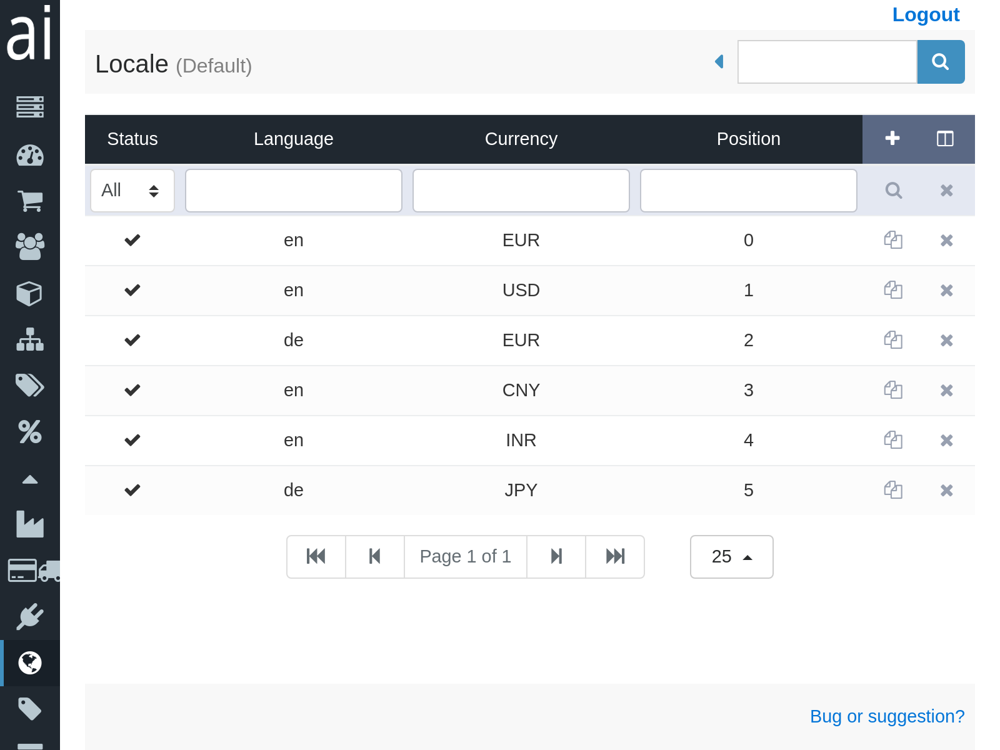
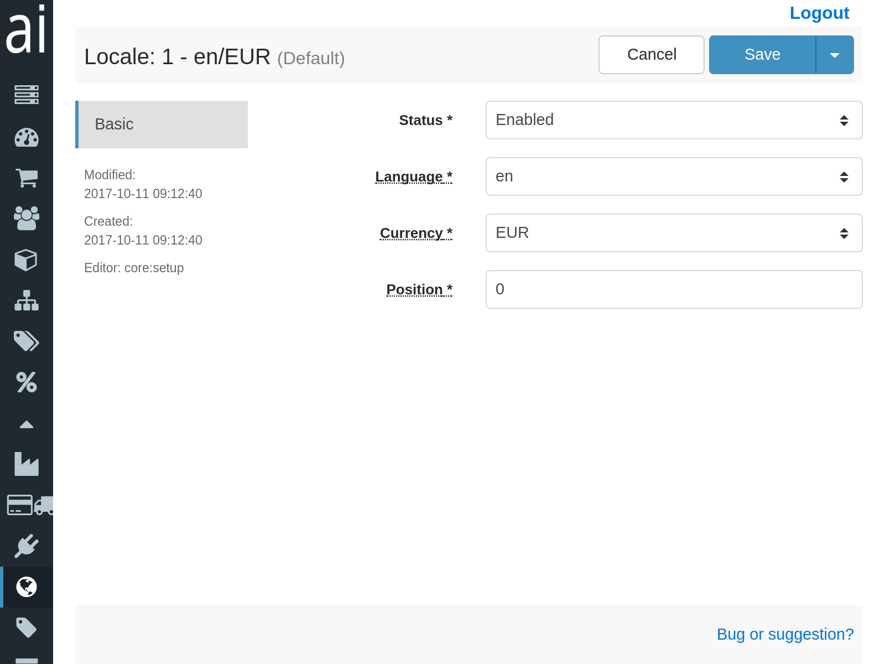

If you would like to provide your customers the possibility to choose between different languages and/or currencies, you have to configure the allowed combinations in the "Locale" panel.

# List of available combiniations

The list view displays the currently available combinations. You can add, edit or delete languages/currencies until the list fits your requirements. Be aware that products, attributes, etc. also need names/descriptions in the available languages and prices for the currencies. If they are not provided, the customers won't be able to buy the products.

The status, language ID and currency ID columns are rather self-explaining. The last column of each item manages the order of the languages and currencies in the frontend. The languages are sorted in ascending order by using the position column. If there are several currencies available for one language, these currencies will be listed in their select box and will also be ordered according to the position of the language/currency combination.

# Detail view

The detail view contains only the basic tab including the following select/input fields:

ID
: Unique ID of the item in the database. This is usually only for internal references and you should not rely on any ID as they change when items are added or deleted.

Status (required)
: Controls the visibility of the language/currency combination. There are several status values available, but the combination will only be shown in the frontend, if the status is "enabled".

Language (required)
: Lists the available languages; languages that are enabled are always shown on top of the first page.

Currency (required)
: Lists the available currencies; currencies that are enabled are always shown on top of the first page.

Position
: Order of the language and currency, when listed in the frontend, if the customer is allowed to choose between more than one language and/or currency. By default, the position is zero, and if two or more combinations share the same position, their order in the frontend will be random.

Creation time
: Date and time, when the entry was added.

Modification time
: Last date and time, when the entry was edited.

Editor
: Last user, who added or modified the entry.
