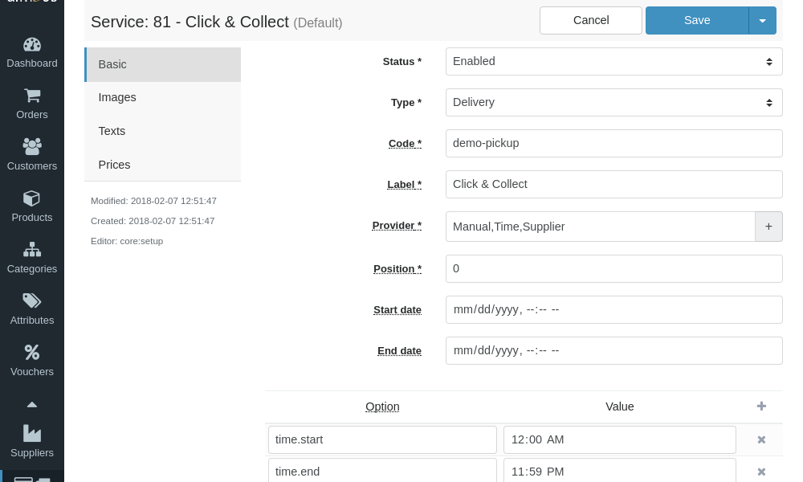
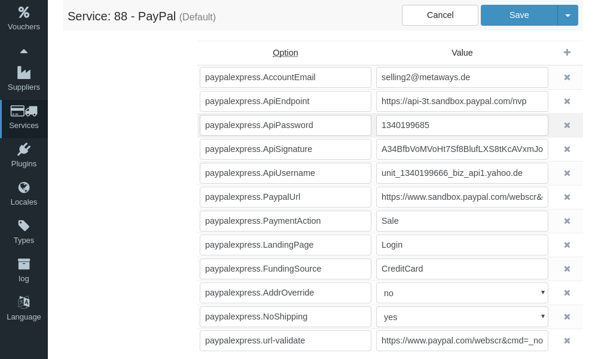
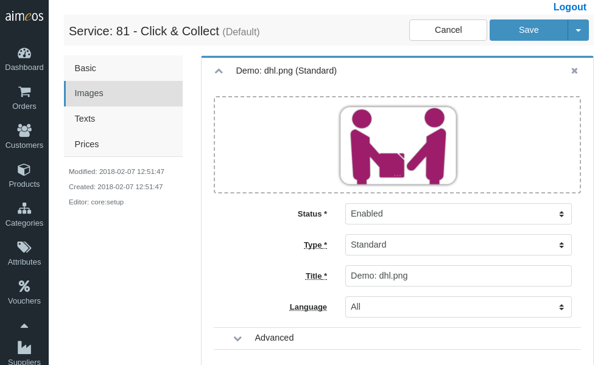
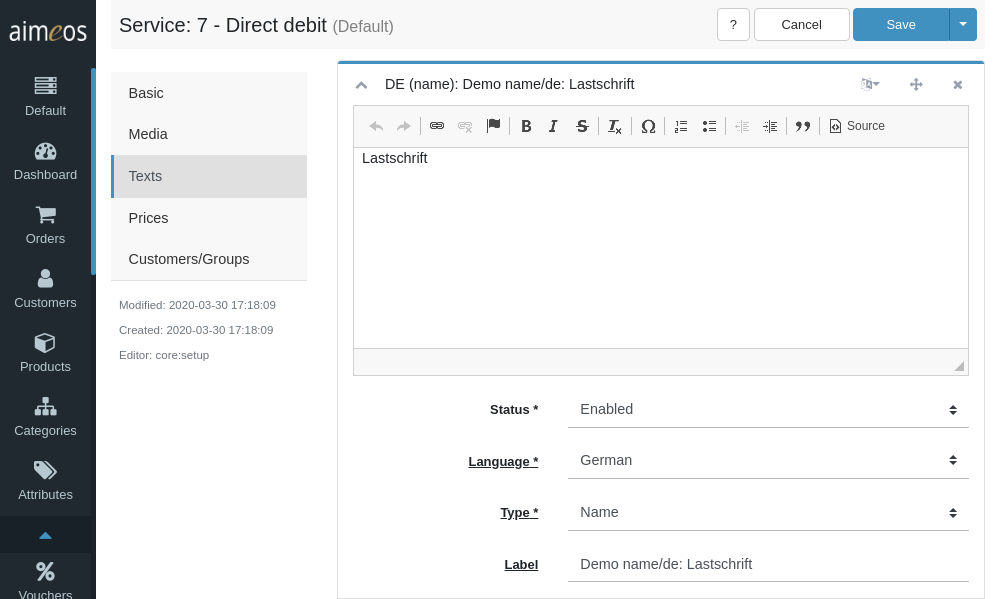

There are some select and input fields in the left section of the detail view that are almost all required. Their purpose are:

Status (required)
: Controls the visibility of the delivery or payment option. There are several status values available but the service will only be shown in the frontend if the status is "enabled".

Type (required)
: The service type, which can be "Delivery" or "Payment". Depending on what you choose, the service will be shown in the delivery or payment screen in the frontend.

Code (required)
: Unique code of the service that can be defined of your own.

Label (required)
: An internal label which helps you to identify the service and which can be used for searching in the administration interface. Usually, this is not used outside of the administration interface but if you don't add a translated name to that service, the label will be shown in the frontend.

Provider (required)
: This is the last part of the coupon provider class name, e.g. "PrePay" for the "\Aimeos\MShop\Service\Provider\Payment\PrePay". The name of the provider is **case sensitive**, so "prepay" is not the same as "PrePay"! You will get a list of available providers when clicking on the input field. Each service provider can be enhanced by one or more decorators that must be added to the provider name and separated by a comma. You view the list of available decorators when clicking on the "+" symbol right of the input field. By clicking on the decorator name it will be added after the provider name or previously added decorators. For a detailed description of the available service providers and decorators that are part of the Aimeos core, please have a look at the [service overview](services.md) and the page for the service decorators [service decorators](service-decorators.md).

Position (optional)
: If there's more than one delivery or payment option the customer can choose from, the integer value in this input field affects its position.

Start date (optional)
: The point in time when the service will be available for customers in the checkout process. The date/time has to be in ISO format (YYYY-MM-DD HH:mm:ss) and the hours must be in the range of 0-23.

End date (optional)
: The point in time when the service won't be available any more. For this field the same format applies as for "Start date".

# Service configuration

The right side (or below) of the service detail view contains a key/value configuration panel where the necessary configuration values of the service and the decorators must be added. The left column in the configuration panel is for the configuration key, the right column for the value and at least the left column of each line must be filled with a valid key. You can add lines by clicking on the "Add" button in the menu bar and delete selected lines with the "Delete" button. The order of the lines doesn't matter.

Each service and decorator needs its own configuration. For the required resp. available configuration keys and values, please refer to the documentation of the service or decorator. Documentation for the built-in ones is available at the [delivery/payment overview](services.md) page. When you add a provider or a decorator, their configuration options will be added to the list automatically.

# Additional information

After entering the basic data for the delivery or payment, it may be important to add additional information like translated images, texts and prices.

## Images

You may want to add at least the logo of logistic and payment providers that are well known. Logos should be rather small and in JPEG, PNG or GIF landscape format to make sure they can be displayed on all platforms and fit into the delivery or payment page.

## Texts

To name and describe the service, three types of texts should be added for each language you want to provide on the website:

Name
: A rather short text, that uniquely identifies the delivery or payment.

Short description
: A view lines that shortly describes the delivery or payment and gives the customer information e.g. about limitations of the service.

Long description
: This can contain all details about the delivery or payment that a customer may want to know. Each text can have a maximum of 64 thousand bytes which equals 16-64 thousand characters depending on the size of the UTF-8 characters you use. To be most compatible with all platforms/operating systems/browsers, use only UTF-8 encoding. Besides plain text, you can also use HTML code for special markup.

## Prices

Each delivery or payment item must have one price associated - even if the shipping or payment is for free. In this case, the price is displayed as 0.00.

Depending on the configured [decorators](service-decorators.md), the price may be changed dynamically based on the rules the decorator implements.
