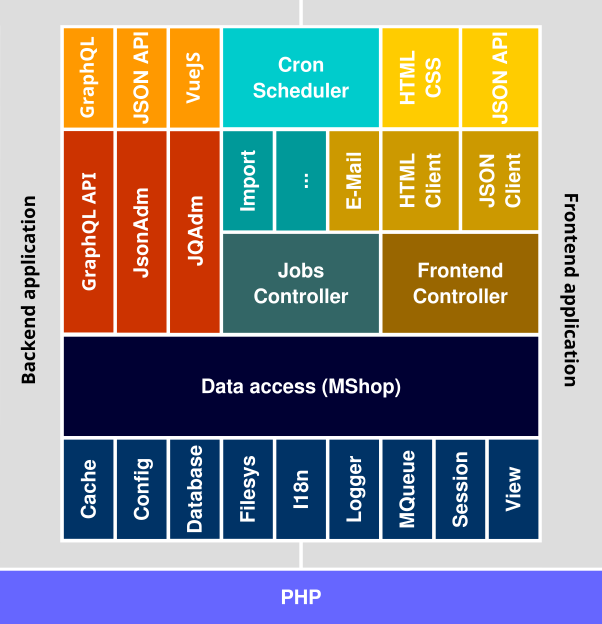

The most important thing this image should make clear is that Aimeos needs a host application where it can be integrated. Contrary to other e-commerce systems, Aimeos is first of all no stand-alone software. Instead, it can be used with any PHP framework or existing application where it can be integrated as native package.

# Administration endpoints

These are the endpoints editors and developers will interact with over HTTP.

## JQAdm interface

Standard Aimeos admin interface for managing all data that is required or generated in Aimeos.

Code: [ai-admin-jqadm extension](https://github.com/aimeos/ai-admin-jqadm)

## JsonAdm API

JSON REST API for retrieving and managing add shop data from remote or from the JQAdm interface.

Code: [ai-admin-jsonadm extension](https://github.com/aimeos/ai-admin-jsonadm)

# Client endpoints

These are the endpoints customers and developers will interact with over HTTP.

## HTML client

Standard HTML frontend including product and account views, checkout process and creating e-mails.

Code: [ai-client-html extension](https://github.com/aimeos/ai-client-html)

## JsonApi client

Full featured JSON REST API for creating custom frontends or enhancing the HTML client by dynamic features.

Code: [ai-client-jsonapi extension](https://github.com/aimeos/ai-client-jsonapi)

# Controllers

These aren't MVC controllers but business logic controllers instead. That means, they know what is to do if a product should be put into the basket for example.

## Frontend controllers

Business logic for everything the different client implementions need. They offer an easy to use interface to retrieve categories, products, services, etc. and manage the basket resp. create the order if  requested.

Code: [ai-controller-frontend extension](https://github.com/aimeos/ai-controller-frontend)

The domain controllers are:

* attribute : Search an retrieve available (product) attributes
* basket : Manage one or more baskets
* catalog : Retrieve catalog tree or tree parts
* customer : Get and save own data of each customer
* locale : Fetch available language/currency combinations
* order : Create order and retrieve existing ones for each customer
* product : Search and filter products
* service : For getting delivery and payment options
* stock : Retrieve the current stock levels for the products
* subscription : Manage recurring product subscriptions
* supplier : Retrieve and filter available suppliers

## Job controllers

All task that need to be executed in an asynchronically because they should be decoupled from the fontend for speed or error resilience.

Code: [ai-controller-jobs extension](https://github.com/aimeos/ai-controller-jobs)

Jobs care about:

* Administrative cleanup tasks
* Data import and export
* Product index management
* Mass media scaling
* Updating order status from exernal sources
* Subscription handling
* Sending e-mails (in [HTML client](https://github.com/aimeos/ai-client-html/tree/master/controller/jobs/src/Controller/Jobs))

## Admin controllers

To be implemented

# Data access

The second layer offers access to the data stored in relational database systems, NoSQL databases or provided by external (HTTP) APIs. It doesn't matter where the data is stored, the data access layer provides the same PHP API and semantics to the layers above regardless of the source. The implementation is located in the [Aimeos core](https://github.com/aimeos/aimeos-core/tree/master/lib/mshoplib/src/MShop) "./lib/mshoplib/" or in extensions.

Within the access layer, separate domains care about specific data, e.g. the product domain manages only the product data while the order domain only cares about order data. There are currently 16 domains available that can be replaced by own implementations for different data sources.

Code: [Aimeos core](https://github.com/aimeos/aimeos-core/tree/master/lib/mshoplib)

Admin related domains:

* cache : Key/value cache for storing e.g. HTML blocks
* job : Job queue for the ExtJS admin interface
* log : Access to log data

Main shop domains:

* catalog : Categories and product references
* coupon : Coupon configuration and code for rebate systems
* customer : Access to customer related data
* locale : Site, language and currency related data
* order : Complete order related data
* plugin : Basket plugin setup and configuration
* product : Base product data
* service : Delivery and payment provider implementations
* supplier : Product supplier related data

Supporting domains:

* attribute : Attributes that can be attached to products, services, media, etc.
* media : Images, documents and files referenced by other domains
* price : Prices referenced by other domains
* stock : Product stock levels
* tag : Tags for all items with a list table
* text : All kind of texts referenced by other domains

# Adapters

The bottom layer in the Aimeos stack contains the adapters to integrate the e-commerce components into the host application or to provide common interfaces for implementations. They exist in the "Aimeos\MW" namespace located in the [Aimeos core](https://github.com/aimeos/aimeos-core/tree/master/lib/mwlib/src/MW) "./lib/mwlib/" or in extensions if they offer specific integrations.

Code: [Aimeos core](https://github.com/aimeos/aimeos-core/tree/master/lib/mwlib)

Adapters for integration into the host application:

* Cache : Use the caching infrastructure
* Config : Configure Aimeos using the application
* Logger : Logging messages to a shared facility
* Mail : Sending e-mails if available
* Session : Shared user sessions
* View : Template engine

Interfaces where often no host implementation exists or it's not reasonable:

* DB : Database abstraction layer (DBAL and PDO available)
* Filesystem : Local and cloud based file access (FlySystem extension available)
* I18n : Translation handling (Gettext extension available)
* Message Queue : Offload resource intensive tasks (Extension for RabbitMQ, Beanstask and Stomp available)
