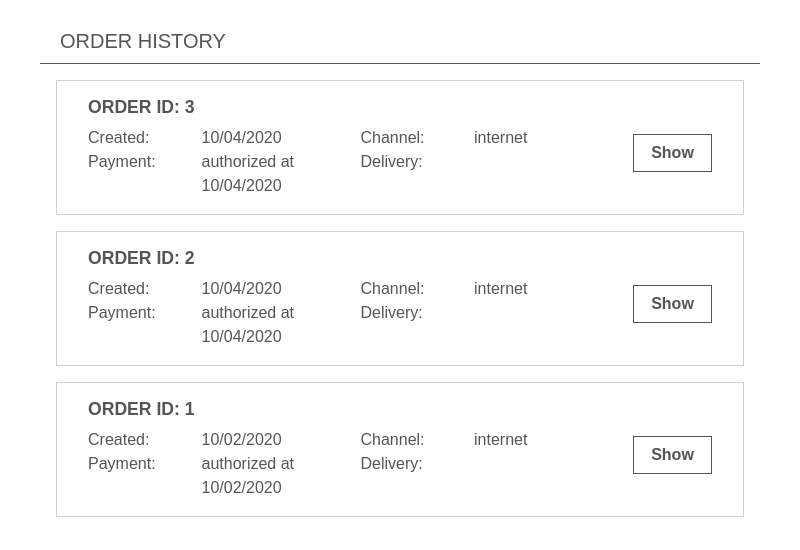
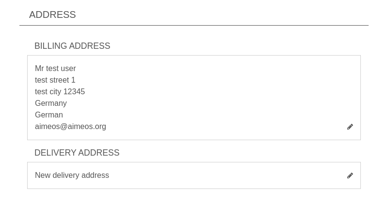
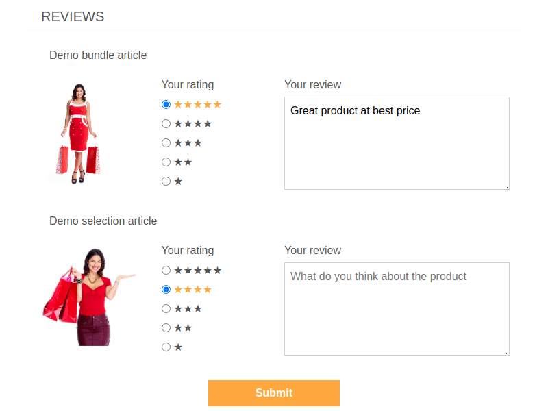
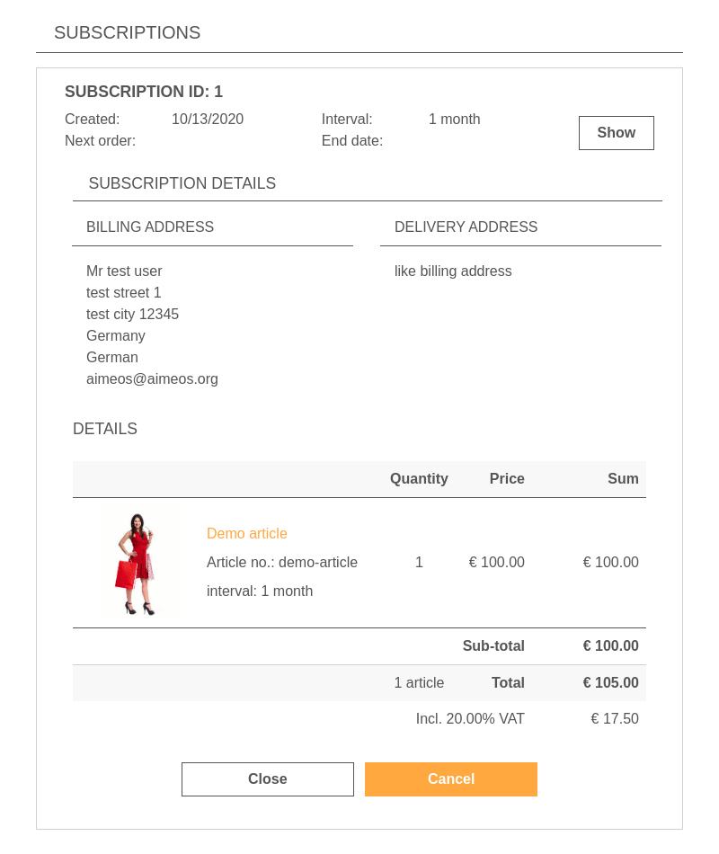

# Favorite

Customers are able to mark products as their favorites. References to these products are stored in the account of the customer and are listed by the "account favorite" component. Customers can view their list of favorite products and also remove items from the list.

## Structure

The ["account favorite" component](../../config/client-html/account-favorite.md#name) currently consists only of the main part but can be extended by the [subpart configuration of the "account favorite" component](../../config/client-html/account-favorite.md#subparts), if you need to add further subparts.

In the "account favorite" component, the products are listed similarly to the standard product list. This list is also paged if customers save a lot of products on their favorite list. Shop owners can configure the [domain items](number of products](../../config/client-html/account-favorite.md#size) that are shown per page and the [client/html/account/favorite/domains](../../config/client-html/account-favorite.md#domains) which are fetched from the database (text, media, attributes, etc.).

To be able to generate the URL for the page or route the component is available at, a few settings can be configured. They are necessary to save the favorite products in the customer account:

* [URL target, e.g. page or route](../../config/client-html/account-favorite.md#target)
* [Controller name](../../config/client-html/account-favorite.md#controller)
* [Controller action](../../config/client-html/account-favorite.md#action)
* [URL settings, e.g. for absolute URLs](../../config/client-html/account-favorite.md#config)

## Templates

You can adapt the templates for the favorite component by overwriting the templates in your own extension or configuring alternative template names:

* [account favorite body](../../config/client-html/account-favorite.md#template-body)
* [account favorite header](../../config/client-html/account-favorite.md#template-header)

If you want to change the HTML structure of one of the templates, please have a look at the original versions to ensure that you don't loose essential functionality.

# History

In the "account history" component, customers can see their placed orders including the order details and the latest delivery and payment status.

## Structure

At least two subparts are included in the ["account history" component](../../config/client-html/account-history.md#name_1), the [list](../../config/client-html/account-history.md#name) and the [order](../../config/client-html/account-history.md#name_2) subparts. They can be controlled via the [subpart configuration of the "account history" component](../../config/client-html/account-history.md#subparts). Both, the [list subpart](../../config/client-html/account-history.md#standardsubparts) and the [order subpart](../../config/client-html/account-history.md#standardsubparts_1) can contain custom subparts, if you need to extend the existing implementations.

The order subpart reuses the [common summary partials](https://github.com/aimeos/ai-client-html/tree/master/client/html/templates/common/summary) which contains the address, service and detail sections so the same information as in the checkout summary page is available.

To be able to load the order details and to return to the list of orders, the URL of the "account history" component must be known. The generated URL can be configured via these settings:

* [URL target, e.g. page or route](../../config/client-html/account-history.md#target)
* [Controller name](../../config/client-html/account-history.md#controller)
* [Controller action](../../config/client-html/account-history.md#action)
* [URL settings, e.g. for absolute URLs](../../config/client-html/account-history.md#config)

!!! note
    If Javascript is enabled, the order details are loaded via AJAX and dynamically added to the list entry of the order. Otherwise, the page is reloaded and only the order details are shown.

## Templates

You can adapt the templates for the subparts by overwriting the templates in your own extension or configuring alternative template names:

* [account history body](../../config/client-html/account-history.md#template-body)
* [account history header](../../config/client-html/account-history.md#template-header)
* [history list body](../../config/client-html/account-history.md#standardtemplate-body)
* [history order body](../../config/client-html/account-history.md#standardtemplate-body_1)

If you want to change the HTML structure of one of the templates, please have a look at the original versions to ensure that you don't loose essential functionality.

# Profile

The profile component offers customers the ability to change their account details including billing and delivery addresses.

## Structure

Currently, the ["account profile" component](../../config/client-html/account-profile.md#name_1) contains an [address subpart](../../config/client-html/account-profile.md#name) is included in the "account profile" component. The subparts can be controlled via the [subpart configuration of the "account profile" component](../../config/client-html/account-profile.md#subparts). The [address subpart](../../config/client-html/account-profile.md#standardsubparts) can contain custom subparts, if you need to extend the existing implementations.

To generate the URL for the page or route the component is available at, these settings must be configured. They are necessary to save the changed addresses in the customer account:

* [URL target, e.g. page or route](../../config/client-html/account-profile.md#target)
* [Controller name](../../config/client-html/account-profile.md#controller)
* [Controller action](../../config/client-html/account-profile.md#action)
* [URL settings, e.g. for absolute URLs](../../config/client-html/account-profile.md#config)

## Templates

You can adapt the templates for the "account profile" component by overwriting the templates in your own extension or configuring alternative template names:

* [account profile body](../../config/client-html/account-profile.md#template-body)
* [account profile header](../../config/client-html/account-profile.md#template-header)

If you change the HTML structure of the templates, please have a look at the original versions to ensure that you don't loose essential functionality, e.g. the dynamic JS features.

# Review

The review component allows customers to rate and review products they have bought before and only for those products to prevent fake reviews. New reviews are stored with status "in review" and are only visible in the frontend after changing their status to "enabled" (can be configured).

## Structure

Up to now, the ["account review" component](../../config/client-html/account-review.md#name) only the [todo subpart](../../config/client-html/account-review.md#name_1) is implemented and the available suparts can be controlled via the [subpart configuration of the "account review" component](../../config/client-html/account-review.md#subparts). The [todo subpart](../../config/client-html/account-review.md#standardsubparts) can contain custom subparts as well if required.

To generate the URL for the page or route the component is available at, these settings must be configured. They are necessary to save the reviews the customer have written:

* [URL target, e.g. page or route](../../config/client-html/account-review.md#target)
* [Controller name](../../config/client-html/account-review.md#controller)
* [Controller action](../../config/client-html/account-review.md#action)
* [URL settings, e.g. for absolute URLs](../../config/client-html/account-review.md#config)

## Templates

You can adapt the templates for the "account review" component by overwriting the templates in your own extension or configuring alternative template names:

* [account review body](../../config/client-html/account-review.md#template-body)
* [account review header](../../config/client-html/account-review.md#template-header)

If you change the HTML structure of the templates, please have a look at the original versions to ensure that you don't loose essential functionality.

## Configuration

There are additional confiugration settings available to control the "account review" component:

[client/html/account/review/todo/size](../../config/client-html/account-review.md#size)
: Max. number of products shown for review

[client/html/account/review/todo/days-after](../../config/client-html/account-review.md#days-after)
: Number of days before a bought product can be reviewed

[controller/frontend/review/status](../../config/controller-frontend/review.md#status)
: Status of the review after the customer review has been stored

# Subscription

In the "account subscription" component, customers can see their placed orders including the order details and the latest delivery and payment status.

## Structure

At least two subparts are included in the ["account subscription" component](../../config/client-html/account-subscription.md#name_2), the [list](../../config/client-html/account-subscription.md#name_1) and the [detail](../../config/client-html/account-subscription.md#name) subparts. They can be controlled via the [subpart configuration of the "account subscription" component](../../config/client-html/account-subscription.md#subparts). Both, the [list subpart](../../config/client-html/account-subscription.md#standardsubparts_1) and the [detail subpart](../../config/client-html/account-subscription.md#standardsubparts) can contain custom subparts, if you need to extend the existing implementations.

The order subpart reuses the [common summary partials](https://github.com/aimeos/ai-client-html/tree/master/client/html/templates/common/summary) which contains the address, service and detail sections so the same information as in the checkout summary page is available.

To be able to load the order details and to return to the list of orders, the URL of the "account subscription" component must be known. The generated URL can be configured via these settings:

* [URL target, e.g. page or route](../../config/client-html/account-subscription.md#target)
* [Controller name](../../config/client-html/account-subscription.md#controller)
* [Controller action](../../config/client-html/account-subscription.md#action)
* [URL settings, e.g. for absolute URLs](../../config/client-html/account-subscription.md#config)

!!! note
    If Javascript is enabled, the order details are loaded via AJAX and dynamically added to the list entry of the order. Otherwise, the page is reloaded and only the order details are shown.

## Templates

You can adapt the templates for the subparts by overwriting the templates in your own extension or configuring alternative template names:

* [account subscription body](../../config/client-html/account-subscription.md#template-body)
* [account subscription header](../../config/client-html/account-subscription.md#template-header)
* [subscription list body](../../config/client-html/account-subscription.md#standardtemplate-body)
* [subscription order body](../../config/client-html/account-subscription.md#standardtemplate-body_1)

If you want to change the HTML structure of one of the templates, please have a look at the original versions to ensure that you don't loose essential functionality.

# Watch

Visitors who create an account can watch products and will be notified if those products are back in stock or if their price decreases - depending on what the customers have chosen. They are also able to remove watched products from this list again.

## Structure

The ["account watch" component](../../config/client-html/account-watch.md#name) currently consists only of the main part but can be extended by the [subpart configuration of the "account watch" component](../../config/client-html/account-watch.md#subparts), if you need to extend the existing implementations.

In the "account watch" component, the products are listed similarly to the standard product list. This list is also paged if customers save a lot of products on their watch list. Shop owners can configure the [number for products](../../config/client-html/account-watch.md#size) that are shown per page and the [domain items](../../config/client-html/account-watch.md#domains) which are fetched from the database (text, media, attributes, etc.). Additionally, shop owners can limit the number of products customer can watch in parallel with the [maxitems](../../config/client-html/account-watch.md#maxitems) option.

To be able to generate the URL for the page or route the component is available at, a few settings can be configured. They are necessary to save the watched products in the customer account:

* [URL target, e.g. page or route](../../config/client-html/account-watch.md#target)
* [Controller name](../../config/client-html/account-watch.md#controller)
* [Controller action](../../config/client-html/account-watch.md#action)
* [URL settings, e.g. for absolute URLs](../../config/client-html/account-watch.md#config)

## Templates

You can adapt the templates for the "account watch" component by overwriting the templates in your own extension or configuring alternative template names:

* [account watch body](../../config/client-html/account-watch.md#template-body)
* [account watch header](../../config/client-html/account-watch.md#template-header)

If you want to change the HTML structure of one of the templates, please have a look at the original versions to ensure that you don't loose essential functionality.
