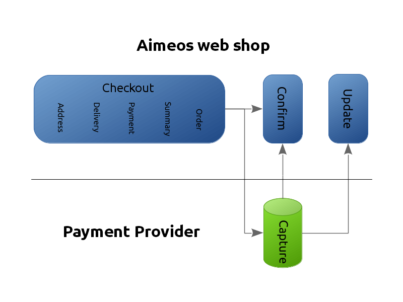
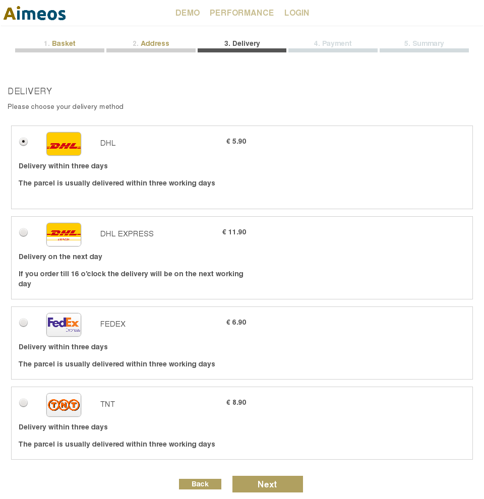
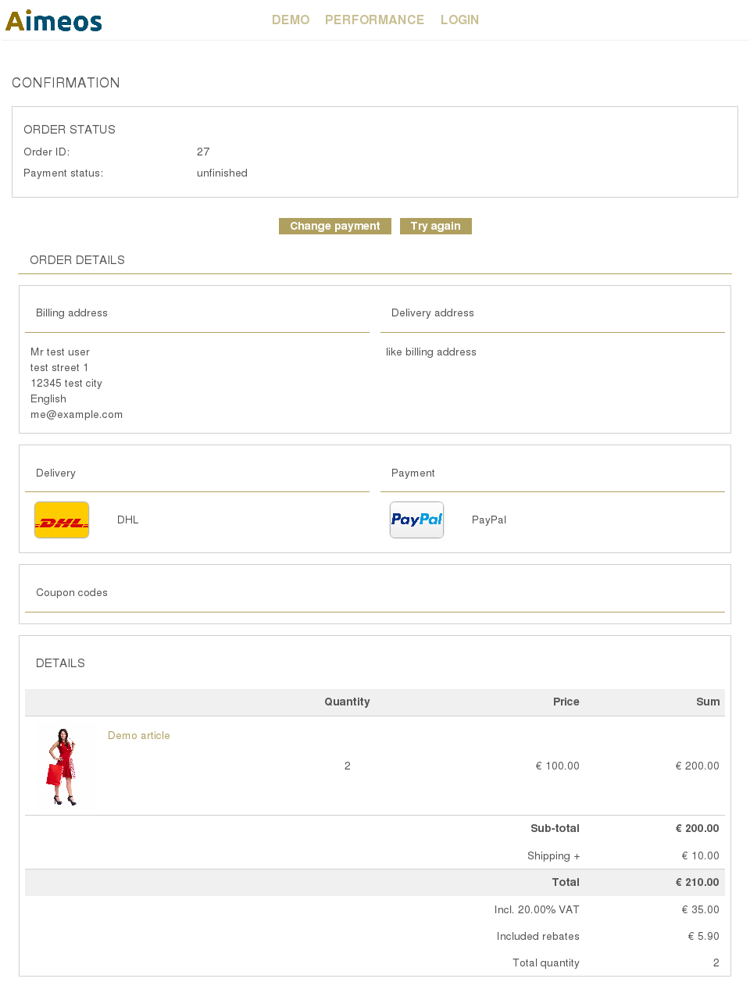

# Checkout process

The checkout process is one of the hearts of a web shop. Aimeos contains a full-featured checkout component that can be customized to very wide degree. The illustration below contains the complete checkout process including payment and asynchronous payment notifications if they are used:



* Checkout
    1. Enter payment (and delivery) address
    2. Choose delivery option
    3. Choose payment option
    4. Show detailed summary page
    5. Start order process
* Confirmation
    1. Show order confirmation or enable retry
* Update notification
    1. Receive payment status updates

## Checkout steps

All steps are implemented as subparts of the "checkout standard" component. The difference between this component and others is that only the subpart is shown that matches the step in the URL parameter or the first one that requires attention if the page is called without parameter.

Moving through the steps is done by instantiating all subparts, calling their `init()` methods and the one that requires some input will set the *standardStepActive* view variable to its own subpart name. This subpart is rendered afterwards and the [init() method of the address subpart](https://github.com/aimeos/ai-client-html/blob/master/src/Client/Html/Checkout/Standard/Address/Standard.php#L250-L278) is a good place to see how this works.

If a customer is already logged in and the [Autofill basket plug-in](../../manual/plugins.md#autofill) is configured, then the address data as well as the chosen delivery and payment options are used from the last order. The steps that doesn't require any input are skipped and the [configured destination page](../../config/client-html/checkout-standard.md#step-active) (the summary page by default) is displayed directly to the customer.

## Payment processing

Afterwards, the order is stored in the database and the product stock and coupon code(s) are blocked (their count is decreased). If the payment fails or the customer leaves the shop before completing the order, the order stays in the database and products and coupon codes won't be available for other customers.

!!! tip
     There's a job controller ("Remove unpaid orders") available for unblock reserved stock and coupon codes of unpaid orders after a configurable amount of time. Also, unfinished orders can be deleted safely after some time using the "Remove unfinished orders" job controller.

A new delivery address is also saved in the customer address table. To prevent this, you have to remove the "address" subpart from the [process subparts configuration](../../config/client-html/checkout-standard.md#standardsubparts_3). This applies also to creating a new customer account based on the e-mail address.

If the customer has chosen a payment provider which requires no redirect to an external payment gateway (like pre-payments), the customer is directly forwarded to the order confirmation page which must contain the "checkout confirm" component.

Otherwise, a form is shown which asks for the required data like credit card information. Submitting the form (done automatically if no further data is required and Javascript is available) will forward the customer to the payment gateway where acquiring the payment takes place.

The payment gateway must redirect the customer back to the confirmation page afterwards to complete the order. Additionally, it's possible to accept order status updates via the "checkout update" component sent by the payment gateway later on.

## Confirmation page

The "checkout confirm" component displays the placed order and the current payment status of that order.

If possible, it updates the payment status depending on the parameters sent by the payment gateways or queries the payment provider for the current status. It asks each configured payment provider for the current shop site to update the payment status until one of them succeeds.

Thus, and for usability reasons it's best to place the most commonly used [payment option](../../manual/services.md#built-in-payment-services) at the top of the list of payment options using a low number (or zero) for the [position value](../../manual/service-details.md#basic-details).

Sometimes, payments of customers are declined by the payment provider or the payment fails for other reasons. In this case, the buttons for retrying the payment are displayed. The customer can use the same payment option or choosing another one.

## Update notifications

The payment status of an order can change due to external reasons like the payment was pending first and succeeds afterwards or it was declined by the credit card provider. It's important for a shop to get notified about these changes. For example, Aimeos shops hold back orders as long as their payment is neither "authorized" nor "received".

The notifications about payment status updates can happen every time and are therefore not bound to any direct customer action. Instead, the payment provider gateways may send them as soon as they occur or maybe only once a day. Thus, they are distinguished into two types:

* real-time/synchronous update
* batch/asynchronous updates

All real-time updates are sent directly to the "checkout update" component of your Aimeos shop. Some payment service provider implementations are able to hand over the URL created by using the [configured destination page or route](../../config/client-html/checkout-update.md#url) automatically to the payment gateway. In the other cases, you need to add the absolute URL to your page containing the "checkout update" component in the management backend of the payment gateway.

Batch updates work differently. Usually, files are uploaded via FTP to your server or you have to fetch the files from the server of your payment gateway. Afterwards, the Aimeos service provider can import the file and updated the payment status of the order in the database.

You have to configure the Aimeos  payment service provider which is responsible for these files to import them. This is explicitly stated in the [service provider documentation](../../manual/services.md#built-in-payment-services) if necessary.

!!! note
    If one of the payment provider you are using sends batched payment status updates, you have to set up the "Batch update of payment/delivery status" job for processing those files

## Change checkout steps

By default, the checkout process consists of these steps in the following order:

* [Enter payment (and delivery) address](../../config/client-html/checkout-standard.md#name)
* [Choose delivery option](../../config/client-html/checkout-standard.md#name_1)
* [Choose payment option](../../config/client-html/checkout-standard.md#name_3)
* [Show detailed summary page](../../config/client-html/checkout-standard.md#name_5)
* [Store order and redirect to the payment provider](../../config/client-html/checkout-standard.md#name_4)

Depending on the type of product you sell, sometimes it is not necessary for the customer to choose e.g. a delivery option. Virtual products usually fall into this category. You can remove a step from the process completely by [modifying the subpart's configuration](../../config/client-html/checkout-standard.md#subparts_2) to:

```
client/html/checkout/standard/subparts = ['address', 'payment', 'summary', 'process']
```

This example would leave the order of the steps as is but removes the "delivery" step. Depending on the configuration of the plug-ins, **delivery and payment options may be enforced**. To change this behavior, you have to adapt the [ServicesAvailable basket plug-in](../../manual/plugins.md#servicesavailable).

!!! warning
    In theory, you can reorder the single steps to any other order but it's not recommended. There are dependencies between some steps like the delivery options depend on the address entered by the customer or the costs of the payment options depend on the total value including the delivery costs. For the same reason it's not recommended to place all steps on a single page. If you do this or change the order be sure that you know what the consequences are!


If necessary, you can also add new steps to the checkout process. They will be automatically inserted into the process after you've added their names to the [subpart configuration](../../config/client-html/checkout-standard.md#subparts_2).

## One page checkout


You can decide to offer a one page checkout additionally to the standard multi step checkout or place two or more steps on the same checkout page. This makes the Aimeos checkout process incredibly flexible and allows you to adapt it to your needs.

The main configuration option for the one page checkout is [client/html/checkout/standard/onepage](../../config/client-html/checkout-standard.md#onepage). Basically, it contains the checkout steps that should be placed on the same page. The available steps are those from the sub-clients of the checkout standard component:

* address
* delivery
* payment
* summary

There's a fifth ("process") step available but they aren't suited to be used for a one page checkout because they have to perform some actions after the order is placed. An example for a full one page configuration would be:

```
client/html/checkout/standard/onepage = ['address', 'delivery', 'payment', 'summary']
```

The order of the subpart names doesn't matter in this setting as it's already determined by the order of the [subparts](../../config/client-html/checkout-standard.md#subparts_2) configuration.

Commonly used variants are:

Delivery and payment on one page
: This is used most often if you want to save one step for the customer and there are not much options to chose from on both pages. The downside of this combination is that you can't calculate additional payment costs based on the price of the chosen delivery option.

Address, delivery and payment on one page
: A classic one page checkout that is legally safe because the summary is still the last step where customers have a complete overview of there data and the price to pay before they finish the order. Drawbacks are the limited payment cost calculation like in the first option and that delivery options can't be limited depending on the country or region of the customer.

Full one page checkout including all steps
: This is the real all in one checkout where customers have every information on one page. It's best suited if you need to display only a limited amount of information or show/hide the parts where users have to enter their data dynamically. To be legally on the safe side, your total order amount must not change any more as soon as this page is displayed. This means that shipping costs are fixed and no payment costs can be charged. Additionally, all drawbacks of the last option applies as well.

When using a full one page checkout, you can limit the sections shown in the summary subpart as well. The blocks for the addresses and delivery/payment options are useless in this setup and should be removed from the [checkout summary template](https://github.com/aimeos/ai-client-html/blob/master/templates/client/html/checkout/standard/summary-body.php).

If only one shipping method is available, you can also hide it in the one page checkout but you shouldn't remove it. As long as it's part of the order, backend systems can work with that data. Instead, make it invisible by using CSS.

# Address

The address page in the checkout process is usually the first page during the checkout customers will see. If customers are already logged in and the [Autofill](../../manual/plugins.md#autofill) basket plug-in is configured, the last address is added automatically to the basket.

## Structure


The address page consists of two sections: the payment address section; the delivery address section. These sections are controlled via the [address subparts configuration](../../config/client-html/checkout-standard.md#subparts).

There's a default implementation available but you are also able to replace or extend the existing implementation and a configure alternative class name:

* [Address class name](../../config/client-html/checkout-standard.md#name)

!!! note
    There can only be one payment address which is stored along with the user login data in the "mshop_customer" table if no other application specific table is used. For delivery addresses there's no limit and they are usually stored in the "mshop_customer_address" or in a table related to the user table of the application. Depending on your framework or application, their user tables are used instead of the "mshop_customer*" tables.

## Form fields

The shown fields in the payment and delivery forms are customizable. You can define each field as mandatory, optional or hidden. The values of hidden fields are sent along with the data entered by the customer but aren't shown in the front-end. All fields that are neither defined as mandatory, optional or hidden are not stored in the basket of the customer. The configuration options for the fields are:

* [mandatory payment fields](../../config/client-html/common-address.md#mandatory_1)
* [optional payment fields](../../config/client-html/common-address.md#optional_1)
* [hidden payment fields](../../config/client-html/common-address.md#hidden_1)
* [mandatory delivery fields](../../config/client-html/common-address.md#mandatory)
* [optional delivery fields](../../config/client-html/common-address.md#optional)
* [hidden delivery fields](../../config/client-html/common-address.md#hidden)

!!! tip
    You can also prevent users from being able to enter a new payment or delivery address using these configuration options:

    * [Disable new payment address](../../config/client-html/checkout-standard.md#paymentdisable-new)
    * [Disable new delivery address](../../config/client-html/checkout-standard.md#deliverydisable-new)

The salutation drop-down contains the list of available salutation codes like "company", "mr" or "mrs" which are translated to appropriate strings in the language of the customer. You can customize which [salutation codes](../../config/client-html/common-address.md#salutations) can be chosen by the customer for the addresses.

There's a hidden input field for the birthday of the customer in the address form. As the birthday belongs to the customer account and not to the order address, you can't use the  configuration settings listed before in this case. Instead, you can display it via CSS:

```css
.aimeos .checkout-standard-address-payment .birthday {
    display: block;
}
```

## Templates

To alter the payment address and delivery address sections, you can adapt the template for the address page by overwriting them in your own extension or by configuring alternative template names:

* [address body template](../../config/client-html/checkout-standard.md#template-body)
* [payment body template](../../config/client-html/checkout-standard.md#paymenttemplate-body)
* [delivery body template](../../config/client-html/checkout-standard.md#deliverytemplate-body)

If you want to change the HTML structure of one of the templates, please have a look at the original versions to ensure that you don't lose essential functionality.

## Validation

Each field of the payment or delivery address form can be [validated against a regular expression](../../config/client-html/common-address.md#validate). This enables shop owners to define rules for each field and enforce syntax, like postal code patterns:

```
client/html/common/address/validate/postal = '/^[0-9]+$/'
```

Defined validation rules are applied to both, payment and delivery address fields.

## Countries, regions and states

When shipping to different countries, you need to know which country or region your customer is living or where the parcel should be shipped to. This may affect the shipping costs. Therefore, you should define the countryid field as mandatory in both the [payment](../../config/client-html/common-address.md#mandatory_1) and [delivery](../../config/client-html/common-address.md#mandatory) address. Afterwards, you can configure the countries or regions that will be available for selection by the customer:

```
common/countries = ['DE', 'FR', 'ES']
```

Usually, these are the two letter ISO country codes but you are able to choose any two letter code for describing e.g. a region like "EU" for Europe or "WE" and "EE" for western and eastern Europe.

Each country or region can be divided into states which is often used in the US. States are country or region specific so each list of states must belong to a country or region. Thus, the state list needs the country or region code as key:

```
common/states = array(
    'US' => array(
        'CA' => 'California',
        'NY' => 'New York',
        // ...
    ),
    // ...
)
```

# Delivery



Currently, the [implementation of the delivery step](../../config/client-html/checkout-standard.md#name_1) contains only one subpart for displaying the list of delivery options.

The list of delivery options is determined by the configured list of [delivery services in the administration interface](../../manual/services.md#delivery). All active delivery services from the current site and all parent sites are taken into account. Their order is determined by the "position" value of each service item and lower values are sorted before higher one.

You can adapt the body template for the delivery subpart by overwriting the template in your own extension or configuring an alternative template name:

* [delivery body template](../../config/client-html/checkout-standard.md#template-body_1)

# Payment


Like in the delivery step, the [implementation of the payment step](../../config/client-html/checkout-standard.md#name_3) also contains only one [subpart](../../config/client-html/checkout-standard.md#subparts_2), which can be extended as well.

All active [payment services set up in the administration interface](../../manual/services.md#payment) for the current site and all parent sites are listed on the payment page in the checkout process. The order of the payment items in the list of payment options is calculated in the same way as for the delivery step: The value of the "position" is used for sorting and those with lower values come first.

You can adapt the body template for the payment subpart by overwriting the template in your own extension or configuring an alternative template name:

* [payment body template](../../config/client-html/checkout-standard.md#template-body_2)

# Summary

Displaying the summary page is usually the last step before the order is stored into the database. It shows the complete basket content and some checkboxes, e.g. for terms and conditions, privacy policy, newsletter, etc.

## Structure


The checkout summary subpart contains no subparts itself. The summary template uses the "detail" partial shared with the basket and the HTML e-mails as well as a partial for the options.

## Terms and privacy pages

By default, the "options" partial contains a "terms" section where customers have to accept your terms and conditions and the privacy policy. Both need to link to the corresponding texts which must be available somewhere in your shop.

## Templates

You can adapt the template for the summary page by overwriting it in your own extension or configuring alternative template names:

* [summary body template](../../config/client-html/checkout-standard.md#template-body_4)

If you want to change the HTML structure of one of the templates, please have a look at the original versions to ensure that you don't loose essential functionality.

!!! warning
    Remember that the detail partial for the summary subpart is shared with the basket and e-mail components. If you change them, the layout for the basket, order history and e-mails will change as well if you don't configure to use a partial with a different name!

# Process

After the order has been saved to the database, the payment part of the checkout implementation will take the necessary steps based on the requirements of the payment gateway.

## Structure


Depending on the payment provider implementation, the [checkout payment implementation](../../config/client-html/checkout-standard.md#name_4) will either display a payment form for entering the credit card details or the customer is directly forwarded to the payment gateway (or the "thank you" page if no further action is required). There's the possibility to add further subparts to the checkout payment component via the [process subpart](../../config/client-html/checkout-standard.md#subparts_1) configuration.

In case of an external payment service, these gateways usually need some additional data, at least the unique order ID and the total amount of the order. This information must be pushed to the payment gateway by the customers and therefore, the data is added in hidden form fields. If Javacript is enabled, the browser will submit this form automatically. Otherwise, the customer has to send the form by clicking on the "Proceed" button.

## Templates

You can adapt the template for the checkout process subpart by overwriting the template in your own extension or configuring an alternative template name:

* [checkout process body template ](../../config/client-html/checkout-standard.md#template-body_3)

If you want to change the HTML structure of one of the templates, please have a look at the original versions to ensure that you don't loose essential functionality.

# Confirm

The "thank you" page including the "checkout confirm" component is the last page, the customers will be redirected to, either from the payment gateway or from the "checkout order" page.

## Structure



The intro section contains only the headline and the notes for the customers that they will receive an e-mail with the order confirmation if the payment was successful resp. suitable texts for every payment status the order may have. The order section summarizes the details of the order placed by the customer. It uses the same shared partials also shown in the order history or checkout summary.

## Templates

You can adapt the templates of every section by overwriting them in your own extension or configuring alternative template names:

* [header template](../../config/client-html/checkout-confirm.md#template-header)
* [body template](../../config/client-html/checkout-confirm.md#template-body)

If you want to change the HTML structure of one of the templates, please have a look at the original versions to ensure that you don't loose essential functionality.
