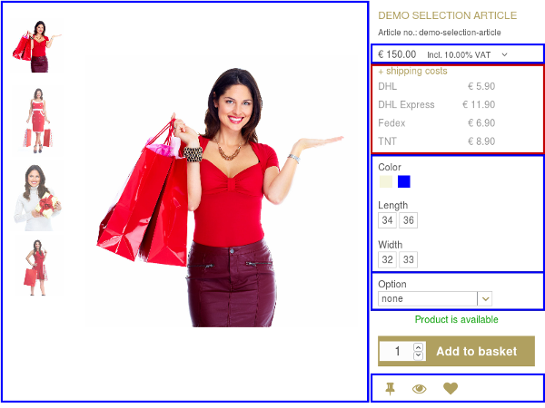

Each core component can be divided into one or more subparts which are implemented as HTML clients themselves, and they can contain several subparts as well. This article focuses on creating a new HTML client subpart that can be added via configuration between any existing subparts.

# Component, level and name

Please keep in mind that a **subpart is written for a specific component and for a certain level** inside the tree structure. I.e. you can't use a subpart written for one component in another one or move the subpart up and down in the hierarchy solely by configuration.

The existing components are located in the [client/html/src/Client/Html/](https://github.com/aimeos/ai-client-html/tree/master/client/html/src/Client/Html) directory and grouped together with similar components, e.g. the "Catalog" directory contains all components used for the product presentation, among others also the catalog detail component. Let's see what this component consists of:



As you can see, it contains some partials (blue) and one subpart (red). The locations of the subpart (and the partials too) depends on where you put them into your template, in this case the *catalog/detail/body-standard* template. The naming for the subpart class must correspond to the namespace and directory structure:

```
Aimeos\Client\Html\Catalog\Detail\Yourpart\Standard
```

You can rename "Yourpart" to whatever you like but it must consist of characters from a-z and digits from 0-9 only. Furthermore, the first character must be in upper case. The last part ("Standard" in this case) is the name of the implementation because there can be several ones with different code and functionality. The first implementation should be named *Standard*.

!!! note
    You can also add new subparts to existing subparts, e.g. to the "Service" subpart. The generated output of your new subpart would be then be added to your template depending on where you add the *block* view helper:
    ```php
    <?= $this->block()->get( '<subpart name>' ) ?>
    ```

# Basic class structure

All HTML clients, either being a component or a subpart, need to extend from the common *\Aimeos\Client\Html\Base* class and implement the same methods. Especially the `getBody()` and `getHeader()` methods are important because they care about generating the HTML, XML, JS or whatever code which is sent to the browser.

The skeleton below is from the catalog detail service subpart and you can use it as reference for your own subpart implementation.

```php
namespace Client\Html\Catalog\Detail\Basic;

class Standard
    extends \Aimeos\Client\Html\Common\Client\Factory\Base
    implements \Aimeos\Client\Html\Common\Client\Factory\Iface
{
    private $subPartPath = 'client/html/catalog/detail/service/standard/subparts';
    private $subPartNames = [];
    private $view;


    public function getBody( $uid = '' ) : string
    {
    }

    public function getHeader( $uid = '' ) : ?string
    {
    }

    public function getSubClient( string $type, string $name = null ) : \Aimeos\Client\Html\Iface
    {
    }

    protected function getSubClientNames() : array
    {
    }
}
```

The only thing you have to do is to **rename the "Service" and "service" strings** to whatever your subpart should be named.

If you want to create a subpart one level below, you have to add the names of these levels in the class name, the `$subPartPath` variable and its documentation. You would replace "Service" to "Service\Yourpart" in your class name and */service/* to */service/yourpart/* in the `$subPartPath` variable for example.

There are two private class variables in this skeleton: `$subPartPath` and `$subPartNames`. Both will be used in the `getSubClientNames()` method explained later. The last class variable `$view` will store the view to avoid retrieving the same data for `getBody()` and `getHeader()` twice.

# Mandatory methods

## getBody()

The `getBody()` method is usually the most important one because it generates most of the output sent to the browser. It contains only a few lines, everything else is outsourced to other methods. The optional parameter `$uid` can contain a unique identifier if the method should generate different outputs on the same page.

```php
public function getBody( $uid = '' ) : string
{
    $view = $this->getView();

    $html = *;
    foreach( $this->getSubClients() as $subclient ) {
        $html .= $subclient->setView( $view )->getBody( $uid, $tags, $expire );
    }
    $view->serviceBody = $html;

    $tplconf = 'client/html/catalog/detail/service/standard/template-body';
    $default = 'catalog/detail/service-body-standard';

    return $view->render( $view->config( $tplconf, $default ) );
}
```

In the `foreach` block the subclients are initialized and their generated output is concatenated. The result is then assigned to the view as "...Body" variable. The prefix should be the name you've given to the subpart and it **must not collide with an existing one**, so be specific enough!

The next two lines contain the template configuration and you should adapt this to your subpart.

At last, the output is generated by the view according to the given template location. That can be overwritten using the config setting in `$tplconf` if required. Both, the template configuration key and it's default value must be adapted to the name of your class.

The default value consists of the component name (catalog/detail/) and the filename made up of the name of your class including sub-names, e.g. "service-additional-body-standard". The complete strings must be in lower-case.

!!! note
    If your subpart client is located at a different level in the hierarchy, you must add all parts of the class name in lower case and separated by slashes (/) like "client/catalog/detail/service/additional/..." for the configuration values.

## getHeader()

Similar to `getBody()`, the `getHeader()` method generates any output that should be part of the header section in the HTML document sent to the browser. The optional parameter `$uid` can contain a unique identifier if the method should generate different outputs on the same page.

```php
public function getHeader( string $uid = '' ) : ?string
{
    $view = $this->getView();

    $html = *;
    foreach( $this->getSubClients() as $subclient ) {
        $html .= $subclient->setView( $view )->getHeader( $uid, $tags, $expire );
    }
    $view->serviceHeader = $html;

    $tplconf = 'client/html/catalog/detail/service/standard/template-header';
    $default = 'catalog/detail/service-header-standard';

    return $view->render( $this->config( $tplconf, $default ) );
}
```

In the `getHeader()` method, the `foreach` block retrieves the output from the subclients. It assigns the result to the view as "...Header" variable and its name **must not collide with others**!

The last lines for generating the output by the view are also very similar besides the fact that the string *header* is used instead of *body*. You must adapt the template configuration key and it's default value to the name of your class too.

!!! note
    Like for the body, you must add all parts of the class name in lower case and separated by slashes (/) like "client/catalog/detail/service/additional/..." for the configuration values.

## getSubClient()

Each client can have a list of subclients and your class is responsible for creating these clients on request. Fortunatly, doing this is very easy because the parent class contains almost all necessary code. You only need to call its method and passing the right values. The `getSubClient()` method accepts two parameters:

* type
: Name of the subclient, e.g. for the "catalog/detail" client this would be "service"

* name
: Name of the implementation and "Standard" is the default value if none is passed

```php
public function getSubClient( string $type, string $name = null ) : \Aimeos\Client\Html\Iface
{
    return $this->createSubClient( 'catalog/detail/service/' . $type, $name );
}
```

This method contains only one line and you have to adapt the first parameter of the `createSubClient()` call according to your class name.

Remember that for clients at a deeper level in the hierarchy, the same as for the other methods applies: You have to extend the prefix string with all class name parts in lower-case separated by slashes (/). Only leave out the *Aimeos\Client\Html* and *Standard* part.

## getSubClientNames()

The implementation for the `getSubClientNames()` helper method is a one-liner too. You can copy and paste this method without any changes. The two class variables you've seen in the class skeleton contains the configuration key and the default value:

```php
protected function getSubClientNames() : array
{
    return $this->getContext()->getConfig()->get( $this->subPartPath, $this->subPartNames );
}
```

The configuration path assigned to the `$subPartPath` variable can be used to overwrite the list of subparts whose content should be rendered to. The default subpart names including their order is stored in the array assigned to the `$subPartNames` class variable.

Thus, you are able to provide strong defaults for the subparts and their order, so no more configuration is necessary. Furthermore, you make it possible to overwrite this configuration and to add new subparts.

# Optional methods

## addData()

This method can be called in both, the `getBody()` and `getHeader()` method. It assigns the required data to the given view. The method signature contains three parameters:

* view
: The view object to which the necessary data should be assigned

* tags
: will contain the list of tags for cache control and cache invalidation afterwards

* expire
: expiration date in YYYY-MM-DD HH:mm:ss format for the assigned data

```php
public function addData( Aimeos\MW\View\Iface $view, array &$tags = [], string &$expire = null ) : Aimeos\MW\View\Iface
{
    // use controller or manager to retrieve required data

    $this->addMetaItem( $itemOrItemList, $expire, $tags );

    $view->yoursubpartVarname = ...

    return $view;
}
```

Usually, some data is fetched from the database via the frontend controller. You shouldn't retrieve data directly from the database because this prevents configuring alternative data sources or using your code in different environments!

For cache control there's a nice helper functions that make calculation of the expiration date and attaching the necessary tags very easy. The `addMetaItems()` method accepts an item object or a list of item objects that either provide a `getStartDate()` and `getEndDate()` method themselves or contain referenced items that implements those methods. It will add the expiration date/time and the tags to the second and third variable passed to this method.

Necessary data can be assigned directly to the view because the [magic methods](https://php.net/manual/en/language.oop5.overloading.php) `__get()` and `__set()` care about their handling in the view class.

## modifyBody()

When caching the complete output of a component, sooner or later there will be one part that depends on data that is different for every user, like something in their session. It's also conceivable that a parameter can have so many different values that hundreds or thousands cache entries for almost the same content needs to be generated.

In both cases it's more efficient to generate only the part that depends on these data for every request and replacing this section in the cached component output. To replace a section of the cached body content, the `modifyBody()` method is called each time after an entry is retrieved from the cache. The clients are able to replace the old content and paste in the new one.

The method needs two parameters in return:

* content
: The cached content including the begin and end marker of the volatile section in the content

* uid
: Unique identifier if the content is placed more than once on the same page using different configuration values

```php
public function modifyBody( string $content, string $uid ) : string
{
    return $this->replaceSection( $content, $this->getView()->csrf()->formfield(), 'catalog.detail.csrf' );
}
```

This line of code is an advanced version of the PHP `str_replace()` function. It replaces the old part identified by the last parameter with the newly generated output in the second parameter. The important part is the name of the marker passed as last parameter: It's a unique string and should resemble the parts identifying your class.

In the template file, the marker is prefixed by `<!-- ` and postfixed by ` -->` to create a valid HTML/XML comment. You need that marker before and after the content you want to replace, e.g.:

```html
<!-- catalog.detail.csrf -->
<?= $this->csrf()->formfield(); ?>
<!-- catalog.detail.csrf -->
```

!!! warning
    The marker in the template must be always part of the cached output, so always add it unconditionally to your template! Otherwise, new content can't be added to the cache entry and you won't see the expected part in the resulting HTML page.

## modifyHeader()

Like for the body, the same is also possible for the header: Replace dynamic parts of a cached entry without losing the ability of caching at all. The `modifyHeader()` method is called after the cached header entry is retrieved and needs the same parameters:

* content
: The cached content including the beginning and end marker of the volatile section in the header

* uid
: Unique identifier if the content is placed more than once in the header of the same page using different configuration values

```php
public function modifyHeader( string $content, string $uid ) : string
{
    return $this->replaceSection( $content, '... user dependent value ...', '...' );
}
```

In the template file, the marker is prefixed by `<!-- ` and postfixed by ` -->` to create a valid HTML/XML comment. You need that marker before and after the content you want to replace, e.g.:

```html
<!-- ... -->
<p>... inital value ...</p>
<!-- ... -->
```

!!! warning
    Keep in mind that here the marker must be also always added unconditionally to your template to be able to replace sections with no output before!

## process()

Subpart that actively modify data, it's required to do that only once per request and before the `getBody()` or `getHeader()` methods are called. For this case, a `process()` method can be used to e.g. add something to the basket or recalculate an existing value.

It doesn't need any parameter but the view is available via `$this->getView()` including all parameters. Also, you can get the context by calling `$this->getContext()`.

```php
public function process()
{
    // do something only once
    parent::process();
}
```

Examples for classes that uses the `process()` method to execute code only once are the [standard basket](https://github.com/aimeos/ai-client-html/blob/master/client/html/src/Client/Html/Basket/Standard/Standard.php) and the [class for the last seen products](https://github.com/aimeos/ai-client-html/blob/master/client/html/src/Client/Html/Catalog/Detail/Seen/Standard.php).

!!! warning
    Always call `parent::process()` at the end of the method to execute the `process()` methods of the sub-clients as well! Otherwise, you would skip processing for all subclients below yours.
