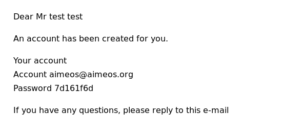
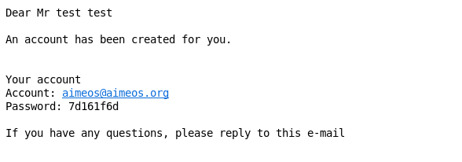
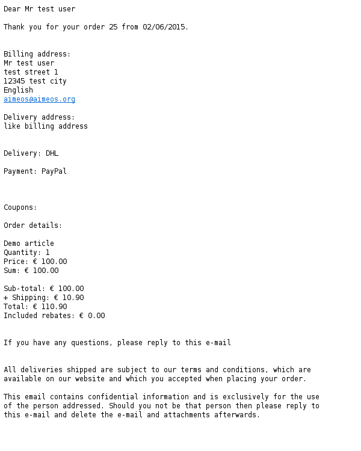
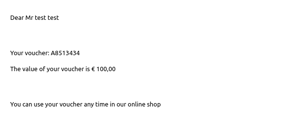
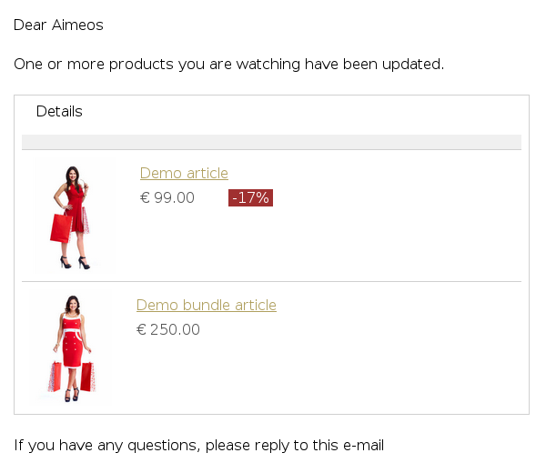
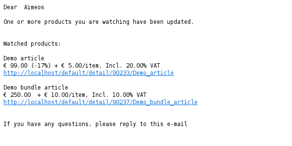

# Common

The Aimeos web shop can send out e-mails after for every payment and delivery status update which also includes the confirmation e-mail. Some configuration options listed in this section are very important for shop owners as you should configure at least the e-mail addresses!

The options that are shared and which you should keep an eye on:

client/html/email/logo
: Path to the logo image displayed in HTML e-mails

client/html/email/from-email
: E-Mail address used when sending e-mails

client/html/email/from-name
: Name used when sending e-mails

client/html/email/reply-email
: E-Mail address used by the customer when replying to e-mails

client/html/email/reply-name
: Recipient name displayed when the customer replies to e-mails

client/html/email/bcc-email
: E-Mail address all e-mails should be also sent to (can be used as notification of the shop owner)

# Account

Aimeos is able to create customer accounts after placing an order automatically. The customers will get an e-mail that contains the credentials for their new accounts created by the [customer/email/account job controller](../../config/controller-jobs/customer-email.md#account).

## Structure

Account e-mails consists of a [HTML](../../config/client-html/email-account.md#name) and a [text](../../config/client-html/email-account.md#name) part. They are sent in one e-mail as alternative views and the mail clients will display the one that is preferred by the customer.

## Templates

You can adapt the templates for the HTML/text account e-mails itself and the included sections by overwriting them in your own extension or configuring alternative template names:

* [Header template](../../config/client-html/email-account.md#template-header)
* [Body template](../../config/client-html/email-account.md#template-body)
* [HTML e-mail body](../../config/client-html/email-account.md#standard/standardtemplate-body)
* [Text e-mail body](../../config/client-html/email-account.md#standard/standardtemplate-body_1)

If you want to change the HTML structure of one of the templates, please have a look at the original versions to ensure that you don't loose essential functionality.

# Delivery

Delivery e-mails are sent out by the [order/email/delivery job](../../cronjobs/index.md) after the delivery status of an order has changed. The available [order delivery status values](https://github.com/aimeos/aimeos-core/blob/master/lib/mshoplib/src/MShop/Order/Item/Base.php) are :

* STAT_UNFINISHED (-1)
* STAT_DELETED (0)
* STAT_PENDING (1)
* STAT_PROGRESS (2)
* STAT_DISPATCHED (3)
* STAT_DELIVERED (4)
* STAT_LOST (5)
* STAT_REFUSED (6)
* STAT_RETURNED (7)

For each of these delivery status values you are able to send out an e-mail to the customers informing them about the delivery status change. For which status changes e-mails are sent is configured via the [controller/jobs/order/email/delivery/standard/status](../../config/controller-jobs/order-email.md#standardstatus) setting.

## E-Mail settings

Shop owners have the possibility to configure specific e-mail settings for the delivery e-mails that differ from the [common settings](#common). Each specific setting overwrites the correlated common setting for the delivery e-mails. The list of specific settings is:

[client-html/email-delivery/from-email](../../config/client-html/email-delivery.md#from-email)
: E-Mail address used when sending delivery e-mails

[client-html/email-delivery/from-name](../../config/client-html/email-delivery.md#from-name)
: Name used when sending delivery e-mails

[client-html/email-delivery/reply-email](../../config/client-html/email-delivery.md#reply-email)
: E-Mail address used by the customer when replying to delivery e-mails

[client-html/email-delivery/reply-name](../../config/client-html/email-delivery.md#reply-name)
: Recipient name displayed when the customer replies to delivery e-mails

[client-html/email-delivery/bcc-email](../../config/client-html/email-delivery.md#bcc-email)
: E-Mail address all delivery e-mails should be also sent to (can be used as notification for the shop owner)

## Structure

Delivery e-mails consists of an [HTML](../../config/client-html/email-delivery.md#name) and a [text](../../config/client-html/email-delivery.md#name_2) part. They are sent in one e-mail as alternative views and the mail clients will display the one that is preferred by the customer.

## Templates

You can adapt the templates for the HTML/text delivery e-mails itself and the included sections by overwriting them in your own extension or configuring alternative template names:

* [Header template](../../config/client-html/email-delivery.md#template-header)
* [Body template](../../config/client-html/email-delivery.md#template-body)
* [HTML e-mail body](../../config/client-html/email-delivery.md#standardtemplate-body)
* [Text e-mail body](../../config/client-html/email-delivery.md#standardtemplate-body_1)

If you want to change the HTML structure of one of the templates, please have a look at the original versions to ensure that you don't loose essential functionality.

# Payment

Payment e-mails are sent out by the [order/email/payment job](../../cronjobs/index.md) after the payment status of an order has changed. This is also used for the order confirmation e-mails which are sent when the payment status is "authorized" or "received". The available [order payment status values](https://github.com/aimeos/aimeos-core/blob/master/lib/mshoplib/src/MShop/Order/Item/Base.php) are :

* PAY_UNFINISHED (-1)
* PAY_DELETED (0)
* PAY_CANCELED (1)
* PAY_REFUSED (2)
* PAY_REFUND (3)
* PAY_PENDING (4)
* PAY_AUTHORIZED (5)
* PAY_RECEIVED (6)

For each of these payment status values you are able to send out an e-mail to the customers informing them about the payment status change. For which status changes e-mails are sent is configured via the [controller/jobs/order/email/payment/standard/status](../../config/controller-jobs/order-email.md#standardstatus_1) setting.

## E-Mail settings

Shop owners have the possibility to configure specific e-mail settings for the payment e-mails that differ from the [common settings](#common). Each specific setting overwrites the correlated common setting for the payment e-mails. The list of specific settings is:

* [client-html/email-payment/from-email](../../config/client-html/email-payment.md#from-email)
: E-Mail address used when sending payment e-mails

* [client-html/email-payment/from-name](../../config/client-html/email-payment.md#from-name)
: Name used when sending payment e-mails

* [client-html/email-payment/reply-email](../../config/client-html/email-payment.md#reply-email)
: E-Mail address used by the customer when replying to payment e-mails

* [client-html/email-payment/reply-name](../../config/client-html/email-payment.md#reply-name)
: Recipient name displayed when the customer replies to payment e-mails

* [client-html/email-payment/bcc-email](../../config/client-html/email-payment.md#bcc-email)
: E-Mail address all payment e-mails should be also sent to (can be used as notification for the shop owner)

## Structure

Payment e-mails consists of an [HTML](../../config/client-html/email-payment.md#name) and a [text](../../config/client-html/email-payment.md#name_3) part. They are sent in one e-mail as alternative views and the mail clients will display the one that is preferred by the customer.

## Templates

You can adapt the templates for the HTML/text payment e-mails itself and the included sections by overwriting the templates in your own extension or configuring alternative template names:

* [Header template](../../config/client-html/email-payment.md#template-header)
* [Body template](../../config/client-html/email-payment.md#template-body)
* [HTML e-mail body](../../config/client-html/email-payment.md#standardtemplate-body)
* [Text e-mail body](../../config/client-html/email-payment.md#standardtemplate-body_2)

If you want to change the HTML structure of one of the templates, please have a look at the original versions to ensure that you don't loose essential functionality.

# Subscription

When the product subscription of customer ends, either because the customer canceled the subscription or the payment failed, an e-mail is sent out by the [subscription/process/renew](../../cronjobs/index.md) or [subscription/process/end](../../cronjobs/index.md) job if the **Email** subscription processor is configured for [subscription renew](../../../config/controller-jobs/subscription-process/#decoratorsglobal_2) or [subscription end](../../../config/controller-jobs/subscription-process/#decoratorsglobal_1). More details about how to configure subscription processors are available in the [subscription processor docs](../../../cronjobs/subscription-processors/).

## E-Mail settings

Shop owners have the possibility to configure specific e-mail settings for the subscription e-mails that differ from the [common settings](#common). Each specific setting overwrites the correlated common setting for the subscription e-mails. The list of specific settings is:

[client-html/email-subscription/from-email](../../config/client-html/email-subscription.md#from-email)
: E-Mail address used when sending subscription e-mails

[client-html/email-subscription/from-name](../../config/client-html/email-subscription.md#from-name)
: Name used when sending subscription e-mails

[client-html/email-subscription/reply-email](../../config/client-html/email-subscription.md#reply-email)
: E-Mail address used by the customer when replying to subscription e-mails

[client-html/email-subscription/reply-name](../../config/client-html/email-subscription.md#reply-name)
: Recipient name displayed when the customer replies to subscription e-mails

[client-html/email-subscription/bcc-email](../../config/client-html/email-subscription.md#bcc-email)
: E-Mail address all subscription e-mails should be also sent to (can be used for debug purposes or to explicitly remove a common BCC e-mail address by setting it to NULL)

## Structure

Subscription e-mails consists of an [HTML](../../config/client-html/email-subscription.md#name) and a [text](../../config/client-html/email-subscription.md#name_2) part. They are sent in one e-mail as alternative views and the mail clients will display the one that is preferred by the customer.

## Templates

You can adapt the templates for the HTML/text subscription e-mails itself and the included sections by overwriting them in your own extension or configuring alternative template names:

* [Header template](../../config/client-html/email-subscription.md#template-header)
* [Body template](../../config/client-html/email-subscription.md#template-body)
* [HTML e-mail body](../../config/client-html/email-subscription.md#standardtemplate-body)
* [Text e-mail body](../../config/client-html/email-subscription.md#standardtemplate-body_1)

If you want to change the HTML structure of one of the templates, please have a look at the original versions to ensure that you don't loose essential functionality.

# Voucher

If a customer bought a voucher, the voucher e-mail including the coupon code is sent out by the [order/email/voucher job](../../cronjobs/index.md). For each bought voucher, one e-mail is sent to the delivery e-mail address (or the billing e-mail address if no delivery address is available).

## E-Mail settings

Shop owners have the possibility to configure specific e-mail settings for the voucher e-mails that differ from the [common settings](#common). Each specific setting overwrites the correlated common setting for the voucher e-mails. The list of specific settings is:

[client-html/email-voucher/from-email](../../config/client-html/email-voucher.md#from-email)
: E-Mail address used when sending voucher e-mails

[client-html/email-voucher/from-name](../../config/client-html/email-voucher.md#from-name)
: Name used when sending voucher e-mails

[client-html/email-voucher/reply-email](../../config/client-html/email-voucher.md#reply-email)
: E-Mail address used by the customer when replying to voucher e-mails

[client-html/email-voucher/reply-name](../../config/client-html/email-voucher.md#reply-name)
: Recipient name displayed when the customer replies to voucher e-mails

[client-html/email-voucher/bcc-email](../../config/client-html/email-voucher.md#bcc-email)
: E-Mail address all voucher e-mails should be also sent to (can be used for debug purposes or to explicitly remove a common BCC e-mail address by setting it to NULL)

## Structure

Voucher e-mails consists of an [HTML](../../config/client-html/email-voucher.md#name) and a [text](../../config/client-html/email-voucher.md#name_2) part. They are sent in one e-mail as alternative views and the mail clients will display the one that is preferred by the customer.

## Templates

You can adapt the templates for the HTML/text voucher e-mails itself and the included sections by overwriting them in your own extension or configuring alternative template names:

* [Header template](../../config/client-html/email-voucher.md#template-header)
* [Body template](../../config/client-html/email-voucher.md#template-body)
* [HTML e-mail body](../../config/client-html/email-voucher.md#standardtemplate-body)
* [Text e-mail body](../../config/client-html/email-voucher.md#standardtemplate-body_1)

If you want to change the HTML structure of one of the templates, please have a look at the original versions to ensure that you don't loose essential functionality.

# Product watch

Notification e-mails for watched products are sent out by the [customer/email/watch job](../../cronjobs/index.md) after the product was updated. This includes both, price and stock level updates.

## E-Mail settings

Shop owners have the possibility to configure specific e-mail settings for the product notification e-mails that differ from the [common settings](#common). Each specific setting overwrites the correlated common setting for the watch e-mails. The list of specific settings is:

[client-html/email-watch/from-email](../../config/client-html/email-watch.md#from-email)
: E-Mail address used when sending notification e-mails

[client-html/email-watch/from-name](../../config/client-html/email-watch.md#from-name)
: Name used when sending notification e-mails

[client-html/email-watch/reply-email](../../config/client-html/email-watch.md#reply-email)
: E-Mail address used by the customer when replying to notification e-mails

[client-html/email-watch/reply-name](../../config/client-html/email-watch.md#reply-name)
: Recipient name displayed when the customer replies to notification e-mails

[client-html/email-watch/bcc-email](../../config/client-html/email-watch.md#bcc-email)
: E-Mail address all notification e-mails should be also sent to (can be used for debug purposes or to explicitly remove a common BCC e-mail address by setting it to NULL)

## Structure

Product notification e-mails consists of an [HTML](../../config/client-html/email-watch.md#name) and a [text](../../config/client-html/email-watch.md#name_2) part. They are sent in one e-mail as alternative views and the mail clients will display the one that is preferred by the customer.

## Templates

You can adapt the templates for the HTML/text product notification e-mails itself and the included sections by overwriting them in your own extension or configuring alternative template names:

* [Header template](../../config/client-html/email-watch.md#template-header)
* [Body template](../../config/client-html/email-watch.md#template-body)
* [HTML e-mail body](../../config/client-html/email-watch.md#standardtemplate-body)
* [Text e-mail body](../../config/client-html/email-watch.md#standardtemplate-body_1)

If you want to change the HTML structure of one of the templates, please have a look at the original versions to ensure that you don't loose essential functionality.
