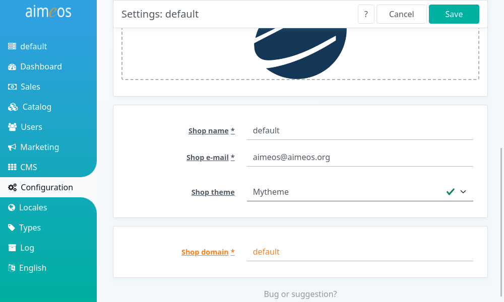

For Laravel, Aimeos offers a way to create distributable theme that you can offer as self-contained packages for download or installation via composer. These themes can be selected per site in the *Settings* panel of the Aimeos admin backend after installation:



# Create theme extension

To create a distributable theme, you must generate an extension for your theme first using the [Aimeos extension generator](https://aimeos.org/extensions). Choose "Laravel theme YYYY.x extension" where YYYY.x is the Aimeos version the theme is for, enter a name of your theme and click on "Download".

# Installation

## Composer installation

Installation via composer should be the preferred method as this ensures that everything works out of the box for everyone automatically. This requires that you distribute your theme package via one of the [repository types supported by composer](https://getcomposer.org/doc/05-repositories.md). Then, only change the package name in the `composer.json` and you or your users only need to run:

```
composer req <vendor>/<mytheme>
```

The name `<vendor>/<mytheme>` must be replaced with the name from the composer.json file of your theme package.

## Manual installation

For local installations only, you can add your theme package into the `./packages/` directory of your Laravel application.

* Create the directory for your theme by executing e.g. `mkdir -p packages/mytheme`
* Unzip the downloaded .zip theme package into that directory

Furthermore, you have to add a *repositories* section to the `composer.json` of your Laravel application which must contain these lines (replace "mytheme" with the name of your theme):

```json
    "repositories": {
        "mytheme": {
            "type": "path",
            "url": "packages/mytheme"
        }
    },
```

Finally, set up your theme using:

```
composer req aimeos-themes/<mytheme>
```

# Blade templates

For Laravel, the Aimeos package includes structural templates for each page which extend from the base layout to build e.g. a catalog list, a basket or checkout page. These [structural Blade template files](https://github.com/aimeos/aimeos-laravel/tree/master/src/views) are located in the `./views/` directory your theme package.

The `base.blade.php` template file is used by most templates and references the CSS and JS files of the theme. The `./catalog/list.blade.php` template uses the base template via `@extends('...')` and adds the output of the configured components to the sections defined in the `base.blade.php` layout template.

If you want change the structure and use a one column layout for your list page, you must adapt the `./ext/<extname>/views/catalog/list.blade.php` file of your *Laravel theme YYYY.x extension* you've created and change the `aimeos_nav` and `aimeos_body` sections like in this example:

```blade
@section('aimeos_nav')
@stop

@section('aimeos_body')
	<?= $aibody['catalog/filter'] ?>
	<?= $aibody['catalog/lists'] ?>
@stop
```

Afterwards, the categories, price, supplier and attribute filter will be shown above in the search result page.

!!! note
    For the pages displaying a category, you have to adapt the `./catalog/tree.blade.php` file too.

# HTML client templates

Most often, you don't need to change the structure of the HTML templates because you can rearrange the layout using CSS to a large degree. If your layout requires a different HTML structure, you can [overwrite the HTML client templates](../frontend/html/overwrite-templates.md) from the *ai-client-html* extension.

# CSS and JS files

The files located in the `client/html/themes/<mytheme>` directory of your Aimeos theme extension for Laravel are distributed within the package but are not used. Instead, the will be automatically copied to the `./public/vendor/shop/<mytheme>` directory of your Laravel application by the last `composer` command.

For development, you will change the files in the `./public/vendor/shop/<mytheme>` directory but for distributing them, you have to add them to the `./ext/<mytheme>/client/html/themes/<mytheme>` again and push their changes into the package repository.

For more information about how to adapt the CSS and JS theme files, please read the article for [creating themes](../frontend/html/create-themes.md).
