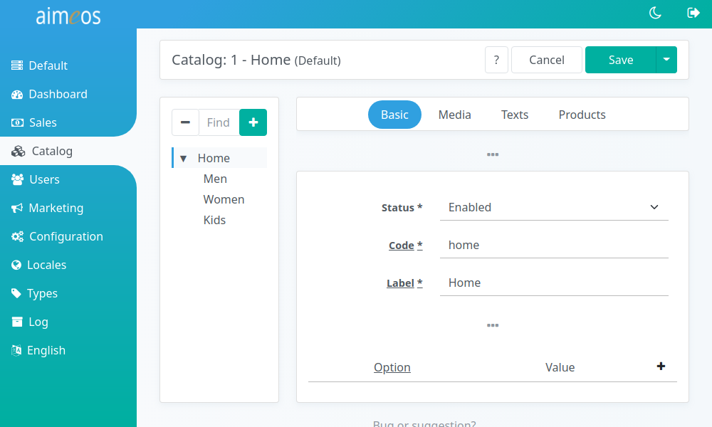
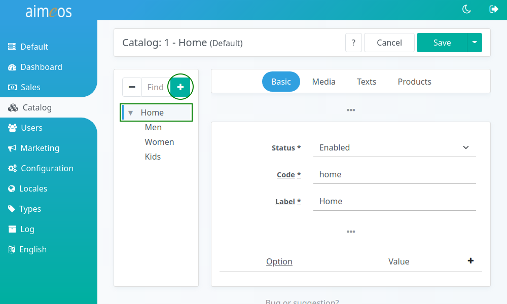
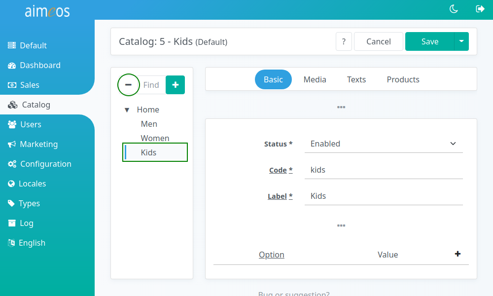
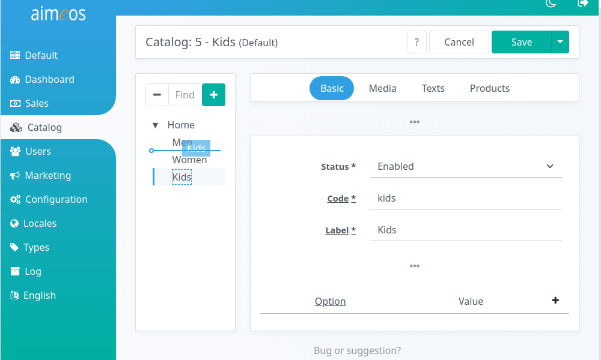

The catalog with its categories is a possibility to organize products in a hierarchical way. The category tree can consist of an unlimited number of categories and sub-categories where products can be associated to.

When you switch to the catalog panel, it displays the root node if there is one available. The little arrow at the left of each category button expands the sub-categories of the node if at least one exists.

# Create categories

If there is no root node available, you have to create one first by clicking on the "+" button in the menu bar above the category tree. This opens the [detail view](category-details.md) for a new category.

After the root node is created, you can add more nodes to the root node or to any other existing sub-node by using the "+" in the menu bar. In both cases, you have to select the node first which should be the parent for your new category.

# Delete categories

You can also delete categories if you've created them by accident or if you don't need them any more. Select the node and use the "-" button in the menu bar.

!!! warning
    Be careful when you delete categories which have sub-categories. They are deleted as well including all the product, text or media associations. The products, texts and media item itself remain in the database nevertheless.

# Move categories

Furthermore, it's possible to rearrange the category tree. Nodes (including its sub-nodes if there are any attached) can be reordered within the same category or moved to a different category.

Select the node you want to move, hold the left mouse button pressed and move the node to the new location. This can be a category for moving the node below that category or between two categories. Release the left mouse button when you've reached the right position to drop the node there.
