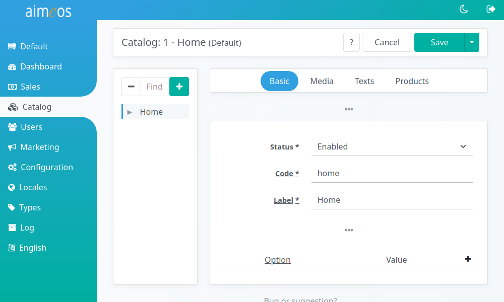
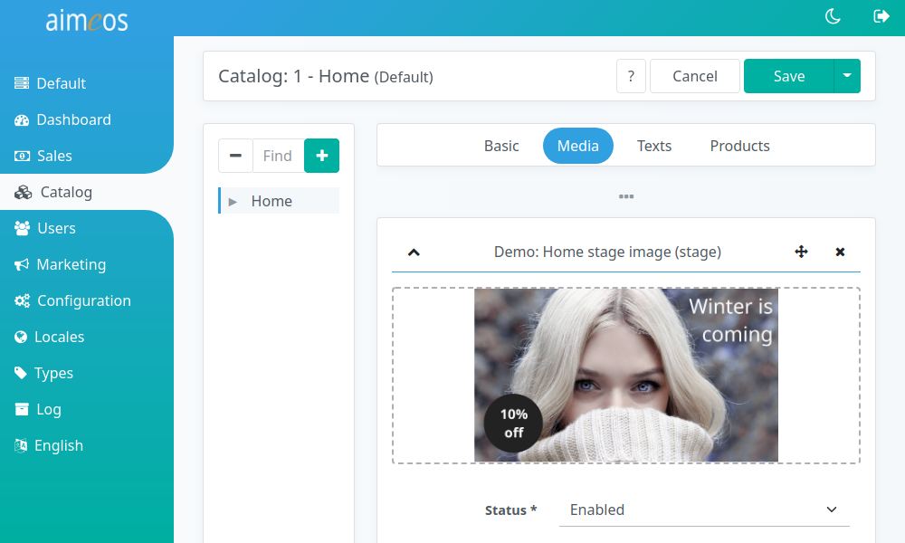
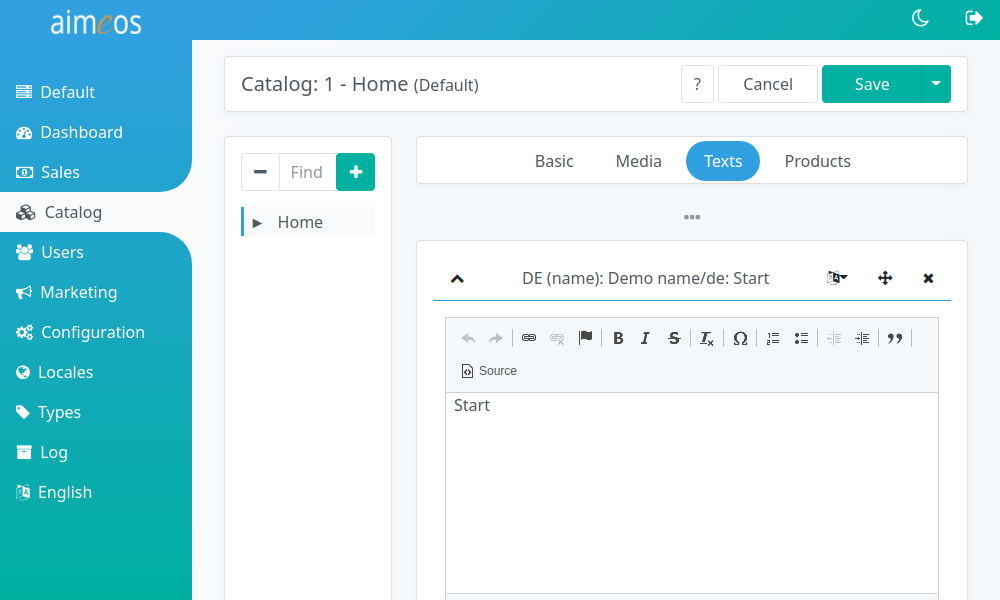
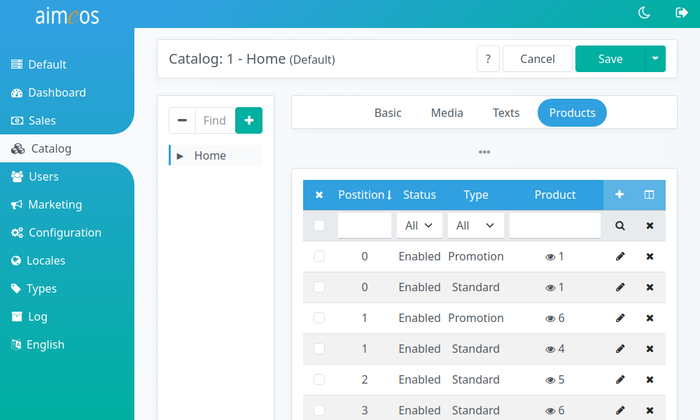

There are some input field in the detail view that are all directly related to the category you've added or you are going to edit. Their purposes are:

Status (required)
: Controls the visibility of the category in the frontend. There are several status values available but the category will only be shown in the frontend if the status is "enabled".

Code (required)
: Unique code of a category. As long as it's unique, this value is only relevant if you would like to automatically import categories.

Label (required)
: An internal label which helps you to identify the category. Usually, this is not used outside of the administration interface but if you don't add a translated name to that category, the label will be shown in the frontend.

URL segment (optional)
: The name of the category in the URL for SEO. If the field is left empty, it will be automatically filled after saving the category. For URL segments for different languages, you can add texts of type URL segment in the "Text" sub-panel

URL target (optional)
: A route name or page ID (depending on your host application) that the category should link to. This enables you to show different pages for single categories. **Caution:** If you enter something invalid, the frontend will show a "non-recoverable error occured" message!

Option/value (optional)
: A arbitrary list of key/value pairs that will be available in the category item in the frontend. You can use it for adding CSS classes that highlight the category in a special way

# Images

To add a new image, click on the blue "+" button for a new image item and then into the dotted area. Your browser will then enable you to select a file. It's name will be automatically added as image label. In case there are more image types available, you have to select one. If your image contains text or is specific to a language, you can choose the language it should be shown for in the frontend.

By default, the frontend will display images with these list types. If items with other types are shown depends on the frontend template:

Standard
: As part of the category head section for describing the category and its products together with the category name and some text

Stage
: Big category images displayed by the "catalog stage" component

The "Advanced" section of the panel offers additional settings for the image:

List type
: Second level type for e.g. grouping images or using it for different purposes

Start date
: The image will only be shown after that date/time, e.g. for seasonal images

End date
: The image will only be shown until that date/time

Option/value
: Pairs of data that will be available in the template

The "Advanced" section also contains a list of image properties. These can be any additional information about the image like copyright, year, etc. You can freely add new property types in the corresponding media property type panel.

# Texts

Each text can have a maximum of 64 thousand bytes which equals 16-64 thousand characters depending on the size of the UTF-8 characters you use. To be most compatible with all platforms/operating systems/browsers, use only UTF-8 encoding. Besides plain text, you can also use HTML code for special markup in the long text field but it's discouraged to do so.

To name and describe the category, you should add at least a name in each language. If other text types are shown depends on the implementation of the frontend. The meta keywords and meta description will be only visible to search engines and the meta description is shown as text in the result list of the search engine.

# Products

Products can be added by clicking on the "+" sign which is on the right side in the table header.

First you have to choose a product from the combo box where you can filter the products by typing the first characters of their label. Besides the status of the relation (enabled/disabled) and its type, you can also add a start and end date for products that should be only listed in the category for a limited time. The order of the associated products is determined by the position value and this is also used in the product list of the frontend.

You can also add option/value pairs to each category <> product relation that will be available in the template, e.g. a CSS class for different styling.

By default there are two list types for each entry in the left panel available:

Default
: This is the standard list type and should be used for regular products in the product list

Promotion
: Product associations with this list type are intended for product promotions on top of the product list
