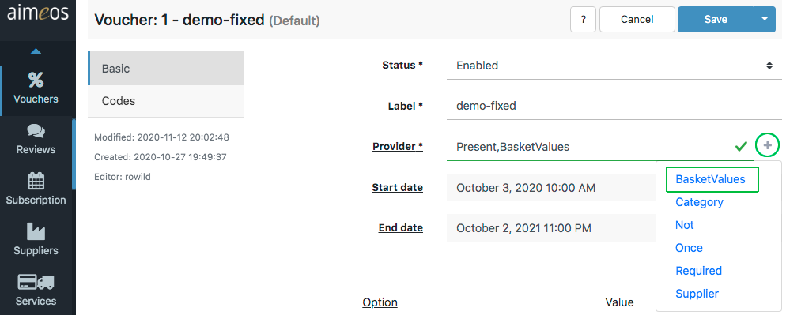
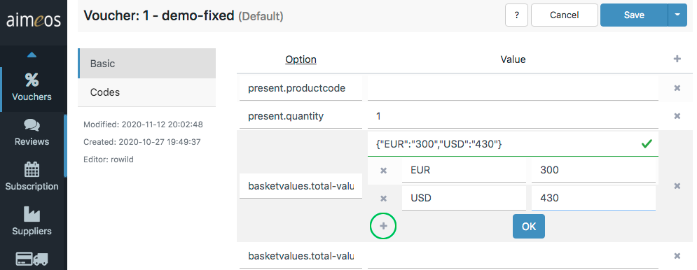

A decorator adds additional features to a coupon provider by adding additional configuration options. For example, if a fixed rebate should only be granted when the total basket value is above a certain limit, simply select and assign a specific decorator to the current coupon provider. All a decorator does is providing one or more specific rules that can be assembled with other decorator rules in various arrangments in order to create a distinctive *rule set* that extends a coupon provider's own configuration. The great advantage of decorators is that they can be reused in any combination with all coupons.

# Usage

Decorators are activated by adding them to the "Provider" input field in the detail view of a coupon item. The easiest way to do so is by clicking on the "+" icon next to the input field and selecting the desired decorator:



However, if you decide to enter the names of the decorators (and the provider) manually, please keep in mind that they are case-sensitive and must be separated by a comma!

**Example**: If a fixed rebate (provided by the "FixedRebate" coupon provider) is configured like this:

```
FixedRebate
```

the decorator checking for a lower limit of the basket (the "BasketValues" decorator) value must be added like this:

```
FixedRebate,BasketValues
```

If you would also like to restrict the coupon to the availability of a certain product in the basket, you also need the "Required" decorator:

```
FixedRebate,BasketValues,Required
```

The decorators are called from right to left, so in the given example the "Required" decorator would execute first, then the "BasketValues" decorator and finally the "FixedRebate" coupon provider. Therefore, it's a good idea to add decorators requiring less resources at the end of the input field and decorators using external sources just before the coupon provider.


# Built-in decorators

## BasketValues

Tests if the total value of the basket (including service costs for delivery and payment) is above or below the configured limits.

basketvalues.total-value-min (optional)
: The minimum value before the coupon has any effect. The format is a JSON encoded map of the currency ID and the value in x.xx format, e.g. *{"EUR":"1.00","USD":"1.00"}*
To easliy enter the desired values, click the "+" icon to open a convenient input form:


basketvalues.total-value-max (optional)
: The maximum value after the coupon has no effect any more. Same format as *basketvalues.total-value-min*.

## Category

Tests if at least one product from the configured category or categories is in the basket of the customer. The decorator is available since 2017.10.

category.code (required)
: The category code or a list of comma-separated category codes (e.g. home,men,shirts)

category.only (optional)
: Apply the discount only to the configured categories, not to the whole basket

## Once

Tests if a customer has already used the same coupon code in previous orders by checking their billing email address. If this is the case, the customer is informed about that and the coupon code has no effect. No further configuration is required. This decorator is available since 2017.10.

## Not

Negates the availability of the coupon depending on the previous decorators. It returns "true" for availability if the coupon shall not be available and false, if it would be available.

When adding this in the provider field:

```
PercentRebate,Category,Not
```

and configuring the "Category" decorator like this:

```
category.code : root
```

the coupon will be applied to the basket if the basket contains products *not* from the "root" category. The availabiliy is evaluated from left to right.

## Required

Tests if a certain product is in the basket of the customer.

required.productcode (required)
: The unique code of a product that must be in the basket before the action of the configured coupon is executed.

required.only (optional)
: Apply the discount only to the configured product, not to the whole basket

## Supplier

Restricts the coupons to a certain supplier that must have been selected by the customer in the delivery section of the checkout process. This is useful if you have several subsidaries in different locations.

supplier.code (required)
: Code of the required supplier
