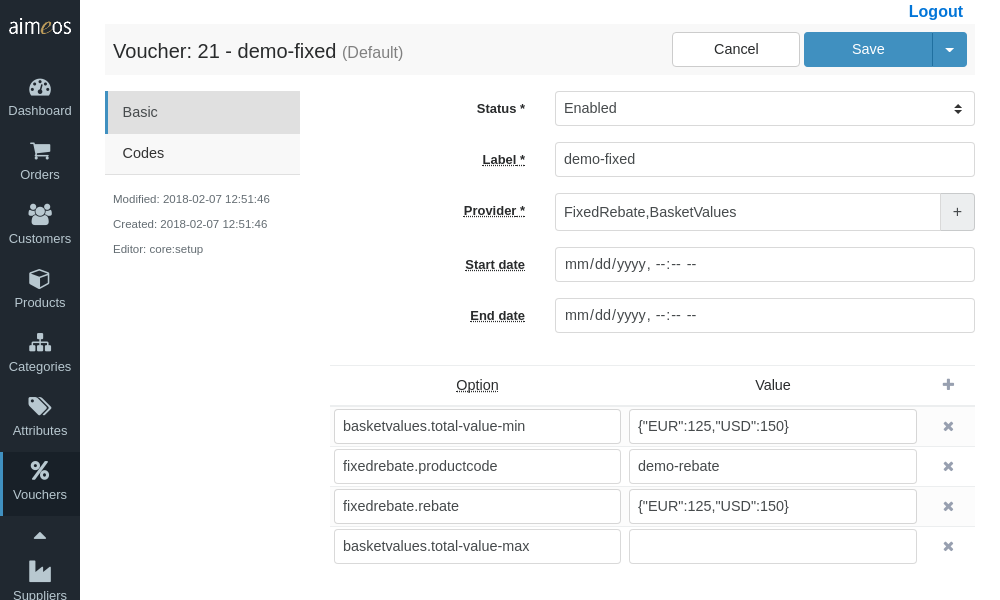
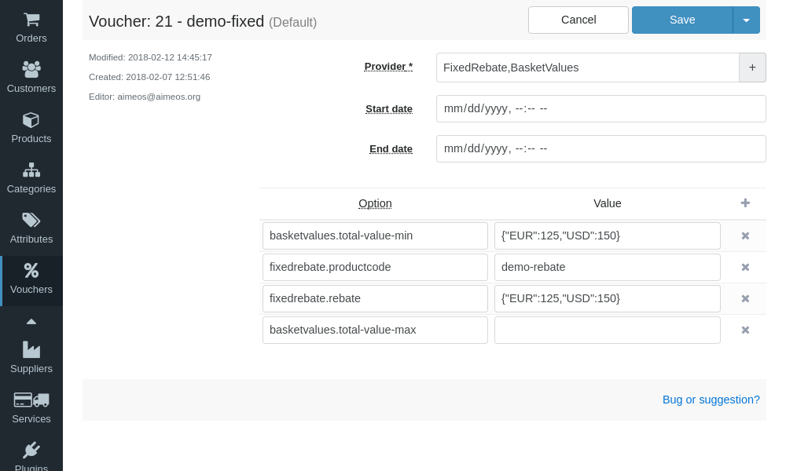
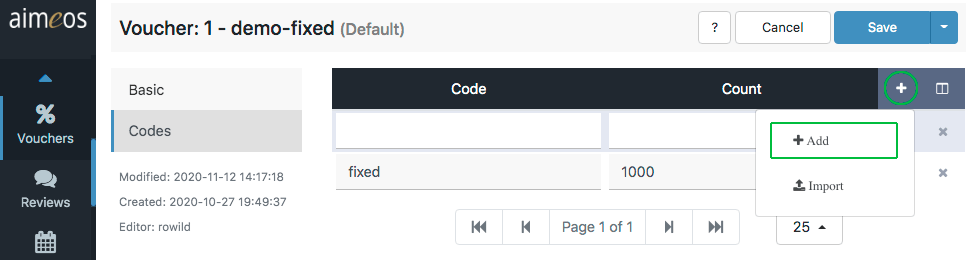
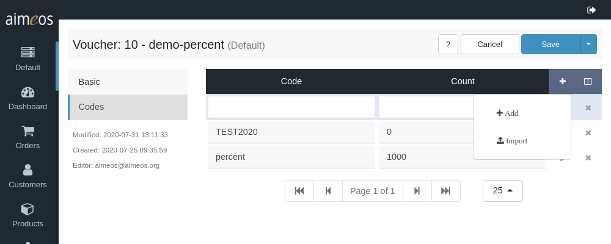

The Coupon detail view offers various select and input fields to configure a coupon:

Status (required)
: Controls the global availability of the configured coupon. There are several status values available but the coupon will only be used if the status is "enabled".

Label (required)
: An internal label which helps you to identify the coupon and which can be used for searching in the administration interface.

Provider (required)
: This field contains the case-sensitive coupon provider class name, e.g. "FixedRebate". A list of available providers is shown when you click into the input field. Selecting a provider adds it to the input field. Furthermore, each provider can be enhanced by one or more decorators, which can be choosen from the drop-down list that appears when the "+" symbol next to the input field is clicked. Selecting a decorator adds it sequentially to the provider or any other previously added decorator(s).  
For a detailed description of all the available coupon providers and decorators provided by the Aimeos core, have a look at [Available coupons](coupons.md) and [Adding features](coupon-decorators.md).

Start date (optional)
: The point in time when the coupon will be available for customers to enter their codes. The date/time value has to be in ISO format (YYYY-MM-DD HH:mm:ss) and the hours must be in the range of 0-23.

End date (optional)
: The point in time when the coupon won't be available any more. The same format rules apply as for "Start date".

!!! note
     Keep in mind that each decorator can bring along its own configuration setting(s). Therefore, depending on which decorator you activate and how many decorators you implement, the amount of configuration fields on the right site / in the lower section of the detail page will change (and therefore also differ from the screenshot shown above).

!!! hint
    To delete a decorator, select the provider from the list and re-assign the decorators you need again. A decorator's configuration field(s) will not be deleted right away, which might be helpful for testing purposes.

# Coupon configuration

The right side (or lower part) of the coupon detail view offers a panel, which presents a list of all the configurable options of a coupon provider and its assigned decorators. Whenever you add or remove a provider or a decorator, its respective configuration option(s) will be added to or removed from the list automatically.

The panel's left column is resevered for configuration keys, the right column for their values. At least the left column of each line must be filled with a valid key. You can add lines by clicking on the "Add" (+) button in the menu bar and delete selected lines via the respective "Delete" (x) button on a line's right side. The order of the lines doesn't matter.



Each coupon and each decorator needs its own configuration. For details about which configuration keys and values are available resp. required, refer to the documentation of the coupon or decorator. For more information about *Aimeos*'s built-in coupons, checkout the documentation about [Available coupons](coupons.md) and [Adding features](coupon-decorators.md).


# Coupon codes

You can add new coupons by clicking on the "+" symbol in the upper right corner of the list header, then on "Add" in the dropdown menu. Alternatively, you can import a file with coupon codes by choosing "Import" instead (see [CSV upload](#csv-upload) below for more information).



The available fields for coupon codes are:

Code (required)
: A coupon code that is unique in the shop site and is able to identify only the coupon configuration it is associated with. Good coupon codes are not too long and should avoid similar looking characters (e.g. the number zero and the capital letter "O", or the number 1 and the lower letter "l"). Please think twice before you really add codes with more than eight (random) characters! If a code should be generally available (e.g. a special sale for "Black Friday" in 2021), it would a good idea to create a descriptive code for your promotion (e.g. "Black-Friday-2021"). On the other hand, if there are lots of different codes and each code is meant to be for exactly one user only, they must be random enough so they can't be guessed.

Count (optional)
: The number of times the code can be redeemed. This can be "1" if only one customer should be able to do so or any other positive number. A value of zero disables the coupon code, and no value at all means that the code is available for an unlimited number of times.

Start date (optional)
: The point in time when this coupon code can be entered by the customer. The date/time value has to be in ISO format (YYYY-MM-DD HH:mm:ss), and the hours must be in the range of 0-23.

End date (optional)
: The point in time when the coupon code will expire. The same format rules apply as for "Start date".

## CSV upload

There is also the possibility to upload CSV files with coupon codes when clicking on the the "+" symbol in the upper right corner of the coupon code list.



The format of the data in the CSV file must be:

```
Code,Count,Start date,End date
TEST1,1,2020-01-01 00:00.00,2020-12-31 23:59:59
TEST2,1
TEST3
```

The first line contains the required keys *Code*, *Count*, *Start date* and *End date*, separated by a colon or semicolon only. All the following lines hold the various values for either of the keys. Only the first value for *Code* is required, all the others are optional. 

!!! warn
    Assigning no values at all also means no limitations at all in terms of the number of times a coupon code can be redeemed as well as its valid time period.

!!! note
    To import the uploaded file, the "Coupon code import CSV" (*coupon/import/csv/code*) job must be executed regularly by a cronjob.
