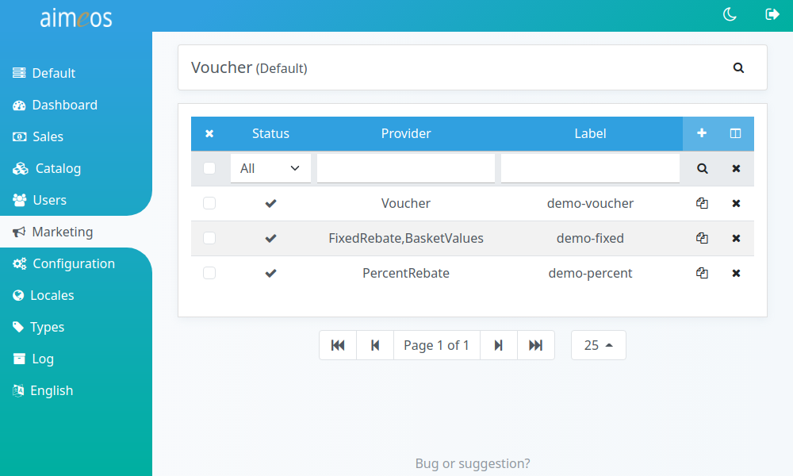
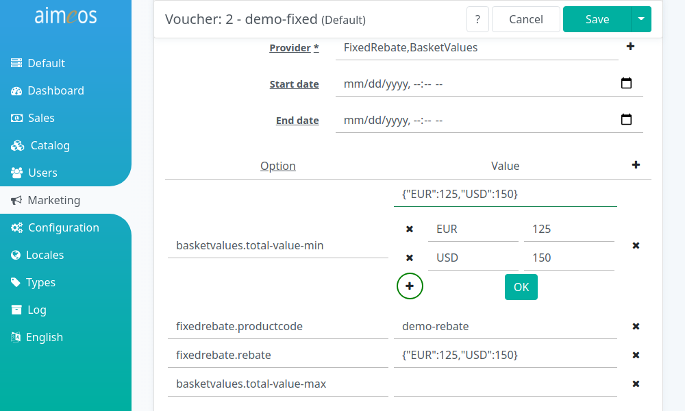

Coupon providers are classes that modify the content of the basket after a valid coupon code was entered by the customer. Possible actions are granting rebates, adding special products or reducing the shipping costs, but in principle coupon providers are able to change the basket in every way that can be implemented.

The codes are associated to one configured coupon provider, so different codes can be used for differently configured providers. The same provider can be configured and used twice, e.g. the first includes a rebate of 5€, the second a rebate of 10€. Depending on the entered code, either the provider with 5€ or 10€ is used.

The configured providers are also notified if the basket content changes because the customer added or deleted a product, has chosen a payment or delivery method or when another coupon is entered. They can then adapt the result of their previously performed action. By default only one coupon code can be entered by the customer, but this can be changed to any number by [setting the number of allowed codes](../../config/controller-frontend/basket/#couponallowed).

Coupon providers can be enhanced by [decorators](coupon-decorators.md) to add certain requirements for restricting coupons. If the requirements for the action aren't met, the coupon code is added to the basket nevertheless, and also stays in the basket. As soon as the basket content changes, the conditions are re-evaluated by the provider and the configured decorators.

# List of configured coupons

The "Coupon" list view provides a paged list of all configured coupons in the system, which can be [filtered](filtering-lists.md) by various criteria. The most important columns are shown by default but the list of columns can be adapted via the list header. Coupons can be added, edited or deleted either by using the shown buttons or by clicking on the list entry.

# Built-in coupon providers

## FreeShipping

Adds a [reduction product](products.md#Default-articles) to the basket of the customer that includes the negative delivery costs. For example, if the delivery costs are 5€, the product reducing the delivery costs would have service costs of -5€.

freeshipping.productcode (required)
: The unique code of the [discount product](products.md#Default-articles) that is used to add the negative delivery costs to the basket. As rebates are displayed like normal products, you can give them a descriptive name and add a picture in the same way as with a regular product.

## FixedRebate

Adds a [reduction product](products.md#Default-articles) to the basket of the customer with the configured rebate amount. For example, if the configured rebate is *{"EUR":"5.00"}*, a value of 5€ would be subtracted from the basket total regardless of the total value of the basket. Therefore, in this case, it's a good idea to configure a [minimum order value](plugins.md#BasketLimits), that is higher than the granted rebate, as well.

fixedrebate.productcode (required)
: The unique code of the [discount product](products.md#Default-articles) that is used to show the granted rebate in the basket. As rebates are displayed like normal products, you can give them a descriptive name and add a picture in the same way as with a regular product. **Caution:** This is *not* the product the rebate should be for!

fixedrebate.rebate (required)
: Rebate value in the currency the customers are using that should be granted if they enter a valid rebate code. The format of the value must be "x.xx" but the decimal point and two digits afterwards are optional. The value must not include a thousands separator or anything similar! It's possible to use different values for multiple currencies. To use 5.00 EUR and 7.00 USD insert *{"EUR":5.00,"USD":7.00}* as configuration value.

To enter value easily, click on the "+" icon to open an input dialog:

## PercentRebate

Adds a [reduction product](products.md#Default-articles) to the basket of the customer with the calculated rebate amount. For example, if the configured percentage is "10.00", a value of 7.50€ would be subtracted from the basket total if the value of all products in the basket is 75.00€. Service costs for delivery and payment are not included in the calculation.

percentrebate.productcode (required)
: The unique code of the [discount product](products.md#Default-articles) that is used to show the granted rebate in the basket. As rebates are displayed like normal products, you can give them a descriptive name and add a picture in the same way as with a regular product. **Caution:** This is *not* the product the rebate should be for!

percentrebate.rebate (required)
: Rebate value in the percent that should be granted if customers enter a valid rebate code. The format of the value must be "x.xx" but the decimal point and two digits afterwards are optional. The value must not include a thousand separator or anything similar nor the percent symbol!

## Present

Adds a [reduction product](products.md#Default-articles) to the basket of the customer. This is very much like a normal product but isn't associated to a category like rebate products so it can't be added by customers directly. Of course, you can also use a product that's available for all customers but in this case it doesn't make sense to enter a coupon code for the customers.

present.productcode (required)
: The unique code of the [present product](products.md#Default-articles) that is added to the basket. You can give present products a descriptive name and add a picture in the same way as with a regular product. Their prices don't have to be 0.00 if you only want to sell it cheaper.

present.quantity (required)
: The amount of products that should be added to the basket.

## Voucher

Adds a [reduction product](products.md#Default-articles) to the basket of the customer with the remaining voucher amount. For example, if the remaining voucher amount is "25.00", a value of 25€ would be subtracted from the basket total. If the total basket value is only 20€, 5€ will remain as the voucher value after the order.

voucher.productcode (required)
: The unique code of the [discount product](products.md#Default-articles) that is used to show the reduction in the basket. As reductions are displayed like normal products, you can give them a descriptive name and add a picture in the same way as with a regular product.
