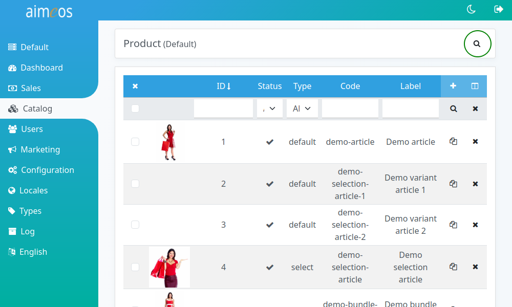
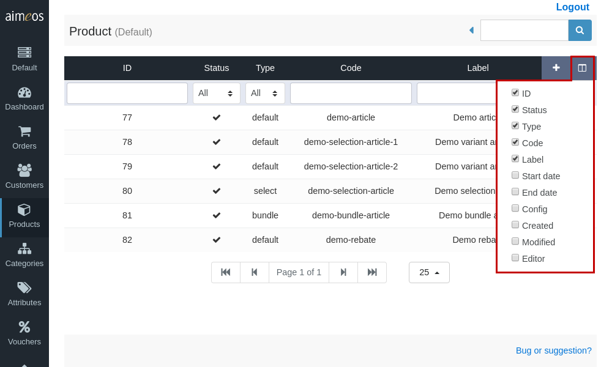

One of the main principles of interaction in the Aimeos administration interface is the concept of filtering list views. Almost all panels consist of a list view showing the records matching the selected filter criteria. By default, each panel has a standard filter matching all available records.

# Global filter

The global filter is located in the upper right corner of the page and is always visible even if you scroll down a long result list. By default, only the input field is shown and the most often used filter criteria is pre-selected. You can display the list of fields and the list of operators by clicking on the blue caret symbol left of the input field.

Its most important parts are the
* drop-down of the fields that can be filtered for
* drop-down of the compare operators
* input/select field for the value

Located next to the input field is the "Search" button that starts filtering the list.

# Fields to filter by

The drop-down containing the fields that you are able to filter depend on the panel which contains the filter toolbar (e.g. in the Product panel you can find product-related fields while in other panels different fields can be found).

There can be many fields in the list to filter, but the most important are always on the top. Fields that belong together are also grouped to find them more easily.

# Filter operators

The operators for filtering are dependent on the selected field and it's type. The available operators are:

equals
: String or number is exactly the same

starts with
: String starts with the given characters

contains
: String does contain the given characters

greater equals
: Number is greater or is the same

less equals
: Number is less than or is the same

greater
: Number is greater than the given value

less
: Number is less than the given value

before
: Date is before the selected day

after
: Date is after the selected day

# Filter toolbar

Additionally to the global filter at the top right of the page, you can also add or select a filter criterium for each colum directly. The filter criteria are applied as soon as you click on the magnifier symbol on the right side. The "X" symbol resets all filters to their default values.

# Paging toolbar

By default, only the first 25 records are shown in the list view even if more records are available. The paging toolbar shown at the bottom of the panel provides an easy way to navigate through the search result.

The paging toolbar consists of the
* button to the first page
* button to the previous page
* current page and total number of pages
* button to the next page
* button to the last page
* Drop-down for choosing the number of records per page

# Changing columns shown

The most important columns are shown by default in the list view, but often there are additional columns available. As the importance of certain information depends on how the application is used, it's not only possible to show additional columns but also to hide columns that are shown by default.

Each list header contains an icon in the upper right corner, where the shown columns can be changed. Clicking on the icon opens the list of available columns, from where you can select or deselect columns by clicking on their names or checkboxes. To apply the changes and show the new columns in the list, you have to click on the column icon again to close the drop-down menu and click on the search button below (magnifier symbol).

# Sorting columns

The columns in many list views are sortable by simply clicking on the column header. Reverse sorting is also possible by clicking on the column header again.
