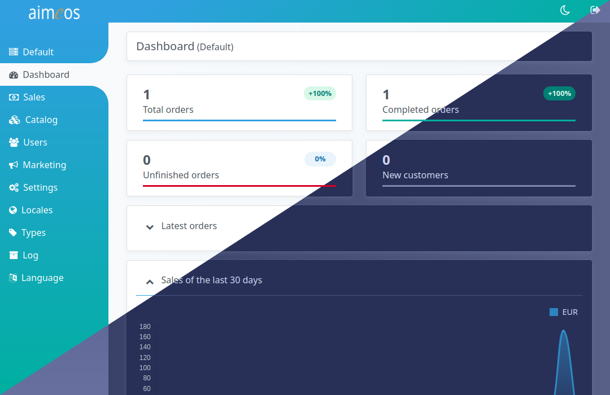

The Aimeos admin backend is the interface for managing products, categories and other data as well as configuring payment/delivery services or basket rules. It's the central place for managing the database content.

How to log into the admin backend depends on your application:

* Laravel : http://yourdomain.tld/admin
* Symfony : http://yourdomain.tld/admin
* TYPO3 : http://yourdomain.tld/typo3

In TYPO3, the backend contains much more than just the Aimeos admin interface. Have a look in the left navigation bar for the *Aimeos Shop* entry.

After login, you will see the dashboard including the latest orders and some graphs related to sales, orders and other reports. It's the starting point to get an overview of what has happend in the last days or weeks.

The navigation at the left contains the available panels for everyday use:

Clicking on each icon will open the panel or shows a list of available panels.