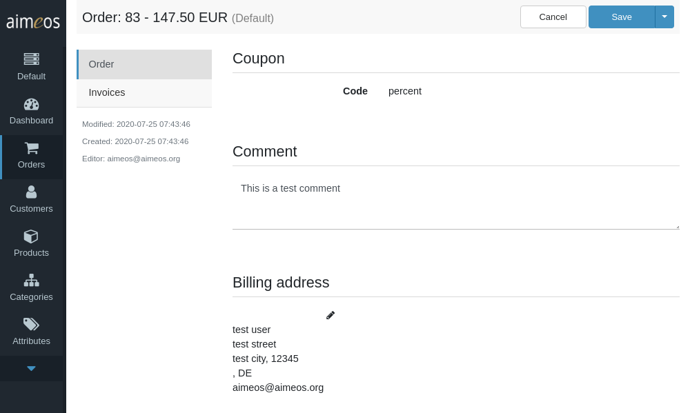
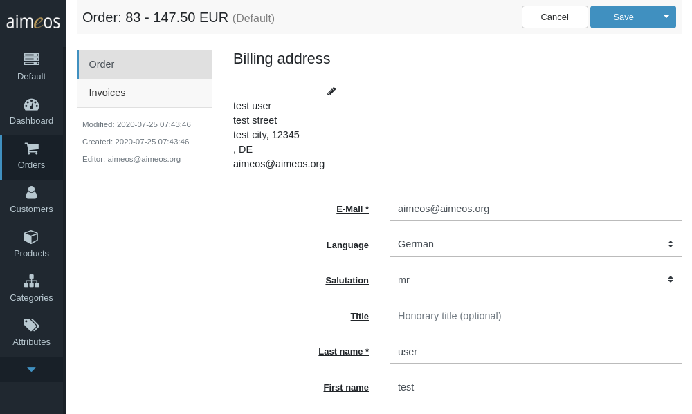
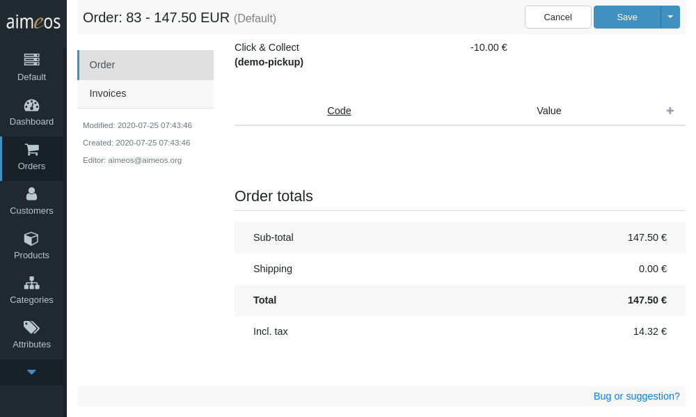

After creating the products and setting up the other parts of the system, customers should now be able to order your products. The order panel is the place where existing orders can be viewed or status values, addresses and service data be managed. The order panel does NOT allow you to delete orders and change the ordered products other than setting new status values. This is for traceability and to comply with laws of most countries.

# List of all orders

The list view provides a paged list of all available orders, which can be [filtered](filtering-lists.md) by various, order-related criteria. The most important columns are shown by default but the list of columns can be adapted via the list header. Orders can be edited by clicking on the list item.

You can also export all orders that match the current search filter by clicking on the download symbol in the right corner of the list header. This will create an export job that is executed by a cron job and the order export will be available afterwards in the dashboard view. If you've added no restrictions in the [filter toolbar](filtering-lists.md), all orders of all pages will be exported.

The format of the export can be configured using the [controller/jobs/order/export/csv/mapping](../config/controller-jobs/order-export.md#mapping)

!!! note
    To generate the order export file, you have to execute the "Order export CSV" (*order/export/csv*) job by a cronjob regularly.

# Order details

The orders created by the Aimeos e-commerce framework are split into two areas:

* order details
* invoice data

The difference is that an order can have several invoices, e.g. if orders have to be split or if customers are able to order the same products again with one click.

On top of the order detail view some general order information is listed:

Site (read-only)
: Code of the site the order was created in. If you have only one shop, this is usually "default", the codes for other sites depends on what was entered when the site was created.

Language
: The language that is used within the order. For e-mails sent to the customers, the language field in their addresses has priority if available

Customer ID (read-only)
: Unique ID of the customer if he has created a permanent account in the shop.

Customer
: To assign an order to a (different) customer, you can use the combobox to find the new customer by his e-mail address

Customer reference
: Arbitrary string customers uses to identify their orders in their systems (often used for B2B sales)

## Products

The "Products" section contains the products that were bought by the customer in this order. Only the delivery status of the products can be changed.

The shown columns contain these data:

Renew
: Turns an ordered product into a subscription

Status
: Delivery status of the ordered product. This can be different from the delivery status in the invoice

Name (read-only)
: Product name in the language of the customer. Listed below are the chosen variant attributes and options by the customer. The last line contains the product code to uniquely identify the product article

Quantity (read-only)
: Number of products bought by the customers

Price (read-only)
: Price for one product + shipping costs per product - granted rebates

Sum (read-only)
: Same information as in the price column but multiplied by the quantity

## Coupon/Comment

Below the list of ordered products are the redeemed coupons. This can be more than one if it's allowed by configuration. The coupon codes can't be changed because this could affect the whole order.

The comment field contains the text the customer has entered at the end of the checkout process. This text can be modified and also used to add arbitrary information to the order. Keep in mind that the customer will be able to see that information because it's also shown in the account history of the customer and sent in the e-mails to the customer.

## Addresses

The content of the "Addresses" section is split into the billing address (left) and the delivery address (right, only if entered by the customer). The billing address is always available while the delivery address is only available if the customer entered a different one than the billing address. By clicking on the address, fields for changing the address details are shown below.

The displayed fields of each address are:

E-Mail
: Electronic mail address of the customer. This is required by most shops as it's used for sending confirmation e-mails.

Language
: The lanuage used in the e-mails.

Salutation (read-only)
: The standard salutation values are "mr" (Mister, male), "mrs" (Misses, female), "ms" (Miss, female) and "company" (organization, no gender). If the field is empty, the salutation is unknown.

Title :
Any official titles like "PhD", etc. This field is usually optional in the front-end.

First name
: The first name of the customer. This field might also be used for first and middle name.

Last name
: The last name of the customer. This field might contain the whole name for names that does not fit into the first/last name schema

Street
: In the western hemisphere this is usually the street name.

House number
: In the western hemisphere this can be used for the house number.

Floor / Apartment
: This might be used for house names, floor number or any other additional information. This field is usually optional in the front-end.

Postal code
: Postal identification for the place the customer lives. This might be empty for areas that don't use this.

City
: City, town or village name the customer lives in.

State
: Used in countries that are divided into sub-areas like federal states.

Country
: Two letter ISO country code the customer lives in.

Telephone
: Telephone number of the customer. This field is usually optional in the front-end.

Facsimile
: Telefax number of the customer. This field is usually left out in the front-end as facsimile numbers are not that important anymore.

Website
: URL of the website if the customer entered one. This field is usually not asked for.

Company
: Name of the company the customer orders for. This field is usually optional in the front-end.

VAT ID
: Business tax identifier of the company

## Payment/Delivery

The "Payment" and "Delivery" sections of the order detail view contains the details about the payment and delivery option chosen by the customer.

The listed information is:

Name (read-only)
: Name of the payment/delivery option in the language of the customer.

Code (read-only)
: Unique code of the payment/delivery service. This is the code of the configured service item and can be anything to help the shop owner to identify how the parcel should be delivered to the customer.

Price (read-only)
: Price for the payment or the shipping.

Below is the list of payment or delivery attributes shown which either have been selected/entered by the customer for this payment/delivery service or the information added by the payment/delivery service provider for further reference. It contains an extensible list of code/value pairs:

Code
: Unique code of the payment/delivery attribute.

Value
: Value or values of the payment/delivery attribute.

You can add new lines by clicking on the "+" symbol in the list header and remove existing lines with the "X" symbol.

## Summary

In the summary section, the sub-total of all ordered products is displayed. This includes granted rebates. The shipping costs (and payment costs if there are any) are printed below before the order total is summed up. The included tax (or additional one in B2B mode) is listed separately just as the value of the included rebates.

# Invoices

The invoice sub-panel contains information about the invoices related to that order. To change any value of the invoice data, you have to click on the pencil icon on the right first.

Their purposes are:

ID (read-only)
: Unique invoice ID. This value is generated automatically.

Type
: If you have different channels besides the web interface like a call center using a different application, this contains where the order comes from. Its value depends on what the application sets during the order process.

Payment (read-only)
: The date and time when the payment status of the order was first set to anything else than "unfinished".

Payment status
: Last payment status of the order. This can be changed manually or by automated processes.

Delivery
: The date and time when the order was shipped to the customer. Usually, it's the date when the parcel was handed over to the logistic partner.

Delivery status
: Last delivery status of the order. This can be changed manually or by automated processes.

Related ID
: Another invoice ID as reference If this invoice is related to another one

Created (read-only)
: Date and time when the entry was added. This value is set automatically.

Modified (read-only)
: Last date and time when the entry was edited last time. This value is set automatically.

Editor (read-only)
: Last user who added or modified the entry. This value is set automatically.

The available payment status values are:

* unfinished : Still unfinished
* deleted : Deleted by the shop owner
* canceled : Canceled by the customer
* refused : Refused by the payment provider
* refund : Refund by the shop owner
* pending : Waiting on the payment
* authorized : Shop owner is authorized to get the money from the customer
* received : Money received by the shop owner

The available delivery status values are:

* unfinished : Still unfinished
* deleted : Deleted by the shop owner
* pending : Waiting for further actions
* progress : Delivery is in progress (internally)
* dispatched : Parcel was handed over to the logistic partner
* delivered : Customer received the parcel
* lost : Parcel is lost on the way to the customer
* refused : Parcel was refused by the customer
* returned : Parcel was returned to the shop owner
