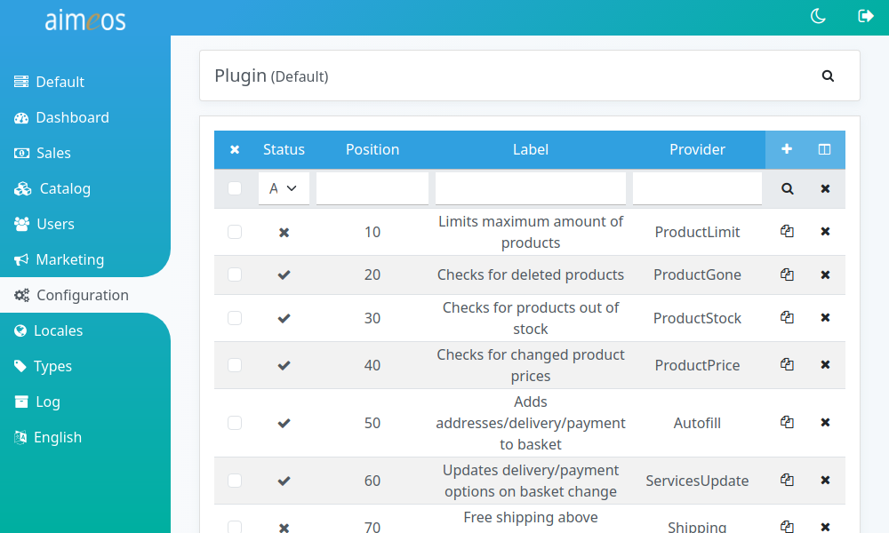

A plug-in in the Aimeos e-commerce framework is a class that registers itself at the basket for certain events. The events can be e.g. when a product is added or deleted, the delivery or payment option is set or the basket is going to be ordered. In each case the plug-ins that have been registered for the event are notified and are then able to react on this event. The plug-ins can for example change the shipping costs, add sample products or check the minimum order value. Plug-ins are a very flexible way to enforce any rules that can be implemented in an algorithm.


# List of configured plug-ins

The "Plugin" list view provides a paged list of all configured plug-ins in the system. The most important columns are shown by default but the list of columns can be adapted via the list header. Plug-in configurations can be added, edited or deleted. A click on the name opens the detail view for editing the plug-in configuration.



Currently, the following plug-ins are configured by default:

* ServicesUpdate
* Autofill
* AddressAvailable
* ServicesAvailable
* ProductGone
* ProductPrice
* Coupon
* ProductStock


# Built-in plug-ins

## AddressAvailable

Checks if billing and delivery addresses are available. You can enforce or prevent the usage of each address type separately. This is checked before the customer wants to place the order.

payment (optional)
: A value of "1" enforces the billing address, "0" prevents a billing address. If you don't set the configuration option, a customer can enter a billing address but it's not required

delivery (optional)
: A value of "1" enforces the delivery address, "0" prevents a delivery address. If you don't set the configuration option, a customer can enter a delivery address but it's not required


## Autofill

Adds delivery and payment options automatically as well as addresses of logged in users when they add a product to the basket.

autofill.useorder (optional, default=1)
: Uses the last order of the customer to add the addresses and the payment/delivery options from that order. A value of "1" or no configuration enables this behaviour, "0" disables it.

autofill.orderaddress (optional, default=1)
: Adds the entered addresses from the last order of the customer. A value of "1" or no configuration enables this behaviour, "0" disables it.

autofill.orderservice (optional, default=1)
: Adds the chosen delivery and payment option from the last order of the customer. A value of "1" or no configuration enables this behaviour, "0" disables it.

autofill.delivery (optional, default=0)
: Adds the first option from the list of delivery options to the basket. A value of "1" enables this behaviour, "0" or no configuration disables it. Make sure your delivery options use unique positions to get reproducible results!

autofill.payment (optional, default=0)
: Adds the first option from the list of payment options to the basket. A value of "1" enables this behaviour, "0" or no configuration disables it. Make sure your payment options use unique positions to get reproducible results!


## BasketLimits

Checks if the basket contains a minimum value and/or a minimum amount of products. This rule is applied before the customer can enter the checkout process.

min-products (optional)
: Minimum quantity of products that must be in the basket. The limit can be reached by different products or by only one product that is ordered with the required quantity. A positive integer value starting from 1

max-products (optional)
: Maximum quantity of products that can be in the basket. The limit can be reached by different products or by only one product that is ordered with the required quantity. A positive integer value starting from 1

min-value (optional)
: The minimum value before the basket can be ordered. The format is a JSON encoded map of the currency ID and the value in x.xx format, e.g. {"EUR":"1.00","USD":"1.00"}

max-value (optional)
: The maximum value until the basket can be ordered. The format is a JSON encoded map of the currency ID and the value in x.xx format, e.g. {"EUR":"1.00","USD":"1.00"}


## Coupon

Activating this plug-in ensures that actions of coupon providers are not only executed when customers enter their code. Instead, the coupon provider will update the basket every time the basket content changes. This also means that coupons will be removed again if their requirements aren't met any more. Please have a look at the coupon decorators if you want to define one or more requirements for a coupon.


## FreeProduct

Adds the configured subscription product to the basket for free. Sets the price of the configured product to 0.00 and uses it's price as rebate for the configured number of times. This is bound to the e-mail address of the customer.

productcode (required)
: SKU code of the product that should be available for free

count (required)
: Number of times the product is available for free


## ProductFreeOptions

Defines the number of the free "config" attributes for products with configurable options. If customers can configure products using several options they can add and each option must be paid additionally, this plugin recalculates the total product price based on the added options.

The configuration can be several entries in the format:
```
<attribute type code> : <number of free configurable attributes>
```

If salad bowls are sold and customers can choose one or more toppings ("meat", "cheese" and "dressing" attribute types) but one of them is for free, the example configuration would be:
```
meat : 1
cheese : 1
dressing : 1
```
Customers chosing one type of meat, cheese and dressing only have to pay the standard price. If a customer wants two types of meat, he gets the cheapest for free and has to pay the second one in addition.


## ProductGone

This plug-in checks if the products the customer would like to order are still available (or have been removed from the list of sold articles in the meantime). If not, the customer is asked to remove them from the basket before he can finish the order. This plug-in is applied in the basket and at the end of the checkout process. It doesn't have any options.


## ProductLimit

Product related limits that can be ordered. This rule is applied when a product is added to the basket.

single-number-max (optional)
: The maximum quantity that is allowed per product. A positive integer number starting from 1

total-number-max (optional)
: The maximum allowed quantity of all products in the basket. A positive integer number starting from 1

single-value-max (optional)
: The maximum order value per product. A positive price value whose format must be x.xx

total-value-max (optional)
: The maximum order value of all products in the basket. A positive price value whose format must be x.xx


## ProductPrice

The plug-in checks if the price of the products the customer would like to order have changed. If this is the case, the customer is informed about the price update in his basket. This plug-in is applied in the basket and at the end of the checkout process. It doesn't have any options.

warn (optional, default=0)
: Display a hint to the customer that the price of a product has been changed

ignore-modified (optional, default=1)
: Ignore order items with a modified price, e.g. by another plugin


## ProductStock

It checks if the products the customer would like to order are still in stock. If not, the customer is asked to remove them from the basket before he can finish the order. This plug-in is applied in the basket and at the end of the checkout process. It doesn't have any options.


## PropertyAdd

Adds product properties to an order product as attributes. This is extremely helpful if product properties are required during the checkout process or by 3rd party systems.

types (required)
: JSON list of product property types whose values should be added to the ordered product

Example:
```
["package-length", "package-width", "package-height", "package-weight"]
```

This would add all product package dimensions and the weight to the ordered product so the shipping costs can be calculated during the checkout process.


## PropertyMatch

Checks if the product which should be added to the basket has the configured product property value. Products can be only added to the basket if they contain the required product properties. Otherwise, the customer is notified that the product can't be ordered.

values (required)
: JSON map of product property types and values

Example:
```
{"mytype": "myvalue"}
```

This would require that the product has a property type "mytype" with the value "myvalue".


## ServicesAvailable

Checks if a delivery or payment service was chosen by the customer. You can enforce or prevent the usage of each service type separately. This is checked before the customer wants to place the order.

payment (optional)
: A value of "1" enforces a payment service, "0" prevents adding a payment service. If you don't set the configuration option, a customer can select a payment service but it's not required

delivery (optional)
: A value of "1" enforces a delivery service, "0" prevents adding a delivery service. If you don't set the configuration option, a customer can select a delivery service but it's not required


## ServicesUpdate

Updates the price of delivery and payment options in the basket if the content of the basket changes. This plugin doesn't require any configuration.


## Shipping

Sets the shipping costs to 0.00 if the basket value (including granted rebates) is equal or greater than the configured value. The shipping costs are added to the rebate value in this case.

threshold (required)
: The minimum value to grant the free shipping for. The format is a JSON encoded map of the currency ID and the value in x.xx format, e.g. {"EUR":"1.00","USD":"1.50"}

## Taxrates

Sets the tax rate of products depending on the country. Shops selling into several states/countries with different tax rates can use this plugin to set a different tax rate for all price items for that countries.

country-taxrates (optional)
: Tax rate for each two letter ISO country code

state-taxrates (optional)
: Tax rate for each two letter state code

To use the tax rate of the EU country the customer is from, use this configuration:
```
country-taxrates : {"AT":"20","BE":"21","BG":"20","CY":"19","CZ":"21","DE":"19","DK":"25","EE":"20","EL":"24","ES":"21","FI":"24","FR":"20","HR":"25","HU":"27","IE":"23","IT":"22","LT":"21","LU":"17","LV":"21","MT":"18","NL":"21","PL":"23","PT":"23","RO":"19","SE":"25","SI":"22","SK":"20"}
```
