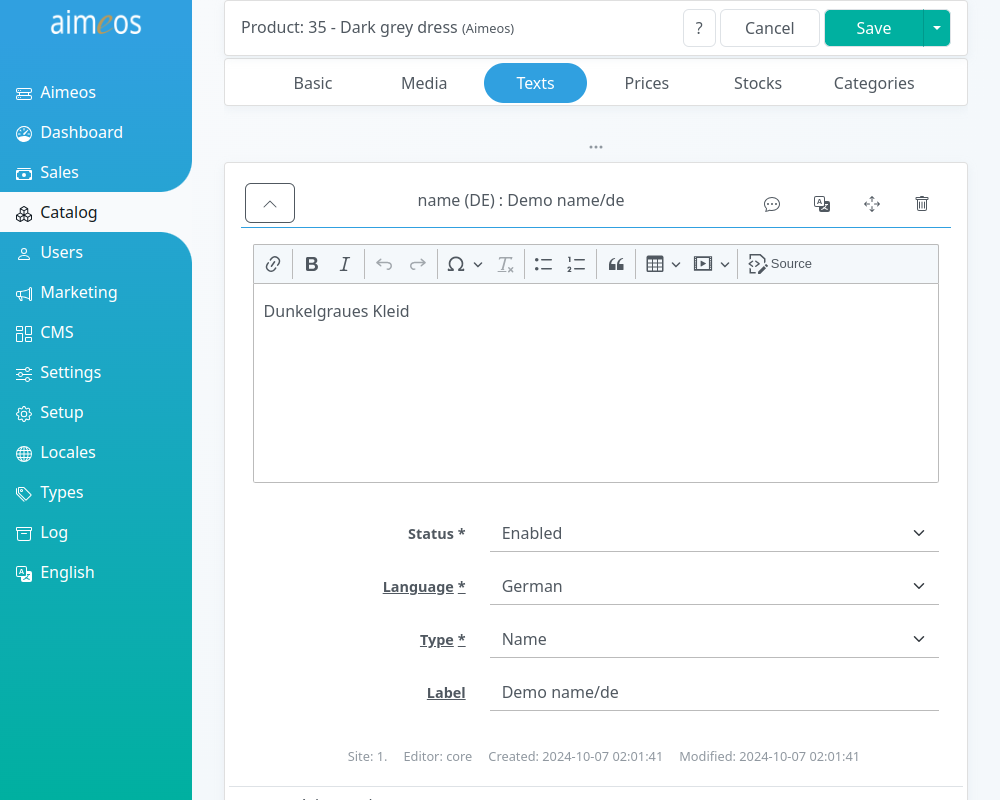

There are many select and input fields in the left section of the detail view that are all directly related to the product you are adding or you are going to modify. Some of them are hidden by default and can be shown by clicking on the three dots (...) below the last shown field. This applies also to the navigation where only a subset of the available tabs is shown by default.

The purpose of the available fields are:

Dataset (optional)
: List of pre-configured data sets to simplify creating new products for editors

Status (required)
: Controls the global visibility of the product. There are several status values available but the product will only be shown in the frontend if the status is "enabled"

Type (required)
: Product type, which can be a "Default" article (a single, self-contained article), "Selection" (a product where the customer can buy one of the sub-products), "Bundle" (a collection of products with a special price when bought in this combination), "Event" for time limited products and "Voucher" (a gift certificate that will generate a coupon code with the bought value)

SKU (required)
: Unique code/SKU of a product, either something official like an EAN code or code of your own

Label (required)
: An internal label which helps you to identify the product and which can be used for searching in the adminstration interface. Usually, this is not used outside of the administration interface but if you don't add a translated name to that product, the label will be shown in the frontend

URL segment (optional)
: Name of the product in the URL for SEO. The value is automatically inserted after saving if the field is left empty. For URL segments in different languages, texts of type "URL segment" can be added in the text sub-panel

Quantity scale (optional)
: Allows ordering products with fractional quantities. The value is the steps allowed for quantities in the basket, e.g. "0.1" for fractional quantities of 1/10th or "5" for multiple of five articles

Available from (optional)
: The point in time when the product will be shown in the shop can be configured via this field. The date/time has to be in ISO format (YYYY-MM-DD HH:mm:ss) and the hours must be in the range of 0-23. Even if it's possible to enter or choose not only a date but also hours, minutes or even seconds, it may not be the exact time when the product will first show up in the frontend due to caching

Created (optional)
: Custom date when the article has been created. It will be used when sorting the product lists by "Latest" and is handy for publishing dates like for books

Available until (optional)
: The point in time when the product won't be shown in the shop any more. For this field the same things apply as for "Available from"

Target (optional)
: Route name or page ID the product list view should link to for the detail page. This allows to you use different detail pages for some of your products. Use only if you know what your are doing because otherwise, this will cause an error in the frontend!

Option/Value (optional)
: Arbitrary list of key/value pairs that will be available with each product item in the frontend. It can be used to assign CSS classes for e.g. displaying a "new" or "sale" badge

# Media/Images

Media items can be files of any type, from pictures over documents to audio files. Anything that can be stored in a file can be used in an (multi) media item. By default, the frontend will only display pictures with a type and list type of "Standard". Items with other list types may be shown as download links.

There should be at least one picture showing the product. The best size of that picture is 240px in length and 320px in height if the default size is used in the frontend. If you upload larger images, they can be scaled down if you configure that, smaller images keep their size (depending on the configuration in controller/common/media/* configuration). If you need other sizes in the frontend later, you can rescale all product images using the media/scale job controller). It should be in JPEG, PNG or GIF to make sure it can be displayed on all platforms.

If you are able to provide more pictures of the product, they will be displayed as thumbnails in the detail view

Status (required)
: Controls the visibility of the image or media file. There are several status values available but the image will only be shown in the frontend if the status is "enabled".

Type (required)
: Media type, by default "Standard" for images that are shown in the product list and details views. You can add more types if you need different kinds of images/media files but you have to adapt the frontend templates yourself to display them.

Label (required)
: An internal label which helps you to identify the image/media file. Usually, this is not used outside of the administration interface but can be shown as image title in the frontend.

Language (optional)
: If an image contains texts in a specific language or should be only shown if users selected a specific language in the frontend, you can assign a language to that file. By default, the files will be shown for all languages.

Each image/media item contains an "Advanced" sub-section which allows you to configure things that are normally not required:

List type (required)
: Second level type for building sub-groups of images/media files. By default, "Standard" is used but you can create more list types for different purposes.

Start date (optional)
: Date and time when the image/media file will be shown in the frontend.

End date (optional)
: Date and time until the image/media file will be shown in the frontend.

Option/Value (optional)
: Arbitrary list of key/value pairs that will be available with each image/media item in the frontend

In the media properties list, you can add more data about the image, like copyright information, year of the image, etc. You can create arbitrary media property types if necessary in the corresponding type panel. Each media property can be language specific or valid for all languages. It depends on the frontend template if that properties are displayed or not.

# Texts

Each text can have a maximum of 64 thousand bytes which equals 16-64 thousand characters depending on the size of the UTF-8 characters you use. To be most compatible with all platforms/operating systems/browsers, use only UTF-8 encoding. Besides plain text, you can also use HTML code for special markup.

To name and describe the product, three types of texts should be added for each language you want to provide on the website:

Name
: A rather short text, that uniquely identifies the product. If you add a name in any language, the product label won't be used any more in the product index for the searching products!

Short description
: A view line that shortly describes the product and is shown in the product list views of each category.

Long description
: This can contain all details about your product that a customer may want to know.

For SEO (search engine optimization), you can also add an URL name and meta information that is only read by search engines:

URL segment
: Name of the product how it should be displayed in the URL. This is especially useful if your product name contains non-latin characters and you want do show nice and short URLs to the users nevertheless.

Meta keywords
: Product keywords that are evaluated by search engines

Meta description
: Product description that is shown by search engines in their result list

# Prices

Each product that a customer shall be able to add to the basket must have at least one price associated - even if the product is for free. In this case, it needs a price of 0.00.

You can add multiple prices to a single product. Either enter different quantities for which the price is valid or choose between the available price types for the same currency. The "Standard" type and list type must be used for the regular price including tax (or excluding tax if all prices are net prices and the tax flag configuration is set accordingly).

Tax rate in % (required)
: Tax rate in percent which is included in the price (gross prices) or added to the price (net prices). All prices have to be either gross or net prices depending on the tax flag configuration. If several tax rates are configured e.g. "GST" and "PST", then multiple tax rates can be entered

Actual current price (optional)
: Price like shown in the frontend and used when purchasing the product. If no price is added, "on request" will be shown in the frontend and the product won't contribute to the basket total.

Shipping costs per item (optional)
: If items are very heavy or have to be sent in a special way, you can add these costs as additional shipping costs. If a customer adds products with additional shipping costs two times to the basket, the additional shipping costs will be also added twice.

Status (required)
: Controls the visibility of the price. There are several status values available but the image will only be shown in the frontend if the status is "enabled".

Type (required)
: Price type, by default "Standard" for prices that are shown in the product list and details views as well as used for purchase in the basket. The select box is only shown if more than one price type is available you can choose from.

Currency (required)
: The currency this price is valid for. This is also only shown if more than one currency is active.

Minimum quantity (required)
: The minimum quantity of product that must be in the basket to get that price per product. You can create block pricing for products, e.g. 1 product for 10€, 5 products for 8€ each. In this example, four products would cost 4 x 10€ and six products 6 x 8€.

Each price item contains an "Advanced" sub-section which allows you to configure things that are normally not required:

List type (required)
: Second level type for different prices. Depending on the frontend templates, they might be shown but not used for purchase! By default, "Standard" is used but you can create more list types for different purposes.

Start date (optional)
: Date and time when the price will be shown in the frontend.

End date (optional)
: Date and time until the price will be shown in the frontend.

Option/Value (optional)
: Arbitrary list of key/value pairs that will be available with each price item in the frontend

# Stock levels

You can add one or more stock levels to products. More than one stock level is e.g. useful if you have several stores where customers can order.

Type (required)
: Usually, you will only have one entry with the "Default" type, buts it's possible to have an unlimited number of them if you have for example shops in several cities or countries. **Caution:** If you have no stock level entry with code **Standard** or delete it, customers won't be able to buy your products!

Stock level (optional)
: The stock level itself can be any integer number and products are considered in stock, when the number is above zero. The stock level will be decreased by every bought product. If the value reaches zero, the product can't be bought by customers any more. It may be possible that the number can get less than zero if more than one customer buys the product simultaniously, because the stock level is decreased only when the payment was successful. If you leave the stock level field empty for that product, it's considerd to be available for an unlimited number of times. This is especially useful for virtual goods like downloads.

Back in stock (optional)
: The last field called "back in stock" is an input/select field for the date/time when the product will be available again (provided, it's currently out of stock).

# Categories

You can add products to one ore more categories, either as regular or promotional products.

The combobox displays a list of the first 20 categories. You can enter the first characters of a category label into the input field to filter the list of shown categories to the ones you are looking for.

If you want to get a specific order of products for each category, go to the "Categories" panel. There's a sub-panel named "Products" where you can change the position of the products within this category.

The default categories are those the product will be shown in the regular product list. Products that are associated to promotion categories will be shown as top seller products above the product list.

!!! warning
    If a product is in no category, it won't be shown in the frontend!

# Characteristics

You can add attributes by clicking on the "+" symbol in the upper right corner of the list. This will add a combobox which will display a list of the first 20 attributes. You can enter the first characters of an attribute label into the input field to filter the list of shown attributes to the ones you are looking for.

Product properties are not shared across products but only available for that single product. A good example is e.g. the ISBN number books which belongs only to that book. Most data should be stored as product properties because they are very fast.

Artilces which are part of a selection product need at least one variant attribute that distinguishes it from the other atrticles of the selection product. The variant attribute or the combination of several variant attributes must identify the article unique within the selection product.

Each product can have an unlimited number of regular attributes. Clothing for example usually has an attribute like color. Attributes are shared between products and if you change the attribute value, it will be the same for all other products referencing this attribute too. Additionally, you can use all attributes to build filters in a facetted search.

Hidden attributes are not shown in the frontend but are stored along with the ordered product. You can use them to pass data to the fulfillment or any other backend system that shouldn't be displayed to customers.

# Options

You can add product options by clicking on the "+" symbol in the upper right corner of the list. This will add a combobox which will display a list of the first 20 options. You can enter the first characters of an attribute label into the input field to filter the list of shown options to the ones you are looking for.

Each product type can have configurable optional parts like an additional printing on a T-Shirt. They are realized by product attributes, which can have their own text, image and price. Customers can also choose to add options more than once if the frontend offers an input field for the quantity.

With customizable product options, customers can enter custom values into the provided input fields and these values will be stored along with the order. In the T-Shirt example, customers could enter the text that should be printed on the T-Shirt. Custom options can also be dates, e.g. for training courses. It's possible to create more customizable option types but the handling has to be implemented in addition. The [example products from the demo](http://laravel.demo.aimeos.org/default/en/EUR/) shows the basic usage.

# Products

Products can have different relations to other products and you can add suggested and "bought together" products to all product types.

You can add products by clicking on the "+" symbol in the upper right corner of the list. This will add a combobox which will display a list of the first 20 products. You can enter the first characters of an product label into the input field to filter the list of shown products to the ones you are looking for.

Suggested products will be rendered on the detail page in their own section below the product details. Their order depends on the order you've added them in this sub-panel.

Usually, products bought together are automatically generated if the "product/bought" job controller is executed. It analyzes the orders and creates a probability for each product combination based on the products bought together in one order. The sorting of the products in this list will reflect the probability that both has been bought together in the past. By default, only products with a probability of > 70% will be added to the list and the more orders have been placed, the better the results. Nevertheless, you can add those products also manually in this sub-panel but remember that they would be overwritten if the "product/bought" job is executed.

# Supplier

Each product can be associated to one or more suppliers, either as regular or promotional products. Then, the supplier data will be shown in the product detail view.

The combobox displays a list of the first 20 suppliers. You can enter the first characters of a category label into the input field to filter the list of shown suppliers to the ones you are looking for.

If you want to get a specific order of products for each supplier, go to the "Suppliers" panel. There's a sub-panel named "Products" where you can change the position of the products within that supplier.

The default suppliers are those the product will be shown in the regular product list. Products that are associated to promotion suppliers will be shown as promoted products above the product list.

# Physical

For non-virtual products or services, you can add product measuments like length, width, height and weight. The measuring unit depends on your own needs and you can use gram, kg, tons or lbs. You only have to use them consistently throughout all products!

# Download

To each product (regardles of the type), a file can be attached for download. This file is then linked at the confirmation page and in the e-mails if the order is payed (payment status "received" by default). The file can be then downloaded by the customers after they logged into their shop account.

# Subscription

You can turn each product (also regardless of type) into a subscription option for the customer. Therefore, you only have to select the available subscription periods for that product. If a required period is missing, you can add it by clicking on the "+" symbol in the upper right of the table. Any combination and positive value for years, months, weeks and days is possible.

When a customer has selected a subscription period for a product, the product is listed in the "Subscription" panel after the order has been finished. There, you can modify the next renewal date there and terminate subscriptions manually.

The subscription job controllers will keep care about starting, renewing and terminating the subscription (if there's an end date or the subscription is canceled) for that product.
