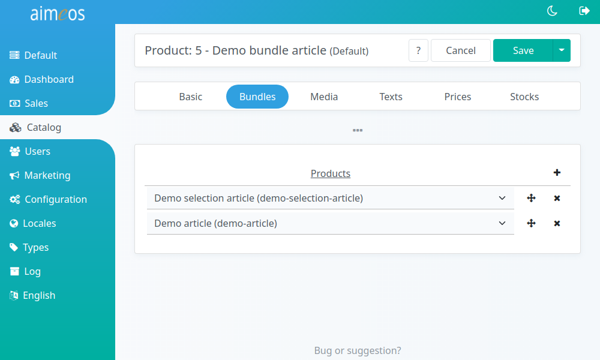
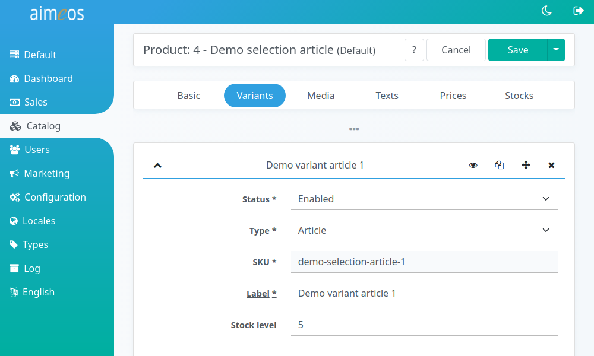

The product panel is the most important part of the shop administration interface as it's the central place for managing all kind of products.

# List of all products

The list view provides a paged list of all available products in the system, which can be [filtered](filtering-lists.md) by various product-related criteria. The most important columns are shown by default, but the list of columns can be adapted via the list header. Products can be added, edited or deleted either via using the button in the menu or by using the context menu, which is shown, if you right-click into the list. A double click also opens the detail view for editing the product.

# Product types

## Default articles

An *Article* (product type / product code: "Default") is the base for almost all products that are added to the shop. An *article* contains its own SKU and therefore its own stock level. All *articles* must be assigned to at least one category in order to be visible, selectable and searchable in the frontend.

There is something like a **non-categorizable article**, though. This is actually not a separate product type, but a *default article* product, which *must not* be added to any category, reason being that such an *article* is only used in conjunction with [vouchers](#vouchers) (not to be confused with a *voucher product*!) and/or any of their providers. A *voucher* is usually used to apply a rebate or a discount to the basket, but it itself does not have any form elements for content (texts, images et. alt.) that might be required for display once it is applied. Therefore it is dependent on such an uncategorized *default article* product that provides any desired information. Due to the nature of such a *voucher* – appling a rebate or discount – these non-categorized articles are sometimes also referred to as *rebate products* or *discount products*. 

## Bundles

*Bundles* are a combination of articles that can be added by a customer to the basket in one step and that will stay there as one product. Only select the articles that should be part of the bundle in the "Bundle" tab of the product detail view. You should also add texts, images and prices to the bundle that are used instead of the data from the single articles. The bundled articles will be shown in the product detail view as well.

!!! warning
    You can't use selection products or other bundles as part of bundle products!

## Events

*Event* products are similar to articles, but they have a start and end date assigned where the event will happen.

Contrary to regular products, *event* products are shown in the frontend catalog lists even if their start date is in the future. Once their end date is reached, they won't be shown any more.

## Selections

If you have several variations of a single product that differ by the unique code and in the values of the associated attributes and you want to show them only once in the product lists, then you should use a product of type *Selection*. It's an alternative to adding all attributes to one product which can only have one code/SKU and store the selected attributes in the order.

First, you have to create the variant attributes. For example, the characteristics of jeans are their color, width and length. You need to create attributes for those three types:

* color
    * black
    * blue
* length
    * 30
    * 32
    * ...
* width
    * 28
    * 30
    * ...

In the next step, create a product of type "Selection" in the "Variants" tab, you can then add single articles for each combination, e.g.

* jeans 1 (color: black, length: 32, width: 28)
* jeans 2 (color: black, length: 32, width: 30)
* ...
* jeans n (color: black, length: 34, width: 32)
* jeans m (color: blue, length: 32, width: 28)
* ...
* jeans z (color: blue, length: 34, width: 32)

To each jeans article, you have to associate the combination of attributes that uniquely identifies the jeans.

After saving the *selection* product, you will find all the articles that belong to the *selection* produt in the product list as well. You can also open the product details for each article individually if you click on the eye symbol in the variants tab.

Each *selection* article can have its own texts, prices and images, like any other product. They will be shown/used if a customer selects the variant attributes that identify the article.

## Vouchers

*Voucher* products (*not* to be confused with [*vouchers*](coupons.md)) are virtual products that will generate a *coupon code* once it has been bought. That *coupon code* will be emailed to the customer, who can use it or sent on to other persons (e.g. as a gift). A *voucher* product can be a single *article* with a fixed price, an article with a [user defined price](product-details.md#price) or part of a *selection* product (assign a variant attribute in that case).

After a customer has bought a *voucher* product and payment has been authorized or received, the [**order/email/voucher** job controller](./../cronjobs/index.md) will generate the coupon codes and send them via email to the delivery address (or billing address if no delivery address is given) of the order. Make sure you run that **job controller at least every five minutes**.

!!! warning
    You need to set up the [Voucher coupon provider](coupons.md#Voucher) for enabling the customer (or the person the voucher code will be given to) to redeem the voucher.
