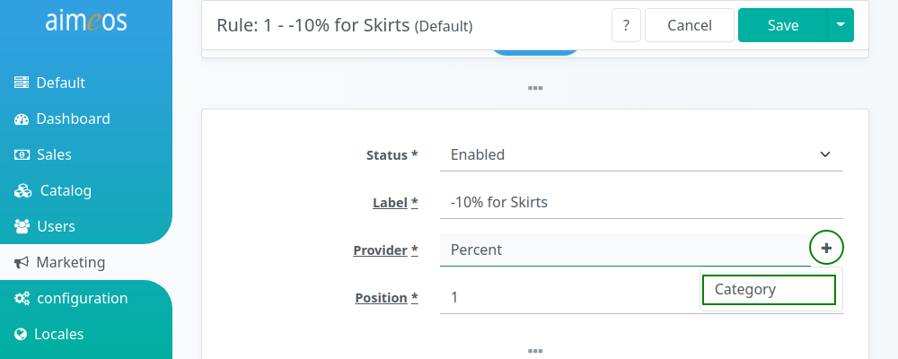

A decorator adds additional features to a rule provider by adding additional configuration options. For example, if a percent discount should only be granted for a sepecific category, simply select and assign the `category` decorator to the current rule provider. All a decorator does is adding one or more specific features that can be assembled with other decorator rules in various arrangments in order to create a distinctive *rule* that extends a rule provider's own configuration. The great advantage of decorators is that they can be reused in any combination with all rules.

# Usage

Decorators are activated by adding them to the "Provider" input field in the detail view of a rule item. The easiest way to do so is by clicking on the "+" icon next to the input field and selecting the desired decorator:



**Example**: If a percentage (provided by the "Percent" rule provider) is configured like this:

```
Percent
```

If you would also like to restrict the rule to products from a specific category, you also need to add the "Category" decorator:

```
Percent,Category
```

The decorators are called from right to left, so in the given example the "Category" decorator would be executed first, then the "Rebate" rule provider. Therefore, it's a good idea to add decorators requiring less resources at the end of the input field and decorators using external sources just before the rule provider.


# Built-in decorators

## Category

Restricts rules to products which are assigned to one of the configured categories.

category.code (required)
: The category code or a list of comma-separated category codes (e.g. home,men,shirts)

!!! warning
    You need to add `catalog` to the `client/html/catalog/domains` configuration setting so the *Category* rule decorator is used, e.g. `['catalog', 'media', 'media/property', 'price', 'text']`. There's documentation how to change the configuration in [Laravel](../laravel/customize.md#change-configuration) and [TYPO3](../typo3/customize.md#change-configuration) articles.
