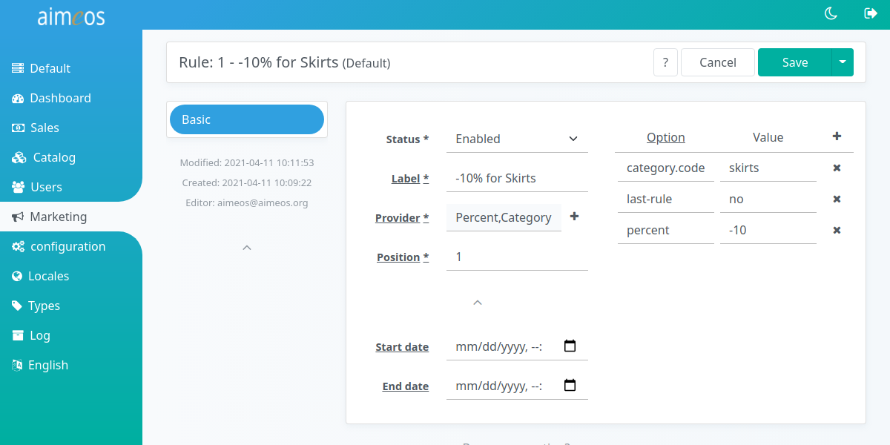
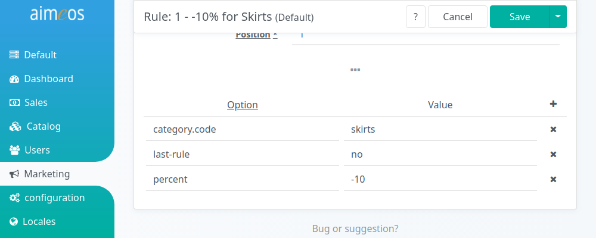

The Rule detail view offers various select and input fields to configure a rule:

Status (required)
: Controls the global availability of the configured rule. There are several status values available but the rule will only be used if the status is "enabled".

Label (required)
: An internal label which helps you to identify the rule and which can be used for searching in the administration interface.

Provider (required)
: This field contains the case-sensitive rule provider class name, e.g. "Percent". A list of available providers is shown when you click into the input field. Selecting a provider adds it to the input field. Furthermore, each provider can be enhanced by one or more decorators, which can be choosen from the drop-down list that appears when the "+" symbol next to the input field is clicked. Selecting a decorator adds it sequentially to the provider or any other previously added decorator(s).
For a detailed description of all the available rule providers and decorators provided by the Aimeos core, have a look at [Available rules](rules.md) and [Adding features](rule-decorators.md).

Position (optional)
: If there's more than one rule, this integer value determines its position. Rules are applied in the order of their position and a rule with position 0 is applied first, rule with higher positions are applied afterwards. If two rule share the same position, it's undefined which one is applied first.

Start date (optional)
: The point in time when the rule will be available. The date/time value has to be in ISO format (YYYY-MM-DD HH:mm:ss) and the hours must be in the range of 0-23.

End date (optional)
: The point in time when the rule won't be available any more. The same format rules apply as for "Start date".

!!! note
     Keep in mind that each decorator can bring along its own configuration setting(s). Therefore, depending on which decorator you activate and how many decorators you implement, the amount of configuration fields on the right site / in the lower section of the detail page will change (and therefore also differ from the screenshot shown above).

!!! hint
    To delete a decorator, select the provider from the list and re-assign the decorator(s) you need. A decorator's configuration field(s) will not be deleted right away, which might be helpful for testing purposes.

# Rule configuration

The right side (or lower part) of the rule detail view offers a panel, which presents a list of all the configurable options of a rule provider and its assigned decorators. Whenever you add or remove a provider or a decorator, its respective configuration option(s) will be added to or removed from the list automatically.

The panel's left column is resevered for configuration keys, the right column for their values. At least the left column of each line must be filled with a valid key. You can add lines by clicking on the "Add" (+) button in the menu bar and delete selected lines via the respective "Delete" (x) button on a line's right side. The order of the lines doesn't matter.

Each rule and each decorator needs its own configuration. For details about which configuration keys and values are available resp. required, refer to the documentation of the rule or decorator. For more information about *Aimeos*'s built-in rules, checkout the documentation about [Available rules](rules.md) and [Adding features](rule-decorators.md).
