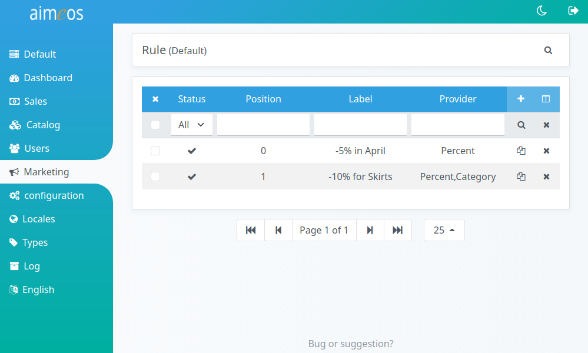

Rules can dynamically modify the content of products before they are passed to the frontend. Possible actions are adding additional data, removing texts or modifying the price of the products depending on the rules. The later case (dynamic pricing rules) are most often used and the default rule providers care about that case.

Rule providers can be enhanced by [decorators](rule-decorators.md) to add certain restrictions. If the requirements for the action aren't met, the rule won't be applied to the products.

# List of rules

The "Rule" list view (in the "Marketing" menu) provides a paged list of all configured rules in the system, which can be [filtered](filtering-lists.md) by various criteria. The most important columns are shown by default but the list of columns can be adapted via the list header. Rules can be added, edited or deleted either by using the shown buttons or by clicking on the list entry.

# Built-in rule providers

## Percent

Changes the price of the product by the configured percentage. A positive percentage will increase the price while a negative percentage reduces the price. For example, if the configured percentage is "-10.00", a value of 5.00€ would be subtracted from the product price of 50.00€.

percent (required)
: Discount in percent that should be added/subtracted from the product price. The format of the value must be "x.xx" but the decimal point and two digits afterwards are optional. The value must not include a thousand separator or anything similar nor the percent symbol!

last-rule (optional)
: If yes, this rule will be the last one applied to the price of each product if the rule matches and no subsequent rules will be executed. The decision if the the rule will be the last one is evaluated for every product independently.

!!! note
    You can combine several percent rules to increase or reduce the product price but the percentages are calculated on the actual price if the rule is applied. A product price of 100€ and two discount rules with -10% and -5% will reduce the price to 85.50€ (rule 1: 100€-10%=90€, rule 2: 90€-5%=85.50€) and not to 85€!