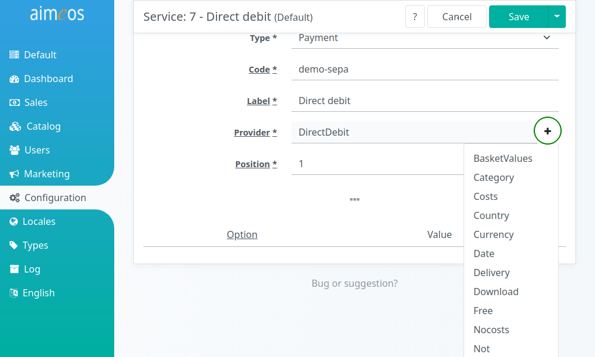

A decorator can add additional features on top of services only by configuration. For example, if a payment by invoice should only be available, when the customer is logged in and already placed at least one successful order, then this can be done by adding a decorator to the payment provider. The great advantage of decorators is that they can be reused in any combination with all services. It's like a set of rules that can be rearranged to create different *rule sets* with only a small amount of rules. Decorators are available for all types of services, therefore each decorator can be used with delivery and payment services.


# Usage

Decorators are activated by adding them to the "Provider" input field in the *Basic* view of a delivery/payment service item. The easiest way to do so is by clicking on the "+" icon next to the input field and selecting the desired decorator:



However, if you decide to enter the names of the decorators (and the provider) manually, please keep in mind that they are case-sensitive and must be separated by a comma!

**Example**: If a payment by invoice (provided by the "PostPay" service provider) is configured like this:

```
PostPay
```

the decorator checking for successful orders of the customer (the "OrderCheck" decorator) must be added like this:

```
PostPay,OrderCheck
```

If you would also like to restrict the visibility of the payment option also to one or more countries, you can additionally add the "Country" decorator:

```
PostPay,OrderCheck,Country
```

The decorators are called from right to left, so in the given example the "Country" decorator would execute first, then the "OrderCheck" decorator and finally the "PostPay" service provider. Therefore it is a good idea to add the decorators requiring less resources at the end of the input field and the decorators using external sources just after the service provider.


# Built-in decorators

## BasketValues

Shows or hides service options based on the basket value. You can configure a minium or maximum basket total value or both and a missing value is interpreted as no restriction.

basketvalues.basket-value-min (optional)
: Map of currencies and minimum total values required to show the service option. The currencies must be three letter ISO currency codes in upper case format and the minimum total value can be of decimal nature (using a decimal point to separate the fractional part). For a complete list of official currency codes, refer to [https://en.wikipedia.org/wiki/ISO_4217](https://en.wikipedia.org/wiki/ISO_4217).

basketvalues.basket-value-max (optional)
: Map of currencies and maximum total values that must not be exceeded to show the service option. The currencies must be three letter ISO currency codes in upper case format and the minimum total value can be of decimal nature (using a decimal point to separate the fractional part). For a complete list of official currency codes, refer to [https://en.wikipedia.org/wiki/ISO_4217](https://en.wikipedia.org/wiki/ISO_4217).

To limit a delivery or payment option to orders up to 100 Euro use:

```
basketvalues.basket-value-max : {"EUR":100}
```

For an additional service options which should be mutually exclusive to the first one, configure the total value above 100 and e.g. an upper limit of 500 Euro:

```
basketvalues.basket-value-min : {"EUR":100.01}
basketvalues.basket-value-max : {"EUR":500}
```

## Category

Shows or hides service options if one of the products in the basket is associated to one of the configured category.

category.include (optional)
: Comma separated list (without spaces) of catalog codes. If one product in the basket is in one of the configured categories, the service option is shown to the user during the checkout.

category.exclude (optional)
: Comma separated list (without spaces) of catalog codes. If one product in the basket is in one of the configured categories, the service option is hidden from the user during the checkout.

The "Category" service option is only shown, if at least one product in the basket belongs to either the "subscriptions" or "special" category or any of their sub-categories:

```
category.include : subscriptions,special
```

The service option is hidden, if at last one product in the basket belongs to either the "subscriptions" or "special" category or any of their sub-categories:

```
category.exclude : subscriptions,special
```


## Costs

Adds an additional percentage based on the basket value to the configured delivery or payment costs. By default, service options have a fixed price, but this decorator is able to calculate additional costs, e.g. for credit card companies or PayPal, services that keep 1.25% to 3.5% of the total amount as transaction fee.

costs.percent (required)
: Decimal value for the additional service fee in percent. The value must not contain the percent sign (%) and the fractional part must be separated by a decimal point, e.g. "1.25" to add 0.125 for each Euro, Dollar or any other currency as service costs.

To add 2.5% to each order as service fee, where the service option was chosen, use a configuration like this:

```
costs.percent : 2.5
```

You can also use negative values for a reduction:

```
costs.percent : -3.0
```

!!! note
    Contrary to the "Reduction" decorator, any amounts subtracted by the "Costs" decorator are not displayed as rebates but as (negative) delivery or payment costs!

## Country

Limits the availability of a service option to one or more countries. Either the billing address, the delivery address or both can be used for the check. Please keep in mind that you have to configure the country drop-down on the address page in the checkout process before this decorator can be used.

country.billing-include (optional)
: If the selected country in the **billing address** of the customer matches one of the countries, the service option is **shown**. The configuration consists of a comma separated list of two letter ISO country codes in upper case, e.g. "DE,AT,CH". For a full list of official two letter country codes refer to [this wikipedia list](https://en.wikipedia.org/wiki/ISO_3166-1_alpha-2). Avoid white spaces between the codes and commas. If the list is empty, the service option won't be shown at all.

country.billing-exclude (optional)
: If the selected country in the **billing address** of the customer matches one of the countries, the service option is **hidden**. (Same rules as for *country.billing-include* apply.)

country.delivery-include (optional)
: If the selected country in the **delivery address** of the customer matches one of the countries, the service option is **shown**. (Same rules as for *country.billing-include* apply.)

country.delivery-exclude (optional)
: If the selected country in the **delivery address** of the customer matches one of the countries, the service option is **hidden**. (Same rules as for *country.billing-include* apply.)

To show the service option only for customers in Germany, Austria and Switzerland use

```
country.billing-include : DE,AT,CH
```

To hide a service option for customers living in the UK use

```
country.billing-exclude : GB
```

If you would like to offer delivery options with different costs depending on the country use

First delivery option:

```
country.delivery-include : DE,AT,CH
```

Second delivery option:

```
country.delivery-exclude : DE,AT,CH
```

The first delivery option would be presented to customers from Germany, Austria and Switzerland only, while the second delivery option would be available for customers from the rest of the world only.


## Currency

Shows service options, if the currency used in the basket is either found in the include or *not* found in the exclude configuration.

currency.include (optional)
: Comma separated list of three letter ISO currency codes (without spaces). If the used currency in the basket **matches one of the listed currency codes**, the service option is shown to the user during the checkout.

currency.exclude (optional)
: Comma separated list of three letter ISO currency codes (without spaces). If the used currency in the basket **does *not* match one of the listed currency codes**, the service option is shown to the user during the checkout.

If the customer has chosen "USD" as currency, the service option is *not* shown if this configuration is set:

```
currency.include : CHF,EUR,GBP
```

With "USD" as the customer's chosen currency, the service option is displayed with a configuration like this:

```
currency.exclude : CHF,EUR
```


## Date

Offers customers an option to chose a delivery/pick up date. You can configure certain restrictions for the delivery date:

date.minimumdays (optional)
: Miniumn number of days to wait when selecting dates

The chosen delivery date will be stored as service attribute in the order of the customer


## Delivery

Lets customers choose if they accept partial deliveries or only a complete delivery of all ordered products.

delivery.partial (optional)
: Enable/disable the option of partitial delivery

delivery.collective (optional)
: Enable/disable the option of collective delivery

To offer customers the choice between partial and collective delivery, add the "Delivery" decorator and use this configuration:

```
delivery.partial : 1
delivery.collective : 1
```


## Download

Checks if all products are downloads to enable or disable service options.

download.all (optional)
: If set to "1", the delivery or payment service option in the checkout process is only available when all products in the basket contain a download attribute (i.e. are download products). Otherwise, the service option is disabled. A value of "0" enables the service option if at least one of the products in the basket is *not* a download product resp. disables the option if all products are downloads.

Wrap the decorator around a shipping option that should only be available if no physical package must be sent:

```
download.all : 1
```

Use this for shipping options that should be visible if there's a physical product that must be shipped:

```
download.all : 0
```


## Free

Checks if basket total value is 0.00 and then shows or hides that delivery/payment option.

free.show (required)
: Enable or disable the delivery/payment option if the basket total value is 0.00.

To show one delivery/payment option and disable a second one, add the "Free" decorator to both with different configurations.

First option:

```
free.show : 1
```

Second option:

```
free.show : 0
```


## Nocosts

If shipping costs per item are used, this decorator can remove those costs for delivery options like pick-up at the store or if the free shipping threshold is reached.


## Not

Negates the availability of the payment/delivery option of previous decorators for the current basket.

To allow the option only for customers with less than three successful orders, add this to the "Provider" field:

```
Prepay,OrderCheck,Not
```

Add this confiugration for the "OrderCheck" decorator so it returns true if the customer has at least three successful orders:

```
ordercheck.total-number-min : 3
```

For the availability, the decorators are evaluated from left to right. If the customer hasn't placed at least three successful orders yet, the "OrderCheck" decorator will return "false", but the "Not" decorator turns that into "true" and therefore the option is shown. If the customer has three or more successful orders, the "OrderCheck" decorator returns "true", but the "Not" decorator flips the result to "false" and the option is hidden.


## OrderCheck

Displays the payment or delivery option only, if the customer has already placed at least one successful order. Pending payments for orders within a configurable amount of time can also be a reason to hide the service option. Customers must be logged in to see the options, otherwise those options are hidden by default. This decorator requires more processing time and should therefore be placed right after the service provider, if possible.

ordercheck.total-number-min (optional)
: The service option will only be shown if the configured number of successfully placed orders is reached. The configuration value must be an integer.

ordercheck.limit-days-pending (optional)
: The delivery or payment option will be hidden if an order placed withing the specified number of days has a payment status "pending". The configuration value can be an integer or a decimal number (using a decimal point to separate the fractional part).

Display the option only, if the customer placed at least three successful orders:

```
ordercheck.total-number-min : 3
```

Hide the option if the payment for an order of the customer wasn't received within the last seven and a half days:

```
ordercheck.limit-days-pending : 7.5
```


## Postal

Limits the availability of delivery or payment options to a list of zip codes.

postal.billing-include (optional)
: List of postal codes allowed for the billing address

postal.billing-exclude (optional)
: List of postal codes not allowed for the billing address

postal.delivery-include (optional)
: List of postal codes allowed for the delivery address

postal.delivery-exclude (optional)
: List of postal codes not allowed for the delivery address

Several zip codes can be added seperated by commas, e.g.

```
postal.delivery-exclude : 12345,AB1234,98DE76
```


## Product

Limits the availability of delivery or payment options based on the products in the customer's basket.

product.include (optional)
: Comma separated list of product codes for which the delivery/payment option should be shown

product.exclude (optional)
: Comma separated list of product codes for which the delivery/payment option should be hidden

Example:

```
product.include : sku1234,987665
product.exclude : 1357AB
```


## Quantity

Adds delivery costs that depend on the quantity of products. It's even possible to define package sizes with more than one product, e.g. one to five products fit into a package and each package costs $5 extra.

quantity.packagecosts (required)
: Delivery costs added for each required article or package of articles

quantity.packagesize (optional)
: Number of articles that fit into one package


## Reduction

Grants a reduction of a configurable percentage based on the basket value if the delivery or payment option was chosen. If you would like to promote certain delivery or payment options, you can reduce the amount of the order by a defined percentage. The reduction can be granted only, if the total value of the basket is above a minimum and/or below a maximum value.

reduction.percent (required)
: Decimal value of the reduction in percent. The value must not contain the percent sign (%) and the fractional part must be separated by a decimal point, e.g. "2.5", to reduce each Euro, Dollar or any other currency by 0.025.

reduction.product-costs (optional)
: Include product specific shipping costs when calculating reduction. If this option is set to "yes" for the delivery service option, the product shipping costs will be reduced by the same percentage as the global shipping costs.

To grant a reduction of 3% of the basket value when choosing the service option:

```
reduction.percent : 3
```


!!! note
    Contrary to the "Costs" decorator, any amounts subtracted by the "Reduction" decorator will be displayed as rebates in the basket!


## Supplier

Adds a list of suppliers to the (delivery) service options, from which a customer can choose. The supplier can be a local store,  for example, where customers can pick up their orders. The list of available suppliers is generated from the active suppliers you add in the "Supplier" panel. The code of the chosen supplier is stored as order service attribute. No further configurations required.


## Time

Customers are able to chose a delivery/pick up time if you add the "Time" decorator to a (delivery) service option.

Certain restrictions for the delivery time can be configured:

time.start (optional)
: Earliest delivery time in 24h "HH:MM" format

time.end (optional)
: Latest delivery time in 24h "HH:MM" format

time.weekdays (optional)
: Comma separated week days for which the start and end time are valid for. The numbers 1 to 7 represent the weekdays (1 = Monday, 7 = Sunday). E.g.: "1,2,3,4,5" for Monday to Friday

The chosen delivery time will be stored as service attribute in the order of the customer


## Weight

Shows delivery or payment options only, if the sum of all product weights is between the configured minimum and maximum weight values. It's assumed that you use the same weight measure for all products weights, e.g. kg, g, lbs or any other suitable weight measure.

weight.min (optional)
: Minimum weight of all products to show the service option

weight.max (optional)
: Maximum weight of all products to show the service option

Show the service option only, if the weight of all products is equal or more than 10kg ("kg" is assumed in this example):

```
weight.min : 10
```

The service option should only be shown, if the weight of all products is up to 5.75kg ("kg" assumed again):

```
weight.max : 5.75
```

Both settings can be used to define a range, e.g.:

```
weight.min : 4.5
weight.max : 8.125
```

These settings would  display the service option only, if the weight of all products is between 4.5kg and 8.125kg. 4.5kg and 8.125kg are included but 4.49kg and 8.126kg are not.

If you define two or more service options with overlapping weight ranges, both options are shown if the weight of all products is between both ranges.
