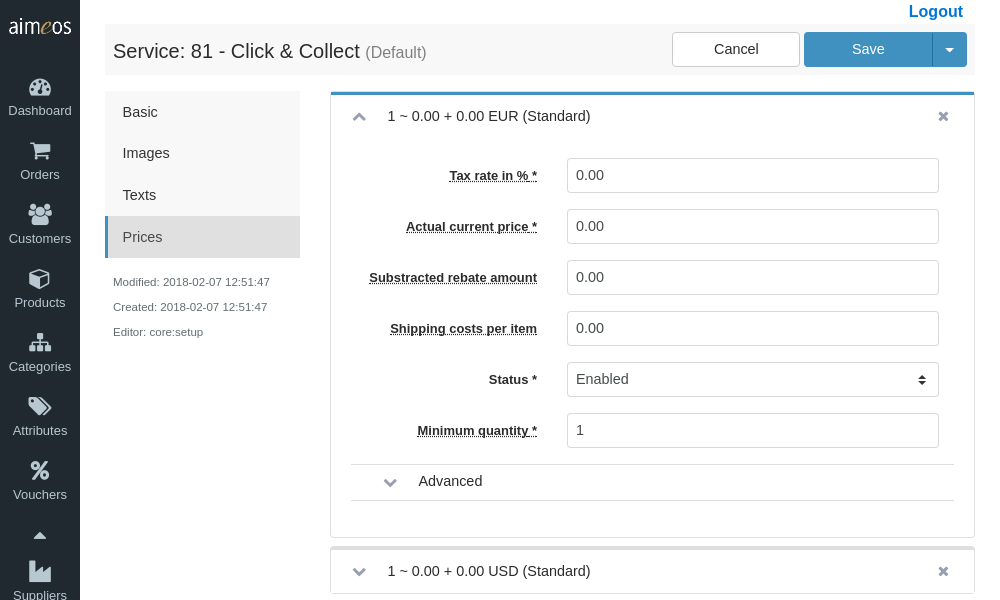

The *Basic* page of a service is two-tiered: the first part is dedicated to the basic setup of a delivery/payment service, while the second half provides fine-grained configuration options of the provider and decorators you define.

As for the first half, almost all select/input fields are required:

Status (required)
: Controls the visibility of the delivery or payment option. There are several status values available but the service will only be shown in the frontend if the status is "enabled".

Type (required)
: The service type which can be "Delivery" or "Payment". Depending on what you choose, the service will be shown in the delivery or payment screen in the frontend.

Code (required)
: Unique code of the service (alpha-numeric sequence of characters of you own choice).

Label (required)
: An internal label which helps you to identify the service and which can be used for searching in the administration interface. Usually, this is not used outside of the administration interface but if you don't add a translated name to that service, the label will be shown in the frontend.

Provider (required)
: The case-sensitive name of the service provider class name, e.g. "PrePay". A list of available providers is shown when you click into the input field. Selecting a provider adds it to the input field. Furthermore, each provider can be enhanced by one or more decorators, which can be choosen from the drop-down list that appears when the "+" symbol next to the input field is clicked. Selecting a decorator adds it sequentially to the provider or any other previously added decorator(s).
For a detailed description of the available service providers and decorators that are part of the *Aimeos* core, check out [Available services](services.md) and [Adding features](service-decorators.md).

Position (optional)
: If there's more than one delivery or payment option the customer can choose from, this integer value affects its position.

Start date (optional)
: The point in time from when the service is available for customers in the checkout process. The date/time value has to be in ISO format (YYYY-MM-DD HH:mm:ss) and the hours must be in the range of 0-23.

End date (optional)
: The point in time when the service won't be available any more. The same format rules apply as for "Start date".

# Service configuration

The second part of the *Basic* page offers a panel which presents a list of all the configurable options of a service provider and its assigned decorators. Whenever you add or remove a provider or a decorator, its respective configuration option(s) will be added to this list automatically.

The panel's left column is resevered for configuration keys, the right column for their respective values. At least the left column of each line must be filled with a valid key. You can add and delete lines using the appropriate buttons the interface provides. The order of the lines doesn't matter.

To learn more about the configuration keys and values, refer to the documentation of the service or decorator. *Aimeos*'s built-in services are discussed extensively in [Available services](services.md).

# Additional information

In order to properly communicate to the user which delivery and payment services can be chosen from, each service can be assigned images, texts and prices.

## Images

It is recommended to add at least the logo of the logistic / payment service. Allowed image formats are JPEG, PNG, GIF and SVG.

## Texts

To name and describe the service, three types of texts should be added for each language the website provides:

Name
: The name of the delivery or payment service (e.g. "UPS", "PayPal").

Short description
: A view lines that shortly describes the delivery or payment and gives the customer information e.g. about limitations of the service.

Long description
: Detailed information about the delivery or payment service. The text can consist of 16 to 64 thousand characters (64 thousand bytes) depending on the size of the UTF-8 characters used. To be most compatible with all platforms/operating systems/browsers, use UTF-8 encoding only. Besides plain text, you can also use HTML code for special markup.

## Prices

Each delivery or payment item must have one price associated - even if the shipping or payment is for free, in which case the price is displayed as 0.00.

Depending on the configured decorators (see [Adding features](service-decorators.md)), the price may be changed dynamically based on the rules the decorator implements.
