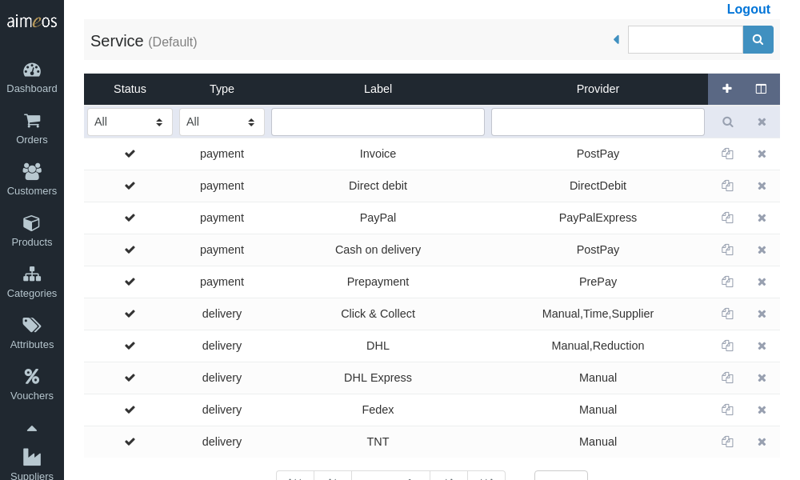
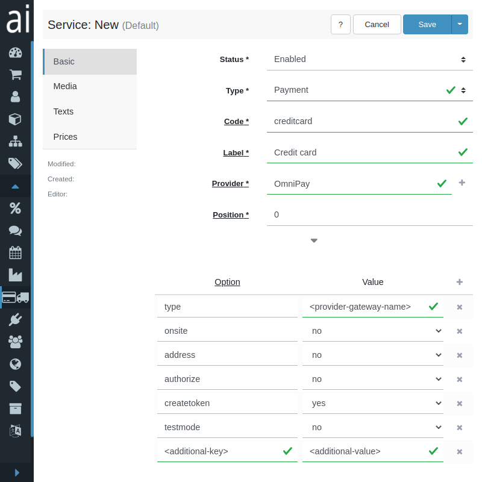
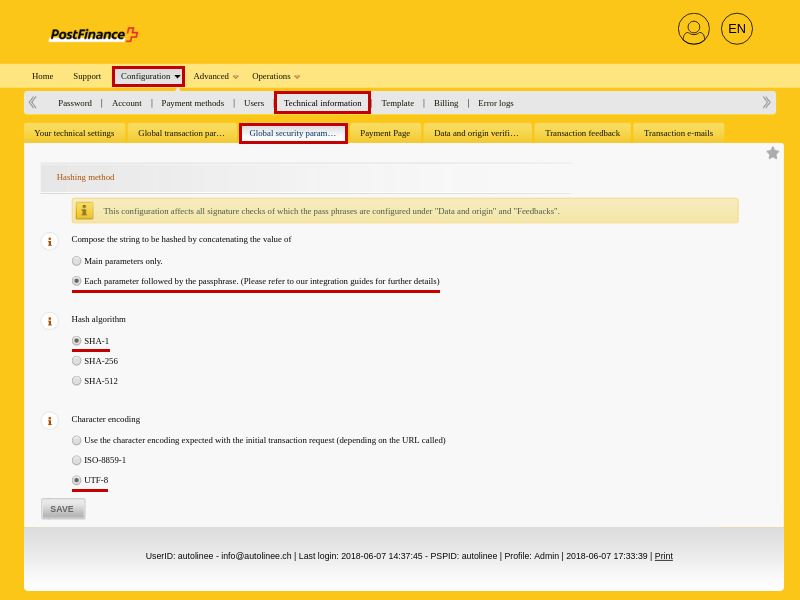
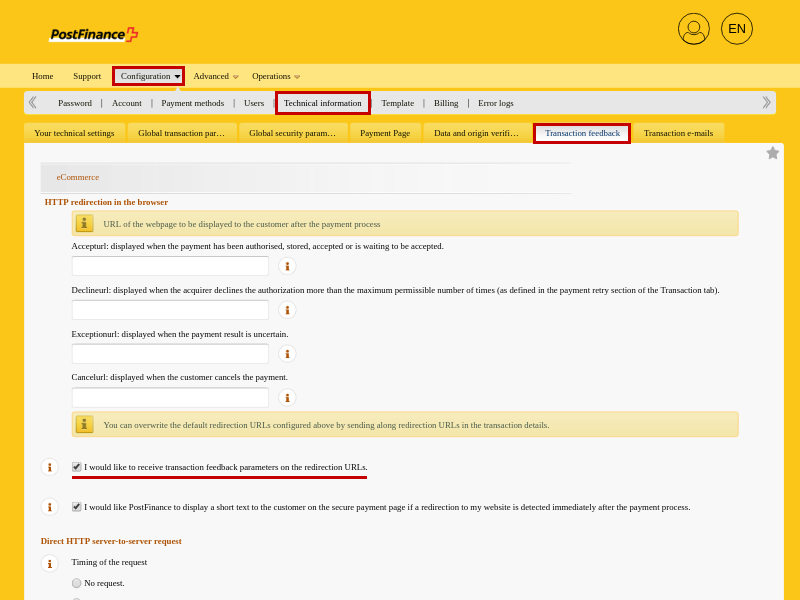

The service panel is dedicated to the delivery and payment options that should be available during the checkout process. A service item configures the delivery or payment provider which is responsible for the further handling of the order (i.e. the payment).

The list view provides a paged list of all available delivery and payment options in the system, which can be [filtered](filtering-lists.md) by various criteria. The most important columns are shown by default but the list of columns can be adapted via the list header. Delivery and payment options can be added or deleted using the buttons in the list. A click on the entry also opens the detail view for editing the delivery or payment item.



# Services explained

## Delivery

During the checkout process, the customer can choose between several delivery options (e.g. UPS, TNT, etc.) if they are made available by the shop owner. Each delivery option can have its own description, picture and price. You can add as many delivery options as you like.

Every delivery option needs a properly configured delivery provider. It implements the handling of the order after the payment was successful. This can be a completely manual handling, a transfer of the order to a logistic partner or an automated process for providing a customized download file to the customer. Everything that can be implemented in an algorithm is possible within a provider.

## Payment

During checkout, customers can select a payment option if provided by the shop owner. Payment options can have their own description, picture, and price.

Each payment option requires its own configured payment provider that takes care of the payment. There are two different payment processes: local and remote payments. A local payment process collects the required payment data (if any additional data is necessary) and stores it locally in the shop system. Alternatively, a remote payment provider redirects the customer to a payment gateway, which handles the payment and notifies the shop system about the result of the payment process (usually success or failure).

Extensions implementing payment providers are available, especially those using payment gateways to handle payments of customers.

!!! note
    Please don't use any payment provider that stores credit card details locally in the shop system as long as you aren't certified as PCI-compliant. For more information take a look at the website of the [PCI Security Standards Council](https://www.pcisecuritystandards.org/).


# Built-in delivery services

## Standard

Completely manual handling of orders without any notifications. It only sets the status of the order to "in progress". This service requires no further configuration.

## Xml

XML based transfer of orders to a web service understanding the content of the XML.

xml.backupdir (optional)
: Relative or absolute path of the backup directory (with strftime() placeholders)

xml.exportpath (required)
: Relative or absolute path and name of the XML files (with strftime() placeholders)

xml.template (optional)
: Relative path of the template file name

xml.updatedir (optional)
: Relative or absolute path and name of the order update XML files


# Built-in payment services

## DirectDebit

If you want to offer payments via an automatic bank transfer from the bank account of the customer, you should configure the **DirectDebit** payment service provider. The customer is asked for the necessary details like bank name, bank account, etc., which are stored along with the order in your database. This service doesn't have any options.

## PayPalExpress

Payments via PalPal are available by the **PayPalExpress** payment service provider. It provides all possibilities PayPal is offering. The required configuration options are:

paypalexpress.AccountEmail
: The e-mail address of the account that will receive the money, usually the one you've used for registration

paypalexpress.ApiUsername
: User name of the account that should be used for the automatic communication with the shop. This is not the name of your own user account!

paypalexpress.ApiPassword
: The password you have assigned to the API user name. This is not the password of your own user account!

paypalexpress.ApiSignature
: The shared secret that is created by PayPal for the API user

!!! hint
    The *Aimeos* PayPalExpress driver uses the [NVP (Name-Value Pair) API](https://developer.paypal.com/docs/nvp-soap-api/NVPAPIOverview/), which is only available with business accounts. This PayPal service is nowadays known as *PayPal Checkout*. If you test your account with a sandbox, remember to also change the links already given in the *Aimeos* PayPalExpress interface (e.g. *https://api-3t.paypal.com/nvp* to *https://api-3t.sandbox.paypal.com/nvp*).

## PrePay

The **PrePay** provider is used for payments that must be done in advance and before the delivery of the ordered products is started, like a bank transfer in advance. This service doesn't have any options.

## PostPay

The **PostPay** provider is useful for all payments where the customers pay after placing their order. This allows payment by invoice or payment by cash on delivery. This service doesn't have any options.


# Supported by ai-payments

Service providers for many payment gateways are available by the *Aimeos* [ai-payments extension](https://github.com/aimeoscom/ai-payments). If you use composer run:

```
composer req aimeos/ai-payments
```

*Aimeos* ai-payments supports the following payment gateways:

## Authorize.net AIM

!!! warn
    This API is deprecated. The recommended alternative solution is called [Payment transations](http://developer.authorize.net/api/reference/index.html#payment-transactions), which incorporates all AIM transaction methods. Read more about [alternative solutions](https://developer.authorize.net/api/upgrade_guide.html).

The [Authorize.net](https://www.authorize.net/) gateway for the [AIM methods](https://www.authorize.net/content/dam/anet-redesign/documents/AIM_guide.pdf) (collect payment details locally and send them to the payment gateway) is available via the **AuthorizeAIM** payment service provider. If you use composer run:

```
composer req aimeos/ai-payments omnipay/authorizenet
```

It supports authorization/capture and offers these configuration options:

apiLoginId (string, required)
: The API login ID from your Authorize.net account

transactionKey (string, required)
: The transaction key generated for your Authorize.net account

authorizenet.address (boolean, optional)
: A value of "1" will send the customer address to Authorize.net

authorizenet.authorize (boolean, optional)
: Use "1" if you want to get an authorization first and capture the payment after the parcel has been dispatched or the product delivered according to the delivery status of the order. Leave this setting out for immediate payments

createtoken (boolean, optional)
: Not supported by that payment provider

onsite (boolean, optional)
: Not supported by that payment provider

testmode (boolean, optional)
: Use "1" for test payments without real money


## Authorize.net SIM

!!! warn
    This API is deprecated. The recommended alternative solution is called [Accept hosted](https://developer.authorize.net/api/reference/features/accept_hosted.html). SIM still works and receives bug fixes. The exact end of lifetime of SIM has not yet been announced. Read more about [alternative solutions](https://developer.authorize.net/api/upgrade_guide.html).

The [Authorize.net](https://www.authorize.net/) gateway for the [SIM method](https://www.authorize.net/content/dam/anet-redesign/documents/SIM_guide.pdf) (collect payment details at the payment gateway site) is available via the **AuthorizeSIM** payment service provider. If you use composer run:

```
composer req aimeos/ai-payments omnipay/authorizenet
```

It supports authorization/capture and offers these configuration options:

apiLoginId (string, required)
: The API login ID from your Authorize.net account

transactionKey (string, required)
: The transaction key generated for your Authorize.net account

hashSecret (string, optional)
: A secret string you've entered in your Authorize.net account that offers additional protection for payment status notifications

authorizenet.address (boolean, optional)
: A value of "1" will send the customer address to Authorize.net

authorizenet.authorize (boolean, optional)
: Use "1" if you want to get an authorization first and capture the payment after the parcel has been dispatched or the product delivered according to the delivery status of the order. Leave this setting out for immediate payments

authorizenet.header (string, optional)
: The HTTP header sent by the checkout update component after updating the order successfully ("Location: <URL to confirm page>" by default)

authorizenet.body (string, optional)
: The HTTP body sent by the checkout update component after updating the order successfully ("success" by default). This could be a complete HTML page too that is shown to the customer and offering a link to the confirm page (authorizenet.header must be a empty value in this case)

createtoken (boolean, optional)
: Not supported by that payment provider

onsite (boolean, optional)
: Not supported by that payment provider

testmode (boolean, optional)
: Use "1" for test payments without real money


## Authorize.net DPM

!!! warn
    This API is deprecated. The recommended alternative solution is called [Accept.js](https://developer.authorize.net/api/reference/features/acceptjs.html). Read more about [alternative solutions](https://developer.authorize.net/api/upgrade_guide.html).

The [Authorize.net](https://www.authorize.net/) gateway for the DPM method (collect payment details locally but pass them to the payment gateway directly) is available via the **AuthorizeDPM** payment service provider. If you use composer run:

```
composer req aimeos/ai-payments omnipay/authorizenet
```

It supports authorization/capture and offers these configuration options:

apiLoginId (string, required)
: The API login ID from your Authorize.net account

transactionKey (string, required)
: The transaction key generated for your Authorize.net account

hashSecret (string, optional)
: A secret string you've entered in your Authorize.net account that offers additional protection for payment status notifications

authorizenet.address (boolean, optional)
: A value of "1" will send the customer address to Authorize.net

authorizenet.authorize (boolean, optional)
: Use "1" if you want to get an authorization first and capture the payment after the parcel has been dispatched or the product delivered according to the delivery status of the order. Leave this setting out for immediate payments

authorizenet.header (string, optional)
: The HTTP header sent by the checkout update component after updating the order successfully ("Location: <URL to confirm page>" by default)

authorizenet.body (string, optional)
: The HTTP body sent by the checkout update component after updating the order successfully ("success" by default). This could be a complete HTML page too that is shown to the customer and offering a link to the confirm page (authorizenet.header must be a empty value in this case)

createtoken (boolean, optional)
: Not supported by that payment provider

onsite (boolean, optional)
: Must be "1" to enable customers to enter their payment details (credit card data) during the checkout process

testmode (boolean, optional)
: Use "1" for test payments without real money


## CardSave

The [CardSave](https://www.cardsave.net/) payment gateway is available via the **CardSave** payment service provider. If you use composer run:

```
composer req aimeos/ai-payments omnipay/cardsave
```

!!! note
    Use "Omnipay" as provider because it's directly supported by the generic Omnipay integration

It supports authorization/capture and offers these configuration options:

merchantId (string, required)
: The merchant ID sent to you by CardSave

password (string, required)
: The password for the merchant ID sent to you by CardSave

cardsave.address (boolean, optional)
: A value of "1" will send the customer address to CardSave for additional verification

cardsave.authorize (boolean, optional)
: Use "1" if you want to get an authorization first and capture the payment after the parcel has been dispatched or the product delivered according to the delivery status of the order. Leave this setting out for immediate payments

createtoken (boolean, optional)
: Not supported by that payment provider

onsite (boolean, optional)
: Not supported by that payment provider

testmode (boolean, optional)
: Use "1" for test payments without real money


## Datatrans

The [Datatrans](https://www.datatrans.ch/en/) payment gateway is available via the **Datatrans** payment service provider. If you use composer run:

```
composer req aimeos/ai-payments academe/omnipay-datatrans
```

The available configuration options are:

merchantId (string, required)
: Your merchant ID

sign (string, required)
: Your sign identifier available in the datatrans backend

hmacKey1 (string, optional)
: The SHA256 pre-shared key for signing requests. It's recommended adding the key to increase security

createtoken (boolean, optional)
: Not supported by that payment provider

onsite (boolean, optional)
: Not supported by that payment provider

testmode (boolean, optional)
: Use "1" for test payments without real money


## Mollie

The [Mollie](https://www.mollie.com/en/) payment gateway is available via the **Mollie** payment service provider. If you use composer run:

```
composer req aimeos/ai-payments omnipay/mollie
```

!!! note
    Use "Omnipay" as provider because it's directly supported by the generic Omnipay integration

The available configuration options are:

apiKey (string, required)
: The API key string from your Mollie account

mollie.address (boolean, optional)
: A value of "1" will send the customer address to the Mollie server for additional verification

createtoken (boolean, optional)
: Not supported by that payment provider

onsite (boolean, optional)
: Not supported by that payment provider

testmode (boolean, optional)
: Use "1" for test payments without real money


## Omnipay (generic)

[Omnipay](https://omnipay.thephpleague.com/) is a library offering a common interface for 100+ different payment gateways. It's available via the **OmniPay** payment service provider.

!!! note
    You have to add the [Omnipay payment driver](https://github.com/thephpleague/omnipay#payment-gateways) you want to use to your composer.json and run *composer update*. Read more about the installation process here: [https://omnipay.thephpleague.com/installation/](https://omnipay.thephpleague.com/installation/).

It supports these configuration options:

type (string, required)
: Gateway name as defined by the [https://github.com/thephpleague/omnipay#payment-gateways Omnipay driver] (stated in the documentation of the driver)

address (boolean, optional)
: A value of "1" will send the customer address to the Stripe server for additional verification

authorize (boolean, optional)
: Use "1" if you want to get an authorization first and capture the payment after the parcel has been dispatched or the product delivered according to the delivery status of the order. Leave this setting out for immediate payments

createtoken (boolean, optional)
: Use "1" to enable token based payments for subscriptions (must be supported by the payment provider)

onsite (boolean, optional)
: Use "1" if payment gateway requires that payment details are collected locally

testmode (boolean, optional)
: Use "1" for test payments without real money

!!! note
    You need to add the credentials for each payment gateway you want to use. There is no common naming for the credentials, so you have to look into the *./src/Gateway.php* of each [payment gateway](https://github.com/thephpleague/omnipay#payment-gateways) to find out what's required. They are listed in the *getDefaultParameters()* method of each Gateway class, e.g. in the [2Checkout class](https://github.com/thephpleague/omnipay-2checkout/blob/master/src/Gateway.php).



!!! tip
    Some payment gateways offered by Omnipay require special handling. Sub-classing from the Omnipay provider and overwriting the existing methods if required can support even special payment gateways interfaces. Please drop us a note if you got a provider working in your shop.


## OPPWA

[OPPWA](https://github.com/vdbelt/omnipay-oppwa) is a white label platform for payments used by several payment providers e.g.:

* Hobex
* HyperPay
* Pay.ON
* PaySquare
* Peach Payments
* Qualife
* ZooPay

If you use composer run:

```
composer req aimeos/ai-payments vdbelt/omnipay-oppwa
```

!!! note
    Use "Omnipay" as provider because it's directly supported by the generic Omnipay integration

It supports these configuration options:

type (string, required)
: Must be "Oppwa"

onsite (boolean, required)
: Must be "1"

userId (string, required)
: User identifier to authenticate against the payment gateway

password (string, required)
: Password to authenticate against the payment gateway

entityId (string, required)
: Unique identifier for the payment account

address (boolean, optional)
: A value of "1" will send the customer address to the OPPWA server for additional verification

authorize (boolean, optional)
: Use "1" if you want to get an authorization first and capture the payment after the parcel has been dispatched or the product delivered according to the delivery status of the order. Leave this setting out for immediate payments

createtoken (boolean, optional)
: Use "1" to enable token based payments for subscriptions

onsite (boolean, optional)
: Not supported by that payment provider

testmode (boolean, optional)
: Use "1" for test payments without real money


## Payone

The [Payone](https://www.payone.com/) payment gateways are available via the Omnipay payment service provider. If you use composer run:

```
composer req aimeos/ai-payments academe/omnipay-payone
```

The available configuration options are:

type (string, required)
: Gateway name, "Payone_ShopFrontend" without quotation marks

address (boolean, optional)
: A value of "1" to pass the billing address to the payment gateway

merchantId (string, required)
: Your merchant ID available in your Payone account

portalId (string, required)
: Portal ID you've created in the Payone backend

portalKey (string, required)
: Hexadecimal string for authentication created in the Payone backend

subAccountId (string, required)
: ID of the sub-account you've created in the Payone backend

clearingtype (string, optional)
: Code from the Payone documentation (default: "cc" for credit cards)

createtoken (boolean, optional)
: Not supported by that payment provider

onsite (boolean, optional)
: Not supported by that payment provider

testmode (boolean, optional)
: Use "1" for test payments without real money. Requires activating the test mode in your payone account, too


## PayPalPlus

[PayPalPlus](https://www.paypal.com/) payments are available via the **PayPalPlus** payment service provider. If you use composer run:

```
composer req aimeos/ai-payments omnipay/paypal
```

The available configuration options are:

clientid (string, required)
: Your PayPal REST client ID available in your [PayPal developer account](https://developer.paypal.com/developer/applications/)

secret (string, required)
: Your PayPal REST secret you've created in your [PayPal developer account](https://developer.paypal.com/developer/applications/)

authorize (boolean, optional)
: Use "1" if you want to get an authorization first and capture the payment after the parcel has been dispatched or the product delivered according to the delivery status of the order. Leave this setting out for immediate payments

createtoken (boolean, optional)
: Not supported by that payment provider

onsite (boolean, optional)
: Not supported by that payment provider

testmode (boolean, optional)
: Use "1" for test payments without real money. Requires using the sandbox API credentials, too


## Postfinance

!!! hint
    The *dev-master* of the [*bummzack/omnipay-postfinance*](https://github.com/bummzack/omnipay-postfinance) driver supports Omnipay 3.0, which is required to work with *Aimeos* 2019.x+ releases!

The [Postfinance](https://e-payment.postfinance.ch) payment gateways are available via the Omnipay payment service provider. If you use composer run:

```
composer req aimeos/ai-payments bummzack/omnipay-postfinance:@dev
```

!!! note
    Use "Omnipay" as provider because it's directly supported by the generic Omnipay integration

The available configuration options are:

type (string, required)
: Gateway name, "Postfinance" without quotation marks

address (boolean, optional)
: A value of "1" to pass the billing address to the payment gateway

pspId (string, required)
: Your merchant ID you use to log into your Postfinance account

shaIn (string, required)
: SHA-IN key

shaOut (string, required)
: SHA-OUT key

createtoken (boolean, optional)
: Not supported by that payment provider

onsite (boolean, optional)
: Not supported by that payment provider

testmode (boolean, optional)
: Use "1" for test payments without real money. Requires activating the test mode in your payone account too

!!! note
    Please configure your Postfinance account according to this documenation: [Required Postfinance settings](https://github.com/bummzack/omnipay-postfinance#configuration-in-the-postfinance-backend)





## Sofort

The [Klarna Sofortüberweisung](https://www.klarna.com/sofort/) (previously *Sofortüberweisung*) payment gateway is available via the Omnipay payment service provider. If you use composer run:

```
composer req aimeos/ai-payments aimeoscom/omnipay-sofort
```

!!! note
    Use "Omnipay" as provider because it's directly supported by the generic Omnipay integration

The available configuration options are:

projectId (string, required)
: Project ID from Projects -> My Projects

username (string, required)
: "Customer No." ("user_id" in test mode), shown in the top left of the user's Klarna backend

password (string, required)
: API key from Projects (not available in test mode) -> My Projects -> `<project name>` -> Base settings

type (string, required)
: Gateway name, "Sofort" without quotation marks

authorize (boolean, required)
: Always use "1" because the Sofort driver only supports this mode

address (boolean, optional)
: A value of "1" will send the customer address to the Sofort server for additional verification

createtoken (boolean, optional)
: Not supported by that payment provider

onsite (boolean, optional)
: Not supported by that payment provider

testmode (boolean, optional)
: Use "1" for test payments without real money. Requires activating the test mode in your sofort.com account, too

!!! hint
    You have to create a valid account with Klarna Sofort first, before you can create a project and activate the test mode. (During registration you will be asked for your bank account details, but you will not be charged yet.) Once you have an account, create a new project under "New project" and choose "Classic project" as project type.


## Stripe

The [Stripe](https://stripe.com) payment gateway is available via the **Stripe** payment service provider. It supports credit card payments and authorization before capture. If you use composer run:

```
composer req aimeos/ai-payments omnipay/stripe
```

The available configuration options are:

apiKey (string, required)
: The secret API key string from your Stripe account

publishableKey (string, requires)
: Public key used in the JS frontend code to authenticate to Stripe

stripe.address (boolean, optional)
: A value of "1" will send the customer address to the Stripe server for additional verification

stripe.authorize (boolean, optional)
: Use "1" if you want to get an authorization first and capture the payment after the parcel has been dispatched or the product delivered according to the delivery status of the order. Leave this setting out for immediate payments

createtoken (boolean, optional)
: Use "1" to enable token based payments for subscriptions

onsite (boolean, optional)
: Must be "1" to enable customers to enter their payment details (credit card data) during the checkout process

testmode (boolean, optional)
: Use "1" for test payments without real money
