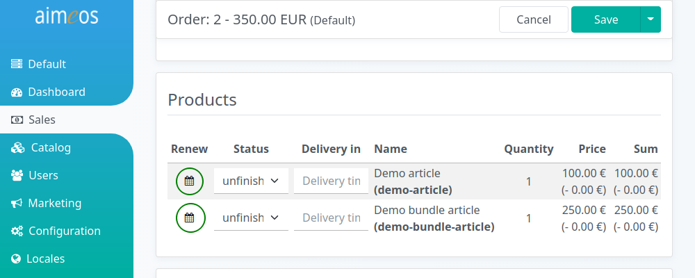
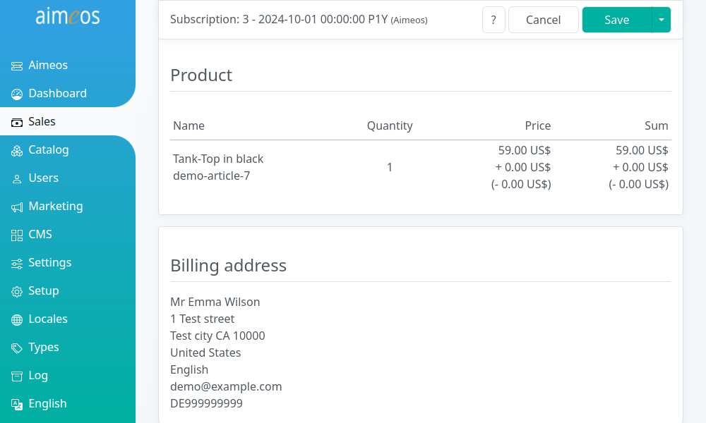

Subscriptions are regular renewed orders so the same products are bought by the customers automatically and they don't have to do it themselves. Also, it can be used to give customers access to a restricted part of the web site during their subscription is active.

After a subscription has been bought by a customer, the *subscription/process/begin* cronjob will start the subscription period and sets the "Next date" value. If that point in time is reached, the *subscription/process/renew* cronjob will care about renewing the subscription and it will create a new order for each renewal. If the subscription reaches the end date or has been cancelled by the customer, the *subscription/process/end* cronjob terminates the subscription.

Unpaid subscriptions won't be active because they have no value for "Next date". If no payment is received within three days, the subscription will be deactivated automatically by the *subscription/process/end* cronjob.

# List of all subscriptions

The list view provides a paged list of all available subscriptions, which can be [filtered](filtering-lists.md) by various, subscription-related criteria. The most important columns are shown by default but the list of columns can be adapted via the list header. Subscrptions can be edited by clicking on the list item.

# Add new subscriptions

Contrary to other list views, you can't add a subscription directly because they are based on ordered products and it would be too difficult to create them from scratch. Instead, you can create a new subscription by clicking on the calendar icon in the left "Renew" column of the ordered products list.

# Subscription details

The first five fields define the subscription and can be changed manually but keep care! Otherwise, it may have unexpected results!

Status
: Status of the subscription. Only enabled subscriptions are renewed.

Interval
: A date period definition starting with the character "P" and followed by positive numbers (including zero) for years, months, weeks, days and hours suffixed by the characters "Y" (year), "M" (month), "W" (week), "D" (days) and "H" (hour). Examples are "P1Y" (for one year intervals), "P6M" (for six month intervals), "PW10" (for 10 week intevals), "P1M14D" (for one month and fourteen days) or "P5H" (five hours). As months have a different number of days, "P1M2W" is a different period than "P6W" (one month and two weeks vs. six weeks).

Next date
: Date of the next subscription renewal. If "Next date" isn't set, the subscription hasn't started yet because the "subscription/process/begin" job controller hasn't been executed yet after the subscription has been created. The subscription is only renewed if the "Next date" value is before or at the same day as the "End date" value (if an end date is set).

End date
: Date when the subscriptions ends. If no "End date" is set, the subscriptions is renewed forever until someone cancels the subscription by setting an end date.

Reason
: The reason why the subscription will end or has ended. Possible values are "payment" if a payment error occured or "cancelled" if the customer cancelled his subscription.

The next fields are only informational and can't be changed:

Site (read-only)
: Code of the site the order was created in. If you have only one shop, this is usually "default", the codes for other sites depends on what was entered when the site was created.

Customer ID (read-only)
: Unique ID of the customer if he has created a permanent account in the shop.

Order ID (read-only)
: Unique ID of the order which contains the initial subscription.

Currency (read-only)
: The currency that is used in the order and for the payment.

Language (read-only)
: The language that is used within the order. For e-mails sent to the customers, the language field in their addresses has priority if available

The "Product" section contains the product that were bought by the customer as subscription.

Name (read-only)
: Product name in the language of the customer. Listed below are the chosen variant attributes and options by the customer. The last line contains the product code to uniquely identify the product article

Quantity (read-only)
: Number of products bought by the customers

Price (read-only)
: Price for one product + shipping costs per product - granted rebates

Sum (read-only)
: Same information as in the price column but multiplied by the quantity

The "Billing address" section contains the billing address details (and the delivery address if available) of the customer.
