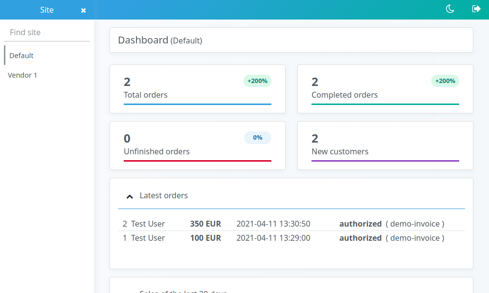
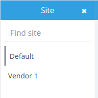
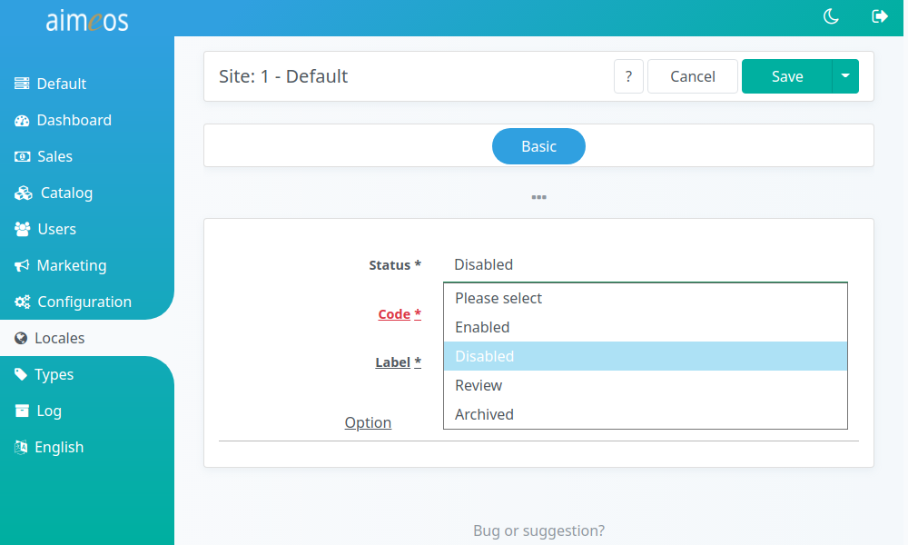

# What is a "site"

Aimeos is capable of handling multiple shops by one installation and each shop is called a "site" in Aimeos' terminology. The basic version of Aimeos provides a single site called "Default" after installation which acts as the base for your first shop. This shop instance will contain all products with all associated data you are going to set up, the configuration of the delivery and payment as well as the orders that will be created by your customers.

# Adding more sites

If you want to set up more shops, you can create an unlimited number of top-level shop instances, which are independent from each other. The easiest way is to run the setup/update script and passing a new site code. This will create a new site with all required data including the necessary default data (e.g. the product types).

!!! tip
    Refer to the documentation of the framework of your choice for any additional information that adding sites might require.

Furthermore, the *Aimeos* company offers an [extension](https://aimeos.com/extensions/) which enables you to add sub-shops that inherit products, categories, pictures, texts, etc. from parent sites. You can even add more sites to these sub-shops without any restrictions in depth. This is perfect for market places, reseller structures and complex B2B portals.

# Change site in backend

For switching between the different available sites, the administration interface contains a site selector in the upper left corner. The icon is only shown, if there are more than one site you have access to with your user. Super users will see all sites, admin users only their own ones and editors can't switch between sites.

Depending on the selected site, you will see the data associated with this site. If the ai-sites extension of the Aimeos company is installed, data inherited from parent sites is shown as well, but can't be changed, only enriched.

# Disable, delete, review and archive sites

If you want to deactivate or delete a site, go to the *Aimeos* administation interface, choose "Locales", then "Sites":

A list of all your sites will be displayed.

If you want to *disable* a site, click on any of the available fields (status, code, name, ...) of the site to edit its settings. Next, set "Status" to "Disabled" (or any of the other setting you wish to activate):

Click "Save" once you are done.

If you want to *delete* a site, go to the list page of your sites ("Locales" => "Sites") and click on the `x` ('Delete this entry') next to the site you wish to delete and you are done.
