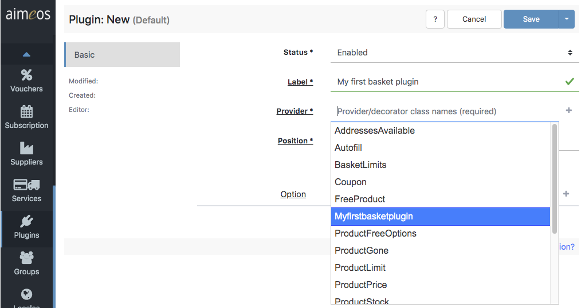

# Life cycle of a basket plugin

This tutorial demonstrates the basic steps of how and where a basket plugin is created and inserted. Details about configuraton option and code requirements can be found in the [main artcile of this chapter](index.md).

## Basics - TL;DR

In general, a basket plugin must be stored in the project specific [Aimeos extension](../../developer/extensions.md) at this location:

```
// Laravel, Symfony
./ext/<yourext>/lib/custom/src/MShop/Plugin/Provider/Order/<classname>.php

// TYPO3
./<yourext>/Resources/Private/Extensions/<yourext>/lib/custom/src/MShop/Plugin/Provider/Order/<classname>.php
```

Aimeos will recognise the plugin automatically, which means it will be available in the *Provider* drop-down list, when a user wants to insert a new plugin in the *Plugins* section of the *Aimeos* backend. 

## The example plugin run-through

Follow these steps to create and insert a working basket plugin:

1. ### Skeleton class

    Put this skeleton code in a file called `Myfirstbasketplugin.php`:

    ```php
    namespace Aimeos\MShop\Plugin\Provider\Order;

    class Myfirstbasketplugin
        extends \Aimeos\MShop\Plugin\Provider\Factory\Base
        implements \Aimeos\MShop\Plugin\Provider\Iface, \Aimeos\MShop\Plugin\Provider\Factory\Iface
    {
        private $singleton;

        public function register( \Aimeos\MW\Observer\Publisher\Iface $p ) : \Aimeos\MW\Observer\Listener\Iface
        {
            return $this;
        }

        public function update( \Aimeos\MW\Observer\Publisher\Iface $basket, $event, $value = null )
        {
        }
    }
    ```

    As discussed in more detail in the [main article](index.md), `register()` and `update()` are required methods, while the `$singleton` property is optional.

    Be aware that all names are case sensitive! `MyFirstBasketPlugin` would mean something completely different than `Myfirstbasketplugin`. We generally recommend to NOT use camel case notation (and also a better name for your plugin).


2. ### Location of class

    Save the file to this location:

    ```php
    // Laravel, Symfony
    ./ext/<yourext>/lib/custom/src/MShop/Plugin/Provider/Order/Myfirstbasketplugin.php

    // TYPO3
    ./<yourext>/Resources/Private/Extensions/<yourext>/lib/custom/src/MShop/Plugin/Provider/Order/Myfirstbasketplugin.php
    ```

    Once this is done, *Aimeos* detects the plugin automatically and editors of your shop site will now be able to insert the plugin in the *Plugins* section of the *Aimeos* backend.
    
    To guarantee a flawless process, make sure the following steps work as expected:

3. ### Check `order` plugin

    Make sure the plugin type of code *order* exists in the "Types -> Plugins" backend:

    [](Plugin-development__00__type-plugin.jpg)

    Do not change it in any way, if it already exists! If it does not, create it. Currently, `order` is the only available code for plugin development.

4. ### Insert new plugin
    
    Go to "Plugins" and click the "+" (plus) sign to insert a new plugin:

    [](Plugin-development__01__create-new-plugin-1.jpg)

5. ### Configure plugin
    
    Give the new plugin a meaningful name, select the new basket plugin provider and assign a position (when in the sequence of all plugins this very plugin shall be executed):

    [](Plugin-development__02__create-new-plugin-2.png)

6. ### Final Configuration
    
    The final configuration could look like this:

    [](Plugin-development__02__create-new-plugin-2.png)

Since this example plugin has no parameters defined, there are no further options to configure. But at this point you can compare with other plugins what is possible. Also, read all about the available basket plugins and their configuration in the [user manual](../../manual/plugins.md).

Learn more about the code structure, its requirements, options and possibilities in the [main article of this chapter](index.md).
