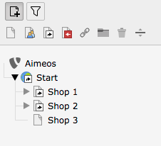
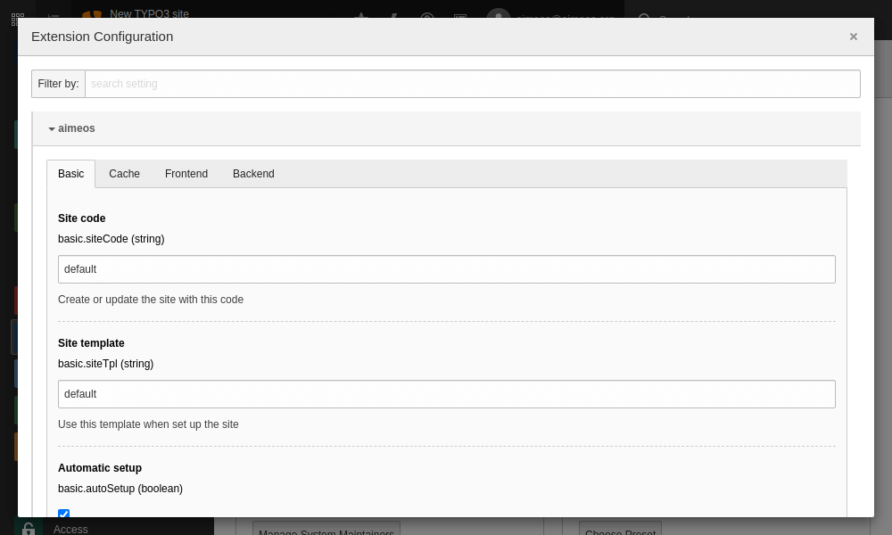
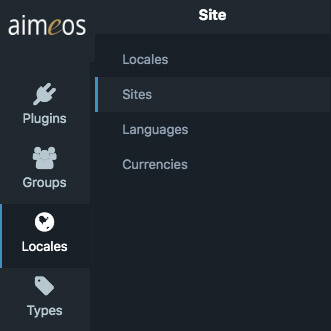
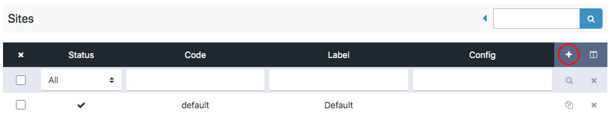
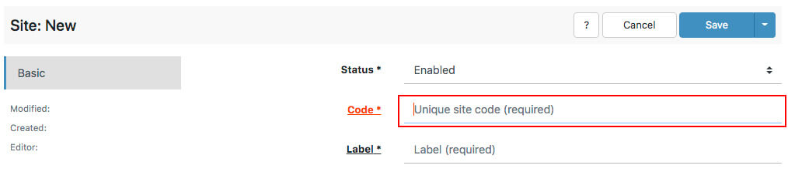
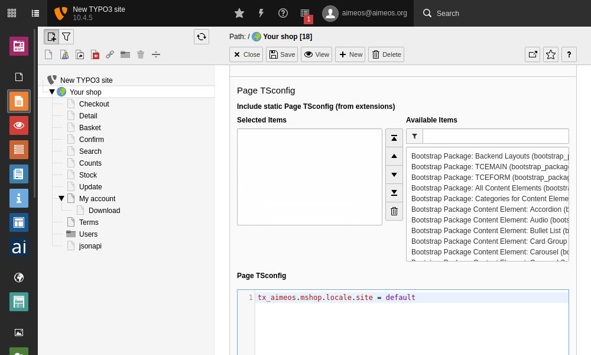

# Change configuration

There are a lot of configuration options available and documented in the *Configuration* section.

## Frontend

To add or overwrite configuration options in TYPO3, you can use TypoScript. Simply add the new or overwritten configuration values to the setup section of a page TypoScript template.

The keys in the configuration documentation are always in the form of:

```
client/html/catalog/filter/default/button = 1
```

To use such a key with TypoScript, replace the slashes (/) with dots (.) and prepend "plugin.tx_aimeos.settings.":

```typoscript
plugin.tx_aimeos.settings.client.html.catalog.filter.default.button = 1
```

If the configuration key accepts an array of values, add them like this:

```typoscript
plugin.tx_aimeos.settings.client.html.catalog.filter.default.subparts {
    0 = search
    1 = tree
    2 = attribute
}
```

In case you want to limit related items by their list type or fetch additional items for suppliers or categories, then use:

```typoscript
plugin.tx_aimeos.settings.client.html.catalog.lists.domains {
    text = text
    product {
        0 = default
    }
    supplier {
        0 = text
        1 = media
    }
    catalog {
        0 = text
        1 = media
    }
}
```

!!! warning "Be extra careful with template assignments!"
    In the case of assigning templates to a plugin (e.g. via the Typoscript Configuration field in a plugin's flexform), the dot-notation only applies to the **left-hand side** of the equation! The **right-hand site**, the relative path to the template, still has to be written **with slashes**!

    **Example:**
    
    ```typoscript
    client.html.catalog.lists.standard.template-body = catalog/lists/body-myspeciallayout
    ```

## Per Plugin

Several plugins provide the possibility to add plug-in specific TypoScript configuration in the "Plugin" tab of the plug-ins placed on a page. Use the configuration keys from the documentation as in the example below:

```typoscript
client.html.catalog.filter.default.button = 1
```

Each slash (/) is replaced by a dot (.), nothing is prepended. The same is true for arrays of values as well. Please have a look at the [frontend section](#frontend) above for an example.

## PageTS

In order to configure a plugin's behaviour in the backend, TYPO3 uses what is called a "page typoscript" (pageTS). *Aimeos* offers only one such configuration option, the "site selection", which is only needed, when you run a [multiple shop](#multiple-shops) setup:

```typoscript
tx_aimeos.mshop.locale.site = myshop
```

This setting will change e.g. which categories are displayed in the plugin options view of the catalog filter plugin. In order to change this setting, you have to edit the page and go to the "Resources" tab. There is a text area where you can add the line above.

## Admin backend

Like the frontend, the *Aimeos* administration interface in TYPO3's backend can be configured as well. It is implemented as a TYPO3 backend module which means that the the respective TypoScript configurations must be prefixed with "module.tx_aimeos.settings.", e.g.:

```typoscript
module.tx_aimeos.settings.mshop.locale.site = myshop
```

It doesn't make sense to assign all frontend settings to the backend module, too. This would only slow down loading the administration interface. There are only a few settings you may want to share between frontend and backend for the same page, namely the "mshop.locale.site" setting.

## Scheduler

All scheduler tasks allow adding specific TypoScript configuration for the jobs that should be executed. This is especially useful for setting or overwriting configuration values for e-mails that should be sent to customers. Use the configuration keys from the documentation like this:

```typoscript
client.html.common.content.baseurl = https://yourdomain/uploads/tx_aimeos
```

The same works with arrays of values as well:

```typoscript
client.html {
    common.content.baseurl = https://yourdomain/uploads/tx_aimeos
}
controller.jobs.order.email.payment.default.status {
    0 = 5
    1 = 6
}
```

# Overwrite translations

There is the possibility to overwrite translations from the core or other *Aimeos* extensions via TypoScript. This is very comfortable if you only want to replace certain existing translations with your own ones. For each translation, you need the ISO language code, the translation domain, the original string and the new translation, e.g.:

```typoscript
plugin.tx_aimeos.settings.i18n.<ISO language code>.<number> {
  domain = <translation domain>
  string = <original English singular from source code>
  trans = <new translation>
}
```

!!! warning
    This should only be used to replace a few translations! If you would like to translate *Aimeos* to a new language, please use the [Transifex website](https://www.transifex.com/aimeos/public/) instead. It will be available in the next *Aimeos* release automatically. Also, if you need to overwrite more than a few translations, you should read the article about [adding translations](../developer/translations.md).

## Required information

ISO language code
: To specify the language for the translation, a [two letter ISO language code (639-1)](https://en.wikipedia.org/wiki/List_of_ISO_639-1_codes) is necessary (e.g. "en"). It is also possible to add the [two letter ISO country code](https://en.wikipedia.org/wiki/ISO_3166-1_alpha-2) to refer to country-specific language variants like "en_GB" for British English. You can use all languages that are mapped via TypoScript from the TYPO3 language IDs. Please make sure the language code is always in lower case while the the optional country code is always in upper case.

number
: This is a continuous number to distinguish between the different translations added to the TypoScript configuration. If you are using a number twice, the latter translation definition will overwrite the former one.

domain
: The "translation domain" where the original string stems from. The *Aimeos* core has six translation domains: "mshop" (core lib with managers), "controller/frontend" (basic business logic for the frontend), "client" (frontend HTML parts), "controller/jobs" (asynchronous cronjob tasks) and "admin" (administration interface). To figure out the domain where a string originates from, look at the ".pot" files in the *Aimeos* core.

string
: The original singular string from the source code or the .pot file. The string must be exactly the same (character case, white spaces, etc.) as in the English source code / .pot file! You can not use an already translated string as source.

trans
: The new translation for the original string. This can be also an array, if one or more plural forms are necessary.

## Singular translations

A simple singular translation to English:

```typoscript
plugin.tx_aimeos.settings.i18n.en.0 {
  domain = client
  string = address
  trans = Address
}
```

A simple singular translation to US English:

```typoscript
plugin.tx_aimeos.settings.i18n.en_US.0 {
  domain = client
  string = basket
  trans = Shopping cart
}
```

Several singular translations to English:

```typoscript
plugin.tx_aimeos.settings.i18n.en {
  0 {
    domain = client
    string = basket
    trans = Basket
  }
  1 {
    domain = client
    string = address
    trans = Address
  }
}
```

Plural translation to English:

```typoscript
plugin.tx_aimeos.settings.i18n.en.0 {
  domain = client
  string = address
  trans {
    0 = Address
    1 = Addresses
  }
}
```

## Plural translations

A translation including one or more plural forms can be defined if the original string in the source code also supports plurals. Two methods are available to perform proper translation of plural strings: `translate()` and `dn()`.

```
$this->translate( '<domain>', '<singular>, '<plural>', <count> )
$i18n->dn( '<domain>', '<singular>, '<plural>', <count> )
```

To overwrite a plural translation, the simplest form is:

```typoscript
plugin.tx_aimeos.settings.i18n.<ISO language code>.<number> {
  domain = <translation domain>
  string = <original singular>
  trans {
    0 = <singular translation>
    <index> = <plural translation>
}
```

The index "0" is always the singular translation. Most languages only have one plural form, so it must be defined by using the index "1". But some languages use several plural forms depending on the count given in the last parameter of the translation method. In this case, the index depends on the language and the value of *count*. To find out the right index for the language, you have to have a look into the [`getPluralIndex()` method](https://github.com/aimeos/aimeos-core/blob/master/lib/mwlib/src/MW/Translation/Base.php) that maps *count* to the index of the proper plural form of the language you want to translate to. An example for Czech would be:

```typoscript
plugin.tx_aimeos.settings.i18n.cz.0 {
  domain = client
  string = hour
  trans {
    # one hour
    0 = dlouhá hodina
    # two to four hours
    1 = dlouhé hodiny
    # more than four hours
    2 = dlouhých hodin
  }
}
```

## Special characters

Sometimes, the source string, that should be translated, contains special characters like new lines (\n) or backslashes (\). This is no problem if you place them in a ".po" file of your project specific extension (same location as the original ".po" file) and transform its content using the Unix Gettext command, e.g.:

```bash
msgfmt -c -o de de.po
```

Using them in TypoScript is more difficult because TypoScript doesn't allow new lines in values. Therefore, you have to use "\n" (a backslash and the character "n") as replacement:

```typoscript
plugin.tx_aimeos.settings.i18n.de.0 {
  domain = client
  string = The payment was canceled.\nDo you wish to retry your order?
  trans = Die Zahlung wurde abgebrochen.\nMöchten Sie Ihre Bestellung wiederholen?
```

If the source translation contains a backslash, it must be preserved in TypoScript:

```typoscript
plugin.tx_aimeos.settings.i18n.de.0 {
  domain = client
  string = You\'ve chosen to pay in advance
  trans = Sie haben Vorauskasse gewählt
```

# Fluid templates

All *Aimeos* templates are written in PHP using a template engine and view helpers that are easy to understand. It works in all integrations in the same way, is extremely fast and doesn't require you as developer to learn a new syntax.

Alternatively, you can use the TYPO3 Fluid template engine for *Aimeos* templates overwritten for your project. Thus, all your templates will be in the same template language.

!!! tip
    The *Aimeos* templates contain nested objects and their methods sometimes needs arguments. To be able to call these methods within Fluid templates, you need to install the [VHS view helper extension](https://typo3.org/extensions/repository/view/vhs) and use the `v:call()` view helper.

To replace an *Aimeos* PHP template by our own Fluid template, the Fluid template needs to be stored at the same location as the *Aimeos* PHP template, i.e. at the `./client/html/templates/` folder of your project-specific *Aimeos* extension. It is also required to preserve the underlying directory structure as well as to abide by the file naming convention (`<template-name>.html`), e.g.:

```
./client/html/templates/catalog/detail/body-default.html
```

The file extension `.html` is important in order to be recognized as template that should be processed by the Fluid engine.

The Fluid view helpers available by default can't give you access to all data you need. Therefore, the *Aimeos* package contains some view helpers to retrieve data from *Aimeos* specific sources like configuration settings or translations. You have to include these view helpers by adding the appropriate namespace to the Fluid template before using them:

```
{namespace ai=Aimeos\Aimeos\ViewHelper}
```

## Configurations

```
{ai:config(key: 'key/to/config', default: '' )}

<ai:config key="key/to/config" default="" />
```

The `ai:config` view helper retrieves the *Aimeos* settings for a given key, e.g. *client/html/catalog/lists/basket-add*. If no value is found for the key, the given default value (optional) is returned instead.

## Translations

```
{ai:translate(singular: 'string for singular', plural: 'string for plural', number: 1, arguments: {0: 10, 1: 'value'}, domain: 'client', escape: true)}

<ai:translate singular="string for singular" plural="string for plural" number="1" arguments="{0: 10, 1: 'value'}" domain="client" escape="true" />
```

The `ai:translate` view helper retrieves the translated value from the *Aimeos* "Gettext" files. It is similar to the `f:translate` view helper and useful for translating singular and plural phrases, e.g.:

```
{ai:translate(singular: '%1$d apple', plural: '%1$d apples', number: 10, arguments: {0: 10})}
```

When the third parameter is "1", the function returns "1 apple", and for values greater than 1 it returns e.g. "10 apples". The method takes care of the various plural rules for all languages.

If the fourth argument (`arguments`) contains values, they will be used to replace the placeholders in the translated string. Internally, the [vsprintf()](https://php.net/manual/en/function.vsprintf.php) method takes care of that.

The *domain* argument is the same one that is used in the *Aimeos* `$this->translate()` view helper. In the frontend it is either "client" or "client/code" while for templates in the administration interface it is "admin".

If you don't want the output to be escaped (i.e. HTML tags returned as source), set the *escape* argument to *false*.

!!! note
    All arguments besides "singular" are optional.

## Blocks

The *Aimeos* template engine has a "block" view helper to save a rendered template, so it can be inserted into another template. This is very similar to the `f:section` tag of the Fluid template engine. It is therefore recommended to replace an *Aimeos* block view helper statement...

```php
 <?php $this->block()->start( 'cataog/detail/actions' ); ?>
     <div class="actions">
         ...
     </div>
 <?php $this->block()->stop(); ?>
 <?php echo $this->block()->get( 'catalog/detail/actions' ); ?>
```

... with a Fluid section tag:

```html
 <f:section name="catalog/detail/actions">
     <div class="actions">
         ...
     </div>
 </f:section>
 <f:render section="catalog/detail/actions" arguments="{...}"/>
```

# Multiple shops

In *Aimeos* terms, a "shop" is a "site". Therefore, when discussing whether the system can handle "mutlipe shops", we say that *Aimeos* is *multi-site capable*. It allows to store several shops in one database.

Follow these steps to create and manage multiple *Aimeos* sites:

1. ## Create a new TYPO3 page

    Each shop needs its individual TYPO3 page tree section. Therefore, create a new page that is located outside of any other potential *Aimeos* site that might already exist.

    

    It is even possible to import the [.t3d package](https://github.com/aimeos/aimeos-typo3#page-setup) that *Aimeos* provides into the new page.

2. ## Create the new site in the Extension Manager

    In the Extension Manager, go to the *Aimeos* configuration settings. Enter a new "site code" for which a new site will be created. (If it already exists, it will be updated with the required entries for the used extension version, in case you have updated to a newer *Aimeos* version.)

    

    * Admin Tools::Settings:
        1. Search for "aimeos"
        2. Enter a new site code in the corresponding input field
        3. Save and return
    * Admin Tools::Extensions:
        1. Click on the update icon of the *Aimeos* extension

    The "update" function runs through a list of checks. Once this check has finished executing, you'll be presented with the types of data that have been added to the new site.

    !!! warning
        If you update *Aimeos* from a previous version, you need to run the update script for **all** sites you've created! Otherwise, required records may be missing and existing data isn't migrated.

3. ## Create the new "Aimeos locale"

    In the *Aimeos* administraion interface of the TYPO3 backend, open the "Locales" menu and click on "Sites":

    

     Add a new site:

    

    Enter the new "site code" in the required "Code" field:

    

    Finally click "Save" in the upper right corner.

4. ## Add pageTS config

    Back in TYPO3's page tree, go to the root page of the newly created shop/site. In order to display the appropriate data of the respective (second, third,...) shop/site, add an additional setting to the page's pageTS field:

    

    * Web::Page
        1. Select the root site of the new page tree
        2. Edit page
        3. Tab *Resources*, section *TypoScript Configuration*

    ```typoscript
    tx_aimeos.mshop.locale.site = <code of site>
    ```

    Click on the icon for *Save and close document* at the top to store the change. Repeat these steps for each page tree where an different shop site other than the "default" site should be used. Clear all TYPO3 caches when you are done.

5. ## TypoScript config

    To tell the frontend which shop/site to use in the new site's page tree, add a line of TypoScript to the setup configuration:

    

    * Web::Template
        1. Select the new site's page tree root
        2. Choose *Info/Modify* in the drop-down at the top
        3. Click on *Setup* in the box below

    ```typoscript
    plugin.tx_aimeos.settings.mshop.locale.site = <code of site>
    ```

    Click on the icon for *Save and close document* at the top to store the change. Repeat these steps for each page tree where another shop site other than the "default" site should be used. Clear all TYPO3 caches when you are done.

6. ## Site parameter

    Users can switch between multiple shops if the `loc-site` parameter is included in the URL. You can configure the name of the parameter (`loc-site` by default) to a different name in the TypoScript setup section:

    ```typoscript
    plugin.tx_aimeos.settings.typo3.param.name.site = <name of the site parameter>
    ```

    For example, if you use the parameter "C" for the countries and that matches the site code, too, then you have to add this configuration to your TypoScript setup:

    ```typoscript
    plugin.tx_aimeos.settings.typo3.param.name.site = C
    ```

7. ## Update multiple shops

    If you decide to upgrade to a newer version of Aimeos, it is required to run the *Aimeos* update script in the Extension Manager for each and every shop/site separately.

    In order to get the code of a specific shop/site, go to "Aimeos Locales", choose "Sites" from its submenu and then one of the shops. You will find the site's unique code in the required field "Code". (Please have a look at [step 3](#create-the-new-aimeos-locale) for details on how to get to the *Aimeos* Locales and its site settings.)

    Next, enter the code in the *Aimeos* extension settings and run the update script. (Please have a look at [step 2](#create-the-new-site-in-the-extension-manager) for a detailed description on how to get to the *Aimeos* extension settings.)

    Repeat these steps for every shop you administer.

8. ## Disable, archive, review or delete a site

    Since these actions are independet of the host application (in this case TYPO3), please refer to the appropriate section in the [manual](../manual/working-with-sites.md) to learn more about how to handle these scenarios.

    Just keep in mind to check any TypoScript settings that might need re-configuration and to clear all TYPO3 caches once you are done, as well as to reload the TYPO3 backend. You might also want to take appropriate care of the respective TYPO3 page of the *Aimeos* site in question, e.g. disabling it, in order to prevent erroneous page renderings in the front end.

9.  ## More info in the user manual

    It is recommended to also read up on the user manual's section that is dedicated to the use of multiple sites: [Working with sites](../manual/working-with-sites.md)

# Basket in navigation

Most e-commerce sites show a small basket at the top right corner of each page. The *Aimeos* TYPO3 extension provides a plug-in for a small basket, too, containing only the number of products and the total value. You can either add this basket plug-in by

* placing the plug-in inside a column of a backend page layout
* assigning the plug-in output to a TypoScript object used in your Fluid layout

!!! tip
    Using a Typoscript object for the basket doesn't require a column in the backend page layout which tends to be easier understandable by editors as long as they shouldn't be able to place the basket plug-in themselves.

## TypoScript object

The following TypoScript code must be placed in a **TypoScript setup template**. One such place could be a `*.typoscript` file in your `./fileadmin/` directory that is included in the setup section of your site. For example, create a `./fileadmin/setup.typoscript` file with the following content:

```typoscript
lib.navigation.basket = COA
lib.navigation.basket.10 = USER
lib.navigation.basket.10 {
    # userFunc = tx_extbase_core_bootstrap->run
    userFunc = TYPO3\CMS\Extbase\Core\Bootstrap->run
    vendorName = Aimeos
    extensionName = Aimeos
    pluginName = basket-small
    controller = Basket
    action = small
    settings =< plugin.tx_aimeos.settings
}
```

Afterwards, you have to add an include statement in the *Web::Template -> Setup* section of your root page:

```typoscript
<INCLUDE_TYPOSCRIPT: source="FILE:fileadmin/setup.typosript">

plugin.tx_aimeos.settings.client.html.basket.standard.url.target = <page ID of your basket page>
plugin.tx_aimeos.settings.client.jsonapi.url.target = <page ID of your JSON API page>
```

You can find more about TypoScript includes in the [documentation of TYPO3](https://docs.typo3.org/m/typo3/reference-coreapi/master/en-us/ApiOverview/TypoScriptSyntax/Syntax/Includes.html). **Don't forget to replace the placeholders** with the proper page ID of your basket page (without the angle brackets!). Otherwise, the small basket won't link to your basket page.

Afterwards, the output of the plug-in is available as `cObject` in your Fluid templates:

```xml
<f:cObject typoscriptObjectPath="lib.navigation.basket" />
```

## Show in navigation

The TYPO3 [bootstrap_package](https://typo3.org/extensions/repository/view/bootstrap_package) makes it very easy to create a site using of a responsive web layout. To add the small basket to the navigation bar, you have to modify the navigation partial. Instead of changing the file in the bootstrap_package directly, you should create your own extension and add your version of this file there:

* Create a new extension using the [extension builder](https://typo3.org/extensions/repository/view/extension_builder)
* Copy the `./Resources/Private/Partials/Page/` directory to your extension using the same directory structure
* Adapt the navigation partial in `./Resources/Private/Partials/Page/Navigation/Main.html`
* Add the Fluid condition as the first child element inside the `<div class="container">` element:

```xml
<div class="container">
    <f:if condition="{f:cObject(typoscriptObjectPath:'lib.navigation.basket')}">
        <f:cObject typoscriptObjectPath="lib.navigation.basket" />
    </f:if>
    ...
</div>
```

Afterwards, add this TypoScript configuration to *Web::Template -> Constants* telling the *bootstrap_package* to look for the partials inside your extension:

```typoscript
page.fluidtemplate.partialRootPath = EXT:<your extension name>/Resources/Private/Partials/Page/
```

Now the small basket should be displayed in the navigation bar on top of your site and you can start styling the HTML.

!!! tip
    Don't forget to activate your extension in the extension manager!

# Countries, states and regions

## Countries

If you want to ship your products to several countries or you need to know from which countries your customers are, you have to enable the country selection in the address page of the checkout process.

By default, the country list is hidden for the billing and delivery address in the checkout process. To display them as mandatory fields you need to add "order.base.address.countryid" to the list of values defined in

* [client/html/checkout/standard/address/billing/mandatory](../config/client-html/checkout-standard/#billingmandatory)
* [client/html/checkout/standard/address/delivery/mandatory](../config/client-html/checkout-standard/#deliverymandatory)

In TYPO3 this is configured for billing and delivery addresses via TypoScript:

```typoscript
plugin.tx_aimeos.settings.client.html.checkout.standard.address {
    billing.mandatory {
        0 = order.base.address.salutation
        1 = order.base.address.firstname
        2 = order.base.address.lastname
        3 = order.base.address.address1
        4 = order.base.address.postal
        5 = order.base.address.city
        6 = order.base.address.languageid
        7 = order.base.address.email
        8 = order.base.address.countryid
    }
    delivery.mandatory < .billing.mandatory
}
```

If no selection should be enforced, use these settings instead:

* [client/html/checkout/standard/address/billing/optional](../config/client-html/checkout-standard/#billingoptional)
* [client/html/checkout/standard/address/delivery/optional](../config/client-html/checkout-standard/#deliveryoptional)

To define the country for billing and delivery addresses as optional, use this TypoScript configuration:

```typoscript
plugin.tx_aimeos.settings.client.html.checkout.standard.address {
    billing.optional {
        0 = order.base.address.salutation
        1 = order.base.address.firstname
        2 = order.base.address.lastname
        3 = order.base.address.address1
        4 = order.base.address.postal
        5 = order.base.address.city
        6 = order.base.address.languageid
        7 = order.base.address.email
        8 = order.base.address.countryid
    }
    delivery.optional < .billing.optional
}
```

The list of countries is defined by the values added to the configuration key [client/html/checkout/standard/address/countries](../config/client-html/checkout-standard/#countries). The TypoScript below will add all countries worldwide to the select boxes for the billing and delivery address:

```typoscript
plugin.tx_aimeos.settings.client.html.checkout.standard.address.countries {
     0 = AD
     # Andorra
     1 = AE
     # United Arab Emirates
     2 = AF
     # Afghanistan
     3 = AG
     # Antigua and Barbuda
     4 = AI
     # Anguilla
     5 = AL
     # Albania
     6 = AM
     # Armenia
     7 = AO
     # Angola
     8 = AQ
     # Antarctica
     9 = AR
     # Argentina
     10 = AS
     # American Samoa
     11 = AT
     # Austria
     12 = AU
     # Australia
     13 = AW
     # Aruba
     14 = AX
     # Åland Islands
     15 = AZ
     # Azerbaijan
     16 = BA
     # Bosnia and Herzegovina
     17 = BB
     # Barbados
     18 = BD
     # Bangladesh
     19 = BE
     # Belgium
     20 = BF
     # Burkina Faso
     21 = BG
     # Bulgaria
     22 = BH
     # Bahrain
     23 = BI
     # Burundi
     24 = BJ
     # Benin
     25 = BL
     # Saint Barthélemy
     26 = BM
     # Bermuda
     27 = BN
     # Brunei Darussalam
     28 = BO
     # Bolivia, Plurinational State of
     29 = BQ
     # Bonaire, Sint Eustatius and Saba
     30 = BR
     # Brazil
     31 = BS
     # Bahamas
     32 = BT
     # Bhutan
     33 = BV
     # Bouvet Island
     34 = BW
     # Botswana
     35 = BY
     # Belarus
     36 = BZ
     # Belize
     37 = CA
     # Canada
     38 = CC
     # Cocos (Keeling) Islands
     39 = CD
     # Congo, the Democratic Republic of the
     40 = CF
     # Central African Republic
     41 = CG
     # Congo
     42 = CH
     # Switzerland
     43 = CI
     # Côte d'Ivoire
     44 = CK
     # Cook Islands
     45 = CL
     # Chile
     46 = CM
     # Cameroon
     47 = CN
     # China
     48 = CO
     # Colombia
     49 = CR
     # Costa Rica
     50 = CU
     # Cuba
     51 = CV
     # Cape Verde
     52 = CW
     # Curaçao
     53 = CX
     # Christmas Island
     54 = CY
     # Cyprus
     55 = CZ
     # Czech Republic
     56 = DE
     # Germany
     57 = DJ
     # Djibouti
     58 = DK
     # Denmark
     59 = DM
     # Dominica
     60 = DO
     # Dominican Republic
     61 = DZ
     # Algeria
     62 = EC
     # Ecuador
     63 = EE
     # Estonia
     64 = EG
     # Egypt
     65 = EH
     # Western Sahara
     66 = ER
     # Eritrea
     67 = ES
     # Spain
     68 = ET
     # Ethiopia
     69 = FI
     # Finland
     70 = FJ
     # Fiji
     71 = FK
     # Falkland Islands (Malvinas)
     72 = FM
     # Micronesia, Federated States of
     73 = FO
     # Faroe Islands
     74 = FR
     # France
     75 = GA
     # Gabon
     76 = GB
     # United Kingdom
     77 = GD
     # Grenada
     78 = GE
     # Georgia
     79 = GF
     # French Guiana
     80 = GG
     # Guernsey
     81 = GH
     # Ghana
     82 = GI
     # Gibraltar
     83 = GL
     # Greenland
     84 = GM
     # Gambia
     85 = GN
     # Guinea
     86 = GP
     # Guadeloupe
     87 = GQ
     # Equatorial Guinea
     88 = GR
     # Greece
     89 = GS
     # South Georgia and the South Sandwich Islands
     90 = GT
     # Guatemala
     91 = GU
     # Guam
     92 = GW
     # Guinea-Bissau
     93 = GY
     # Guyana
     94 = HK
     # Hong Kong
     95 = HM
     # Heard Island and McDonald Islands
     96 = HN
     # Honduras
     97 = HR
     # Croatia
     98 = HT
     # Haiti
     99 = HU
     # Hungary
     100 = ID
     # Indonesia
     101 = IE
     # Ireland
     102 = IL
     # Israel
     103 = IM
     # Isle of Man
     104 = IN
     # India
     105 = IO
     # British Indian Ocean Territory
     106 = IQ
     # Iraq
     107 = IR
     # Iran, Islamic Republic of
     108 = IS
     # Iceland
     109 = IT
     # Italy
     110 = JE
     # Jersey
     111 = JM
     # Jamaica
     112 = JO
     # Jordan
     113 = JP
     # Japan
     114 = KE
     # Kenya
     115 = KG
     # Kyrgyzstan
     116 = KH
     # Cambodia
     117 = KI
     # Kiribati
     118 = KM
     # Comoros
     119 = KN
     # Saint Kitts and Nevis
     120 = KP
     # Korea, Democratic People's Republic of
     121 = KR
     # Korea, Republic of
     122 = KW
     # Kuwait
     123 = KY
     # Cayman Islands
     124 = KZ
     # Kazakhstan
     125 = LA
     # Lao People's Democratic Republic
     126 = LB
     # Lebanon
     127 = LC
     # Saint Lucia
     128 = LI
     # Liechtenstein
     129 = LK
     # Sri Lanka
     130 = LR
     # Liberia
     131 = LS
     # Lesotho
     132 = LT
     # Lithuania
     133 = LU
     # Luxembourg
     134 = LV
     # Latvia
     135 = LY
     # Libya
     136 = MA
     # Morocco
     137 = MC
     # Monaco
     138 = MD
     # Moldova, Republic of
     139 = ME
     # Montenegro
     140 = MF
     # Saint Martin (French part)
     141 = MG
     # Madagascar
     142 = MH
     # Marshall Islands
     143 = MK
     # Macedonia
     144 = ML
     # Mali
     145 = MM
     # Myanmar
     146 = MN
     # Mongolia
     147 = MO
     # Macao
     148 = MP
     # Northern Mariana Islands
     149 = MQ
     # Martinique
     150 = MR
     # Mauritania
     151 = MS
     # Montserrat
     152 = MT
     # Malta
     153 = MU
     # Mauritius
     154 = MV
     # Maldives
     155 = MW
     # Malawi
     156 = MX
     # Mexico
     157 = MY
     # Malaysia
     158 = MZ
     # Mozambique
     159 = NA
     # Namibia
     160 = NC
     # New Caledonia
     161 = NE
     # Niger
     162 = NF
     # Norfolk Island
     163 = NG
     # Nigeria
     164 = NI
     # Nicaragua
     165 = NL
     # Netherlands
     166 = NO
     # Norway
     167 = NP
     # Nepal
     168 = NR
     # Nauru
     169 = NU
     # Niue
     170 = NZ
     # New Zealand
     171 = OM
     # Oman
     172 = PA
     # Panama
     173 = PE
     # Peru
     174 = PF
     # French Polynesia
     175 = PG
     # Papua New Guinea
     176 = PH
     # Philippines
     177 = PK
     # Pakistan
     178 = PL
     # Poland
     179 = PM
     # Saint Pierre and Miquelon
     180 = PN
     # Pitcairn
     181 = PR
     # Puerto Rico
     182 = PS
     # Palestine, State of
     183 = PT
     # Portugal
     184 = PW
     # Palau
     185 = PY
     # Paraguay
     186 = QA
     # Qatar
     187 = RE
     # Réunion
     188 = RO
     # Romania
     189 = RS
     # Serbia
     190 = RU
     # Russian Federation
     191 = RW
     # Rwanda
     192 = SA
     # Saudi Arabia
     193 = SB
     # Solomon Islands
     194 = SC
     # Seychelles
     195 = SD
     # Sudan
     196 = SE
     # Sweden
     197 = SG
     # Singapore
     198 = SH
     # Saint Helena, Ascension and Tristan da Cunha
     199 = SI
     # Slovenia
     200 = SJ
     # Svalbard and Jan Mayen
     201 = SK
     # Slovakia
     202 = SL
     # Sierra Leone
     203 = SM
     # San Marino
     204 = SN
     # Senegal
     205 = SO
     # Somalia
     206 = SR
     # Suriname
     207 = SS
     # South Sudan
     208 = ST
     # Sao Tome and Principe
     209 = SV
     # El Salvador
     210 = SX
     # Sint Maarten (Dutch part)
     211 = SY
     # Syrian Arab Republic
     212 = SZ
     # Swaziland
     213 = TC
     # Turks and Caicos Islands
     214 = TD
     # Chad
     215 = TF
     # French Southern Territories
     216 = TG
     # Togo
     217 = TH
     # Thailand
     218 = TJ
     # Tajikistan
     219 = TK
     # Tokelau
     220 = TL
     # Timor-Leste
     221 = TM
     # Turkmenistan
     222 = TN
     # Tunisia
     223 = TO
     # Tonga
     224 = TR
     # Turkey
     225 = TT
     # Trinidad and Tobago
     226 = TV
     # Tuvalu
     227 = TW
     # Taiwan
     228 = TZ
     # Tanzania, United Republic of
     229 = UA
     # Ukraine
     230 = UG
     # Uganda
     231 = UM
     # United States Minor Outlying Islands
     232 = US
     # United States
     233 = UY
     # Uruguay
     234 = UZ
     # Uzbekistan
     235 = VA
     # Vatican City State (Holy See)
     236 = VC
     # Saint Vincent and the Grenadines
     237 = VE
     # Venezuela, Bolivarian Republic of
     238 = VG
     # Virgin Islands, British
     239 = VI
     # Virgin Islands, U.S.
     240 = VN
     # Viet Nam
     241 = VU
     # Vanuatu
     242 = WF
     # Wallis and Futuna
     243 = WS
     # Samoa
     244 = YE
     # Yemen
     245 = YT
     # Mayotte
     246 = ZA
     # South Africa
     247 = ZM
     # Zambia
     248 = ZW
     # Zimbabwe
 }
```

## States and regions

For each country you can freely define a list of states or regions that can be used afterwards to calculate the final price for each delivery option. To define states or regions via TypoScript use something like this:

```typoscript
plugin.tx_aimeos.settings.client.html.checkout.standard.address.states {
    US {
        CA = California
        NY = New York
       ...
    }
    EU {
        W = Western Europe
        C = Central Europe
        ...
    }
}
```

The key you have chosen for the state or region will be stored in the order address of the customer and can then be used during the rest of the checkout process. More details can be found in [client/html/checkout/standard/address/states](../config/client-html/checkout-standard/#states).
