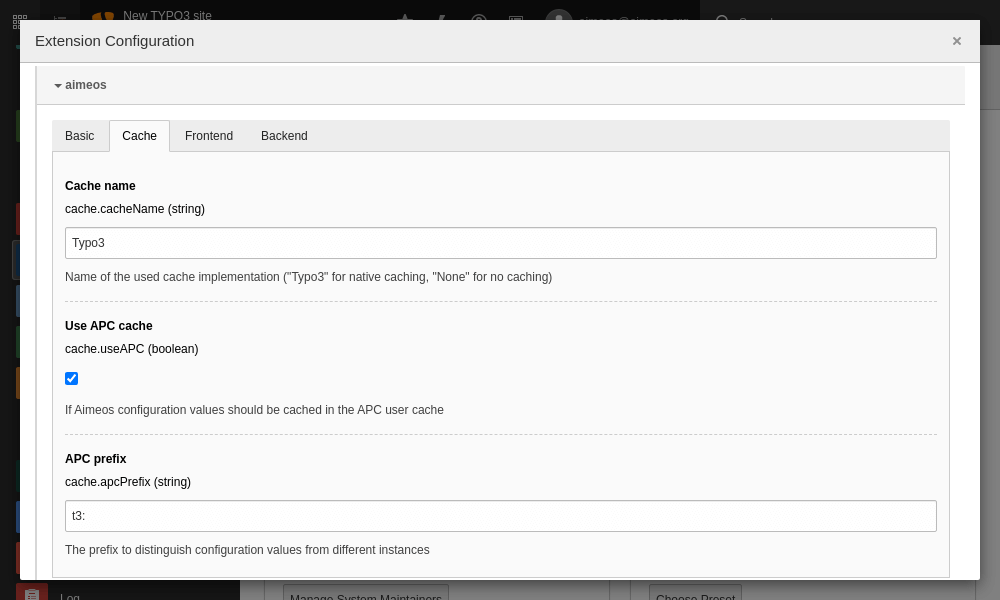

# Security

Modern browsers can be told to prevent execution of injected Javascript by an attacker. The technique is called "Content Security Policy" and can be activated by sending appropriate HTTP headers. Within TYPO3 this can be configured with a single TypoScript statement:

```typoscript
config.additionalHeaders = Content-Security-Policy: default-src 'self'; style-src 'self' 'unsafe-inline'
  | X-Content-Security-Policy: default-src 'self'; style-src 'self' 'unsafe-inline'
  | X-Webkit-CSP: default-src 'self'; style-src 'self' 'unsafe-inline'
```

This must be a single line in the configuration template which should be part of the root page. It tells the browser to allow only content (Javascript, CSS, images, etc.) from your own server and also inline CSS declarations (necessary for displaying the product pictures as scalable background).

!!! note
    If you are using a [different domain for serving static content](#different-domain-for-static-files), you have to add this domain to the `default-src` and `style-src` statement.

# Databases

The Aimeos shop is able to use different databases for its data domains. Thus, you can configure a separate database e.g. for all customer or order related data. If no specific database is configured for a data domain, the default database will be used.

Create an additional database configuration in the `./typo3conf/LocalConfiguration.php` file:

```php
    'DB' => [
        'Connections' => [
            'Aimeos' => [
                'driver' => 'mysqli',
                'host' => '...',
                'port' => '...',
                'dbname' => '...',
                'user' => '...',
                'password' => '...',
                'charset' => 'utf8mb4',
                'tableoptions' => [
                    'charset' => 'utf8mb4',
                    'collate' => 'utf8mb4_unicode_ci',
                ]
            ]
        ]
    ]
```

Afterwards, create a file named `./Resources/Private/Config/resource.php` in your own Aimeos extension that will reference the database configuration from the `./typo3conf/LocalConfiguration.php` file:

```php
return [
    'db-order' => [
        'adapter' => 'mysql',
        'host' => $GLOBALS['TYPO3_CONF_VARS']['DB']['Connections']['Aimeos']['host'],
        'port' => $GLOBALS['TYPO3_CONF_VARS']['DB']['Connections']['Aimeos']['port'],
        'database' => $GLOBALS['TYPO3_CONF_VARS']['DB']['Connections']['Aimeos']['dbname'],
        'username' => $GLOBALS['TYPO3_CONF_VARS']['DB']['Connections']['Aimeos']['user'],
        'password' => $GLOBALS['TYPO3_CONF_VARS']['DB']['Connections']['Aimeos']['password'],
        'stmt' => ["SET SESSION sort_buffer_size=2097144; SET NAMES 'utf8mb4'; SET SESSION sql_mode='ANSI'"],
        'defaultTableOptions' => [
            'charset' => $GLOBALS['TYPO3_CONF_VARS']['DB']['Connections']['Aimeos']['tableoptions']['charset'] : 'utf8mb4',
            'collate' => $GLOBALS['TYPO3_CONF_VARS']['DB']['Connections']['Aimeos']['tableoptions']['collate'] : 'utf8mb4_unicode_ci',
        ],
        'limit' => 2,
    ],
];
```

More details about the available domains and the necessary configuration is available in the [database article](../infrastructure/databases.md).

To avoid the install tool creating the tables in the TYPO3 database add the tables that are stored in other databases to the "DB" section of your `./typo3conf/LocalConfiguration.php`:

```php
    'DB' => [
        'TableMapping' => [
            'madmin_cache' => 'Aimeos',
            'madmin_cache_tag' => 'Aimeos',
            'madmin_job' => 'Aimeos',
            'madmin_log' => 'Aimeos',
            'madmin_queue' => 'Aimeos',
            'mshop_attribute' => 'Aimeos',
            'mshop_attribute_list' => 'Aimeos',
            'mshop_attribute_list_type' => 'Aimeos',
            'mshop_attribute_property' => 'Aimeos',
            'mshop_attribute_property_type' => 'Aimeos',
            'mshop_attribute_type' => 'Aimeos',
            'mshop_catalog' => 'Aimeos',
            'mshop_catalog_list' => 'Aimeos',
            'mshop_catalog_list_type' => 'Aimeos',
            'mshop_coupon' => 'Aimeos',
            'mshop_coupon_code' => 'Aimeos',
            'mshop_index_attribute' => 'Aimeos',
            'mshop_index_catalog' => 'Aimeos',
            'mshop_index_cgroup' => 'Aimeos',
            'mshop_index_customer' => 'Aimeos',
            'mshop_index_price' => 'Aimeos',
            'mshop_index_supplier' => 'Aimeos',
            'mshop_index_text' => 'Aimeos',
            'mshop_locale' => 'Aimeos',
            'mshop_locale_currency' => 'Aimeos',
            'mshop_locale_language' => 'Aimeos',
            'mshop_locale_site' => 'Aimeos',
            'mshop_media' => 'Aimeos',
            'mshop_media_list' => 'Aimeos',
            'mshop_media_list_type' => 'Aimeos',
            'mshop_media_property' => 'Aimeos',
            'mshop_media_property_type' => 'Aimeos',
            'mshop_media_type' => 'Aimeos',
            'mshop_order' => 'Aimeos',
            'mshop_order_base' => 'Aimeos',
            'mshop_order_base_address' => 'Aimeos',
            'mshop_order_base_coupon' => 'Aimeos',
            'mshop_order_base_product' => 'Aimeos',
            'mshop_order_base_product_attr' => 'Aimeos',
            'mshop_order_base_service' => 'Aimeos',
            'mshop_order_base_service_attr' => 'Aimeos',
            'mshop_order_status' => 'Aimeos',
            'mshop_plugin' => 'Aimeos',
            'mshop_plugin_type' => 'Aimeos',
            'mshop_price' => 'Aimeos',
            'mshop_price_list' => 'Aimeos',
            'mshop_price_list_type' => 'Aimeos',
            'mshop_price_property' => 'Aimeos',
            'mshop_price_property_type' => 'Aimeos',
            'mshop_price_type' => 'Aimeos',
            'mshop_product' => 'Aimeos',
            'mshop_product_list' => 'Aimeos',
            'mshop_product_list_type' => 'Aimeos',
            'mshop_product_property' => 'Aimeos',
            'mshop_product_property_type' => 'Aimeos',
            'mshop_product_type' => 'Aimeos',
            'mshop_service' => 'Aimeos',
            'mshop_service_list' => 'Aimeos',
            'mshop_service_list_type' => 'Aimeos',
            'mshop_service_type' => 'Aimeos',
            'mshop_stock' => 'Aimeos',
            'mshop_stock_type' => 'Aimeos',
            'mshop_subscription' => 'Aimeos',
            'mshop_supplier' => 'Aimeos',
            'mshop_supplier_address' => 'Aimeos',
            'mshop_supplier_list' => 'Aimeos',
            'mshop_supplier_list_type' => 'Aimeos',
            'mshop_tag' => 'Aimeos',
            'mshop_tag_type' => 'Aimeos',
            'mshop_text' => 'Aimeos',
            'mshop_text_list' => 'Aimeos',
            'mshop_text_list_type' => 'Aimeos',
            'mshop_text_type' => 'Aimeos',
        ]
    ]
```

The value "Aimeos" is the name of the DB "Connections" entry of the same file.

# Enable APC

A big performance boost can be achieved by installing "APCu" (the APC user cache). It can cache all configuration and translation entries in the shared memory of the web server which can improve performance by 50%.

!!! warning
    Be aware that you have to clear the APC user cache manually each time after you've changed a configuration option or a translation!

In order to tell your application to use the APC user cache, you need to activate the "Use APC cache" checkbox in the Aimeos extension configuration:


!!! warning
    If you have more than one shop application on the same server, you must assign an **unique APC prefix** for each instance!

# Caching

During development it's very useful to disable the internal content caching done by the Aimeos package. By default, the following output is cached:

* HTML header and body of each component by the Aimeos caching framework
* Small basket and last seen products in the session of the user

Thus, new content is only generated if you flush the caches and/or delete the frontend cookie in your browser.

To disable the content caching completely, change this setting in the Aimeos extension configuration:



* Admin Tools::Settings
* Click on "aimeos"
* Chose the "Cache" tab
* Replace *Typo3* in "Cache Name" with *None*

!!! warning
    Don't disable the content caching by default in production environments. This has a **severe performance impact**!

The basket is also updated automatically if you add products to or delete products from the basket resp. modifying the basket content in another way.

!!! tip
    You can also disable caching the basket content in the sessions for development using the [client/html/basket/cache/enable](../config/client-html/basket-cache#enable) configuration option.

# Cache distribution

The [content cache](#caching) is usually enabled by default if you haven't disabled it during development.

If you have a high volume of products (50k+) and your database server gets slower due to the amount of queries executed, you can offload the content cache entries either to another database server or to an in-memory key/value store like [Redis](https://redis.io/).

To move the content cache entries to a Redis server, you have to install the [ai-cache extension](https://github.com/aimeos/ai-cache). The extension contains documentation how to configure your application for Redis support.

Alternatively, you can move the cached component content to another database server. In this case, you must add a `db-cache` resource block to your `./Resources/Private/Config/resource.php`:

```php
return [
    'db-cache' => [
        'adapter' => 'mysql',
        'host' => '...',
        'port' => '...',
        'database' => '...',
        'username' => '...',
        'password' => '...',
        'stmt' => ["SET SESSION sort_buffer_size=2097144; SET NAMES 'utf8mb4'; SET SESSION sql_mode='ANSI'"],
        'defaultTableOptions' => [
            'charset' => 'utf8mb4',
            'collate' => 'utf8mb4_unicode_ci',
        ],
        'limit' => 2,
    ],
];
```

# Distribute static files

Browsers don't load all required files at once referenced inside a HTML document. Instead, they limit the number of concurrent requests for a single domain. To get around this, a common way is to make the files also available via a different domain, so the browsers will download more files in parallel. Thus, rendering the page is much faster for the user.

One way is to create a second virtual host configuration in your web server which uses a sub-domain like "static.example.com". The document root should point to the same directory as your main virtual host (e.g. example.com) in the file system to ease maintenance. Otherwise you would have to make sure that the files are in sync in both directories.

If the internet connection to your customers is short and fast and your server is able to handle the load, this way is the preferred one - especially, if you are able to serve the files from a memory-based cache like a [reverse Nginx proxy](https://docs.nginx.com/nginx/admin-guide/web-server/reverse-proxy/) or [Varnish](https://www.varnish-cache.org/).

Another option is to use a domain from a content delivery network (CDN) like [Amazon Cloudfront](https://aws.amazon.com/cloudfront/). Usually, you can configure these services to retrieve the static files on the first request from your host and deliver them from their caches afterwards.

The advantage of a CDN over a sub-domain on your own server is the load-balancing across many servers and the distribution from a server close to the visitors of your web site. Both can improve the speed of your web site a lot.

In both cases, you need to configure the Aimeos extension to create links to the product pictures with a different domain. This can be done via an entry in the `./Resources/Private/Config/resource.php` file:

```php
    'resource' => [
        'fs' => [
            'adapter' => 'Standard',
            'tempdir' => PATH_site . 'typo3temp',
            'basedir' => PATH_site . 'uploads/tx_aimeos',
            'baseurl' => 'https://static.example.com/media/',
        ],
    ],
```

You can also use the "aimeos/ai-filesystem" package to store files directly on another server. There are drivers for different services available. For details, please have a look at the readme file of the [ai-filesystem package](https://github.com/aimeos/ai-filesystem#installation). An example configuration for using an Amazon S3 storage would be:

```php
    'resource' => [
        'fs' => [
            'adapter' => 'FlyAwsS3',
            'credentials' => [
                'key'    => 'your-key',
                'secret' => 'your-secret',
            ],
            'region' => 'your-region',
            'version' => 'latest',
            'bucket' => 'your-bucket-name',
            'prefix' => 'your-prefix', // optional
            'baseurl' => 'https://your-bucket-name.s3.your-region.amazonaws.com/your-prefix/',
        ],
    ],
```

You can also add some configuration to deliver the CSS and Javascript files from the second domain:

```typoscript
page.includeCSS.tx_aimeos = https://static.example.com/typo3conf/ext/aimeos/Resources/Public/Themes/elegance/aimeos.css
page.includeJSlibs.jquery = https://static.example.com/typo3conf/ext/aimeos/Resources/Public/Themes/jquery.min.js
page.includeJSlibs.jquery-migrate = https://static.example.com/typo3conf/ext/aimeos/Resources/Public/Themes/jquery-migrate.js
page.includeJSlibs.jquery-ui = https://static.example.com/typo3conf/ext/aimeos/Resources/Public/Themes/jquery-ui.custom.min.js
page.includeJS.tx_aimeos = https://static.example.com/typo3conf/ext/aimeos/Resources/Public/Themes/elegance/aimeos.js

page.includeCSS.tx_aimeos.external = 1
page.includeJSlibs.jquery.external = 1
page.includeJSlibs.jquery-migrate.external = 1
page.includeJSlibs.jquery-ui.external = 1
page.includeJS.tx_aimeos.external = 1
```
